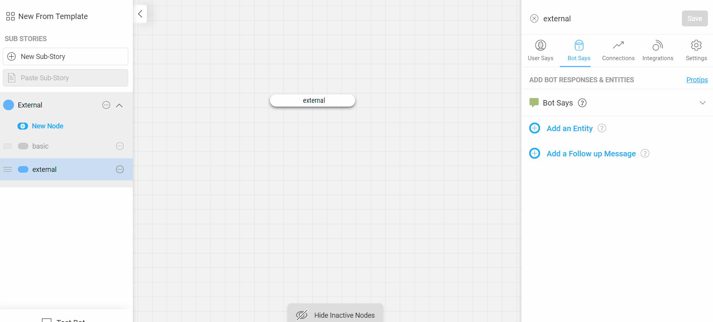

## Why?
There might be times when there is an existing bot with a flow already built on another platform or through custom code. It is possible to connect this external bot flow to the haptik tools through the bot builder tool.

## Steps to integrate

### Method 1 - Using Webhooks
> Note: This is the recommended way to integrate with an external bot

This is a straigthforward method where the client can integrate with haptik's tool using simple webhooks.

For the purposes of the integration, haptik will provide the client with the following data:
- client_id
- token
- webhook URL

The client can then use this data for the integration. Here's how the integration will work:

1) When the client wants to transfer the chat to an agent they perform the following actions:
 * Create a Haptik User - https://docs.haptik.ai/webhooks/create-haptik-user
 * Send a message to Haptik - https://docs.haptik.ai/webhooks/send-message-to-haptik. This creates a new message in agent chat and assigns the chat to an agent.

2) The client also needs to provide a webhook of their own where the responses from the agent will be sent. Haptik will send the agent responses to this webhook endpoint with the following paylaod - https://docs.haptik.ai/webhooks/webhook-payload. 

3) Client processes the messages received on the webhook and forwards it to the user who sent the message.

### Method 2 - Use a single node bot
> Note: This method is not recommended as it can make the bot responses slow.

#### Create a bot on bot builder
The first step is to create a new bot on the bot builder tool. This bot will act as a gateway between haptik platform and the external bot.

#### Create a node to transfer data
The second step is to create a node in the bot. The job of this node is to take any user input that comes in and pass it along to the external bot. The node is also responsible to accept the input that comes in from the external bot and send it back to the user.

##### Accepting all inputs
We get the node to capture all the input messages by using a catchall entity. You can do this by adding an entity called "feedback_regex". This entity uses regex to capture the complete user message in the entity called "feedback_regex". 

You can add entity by going to `bot_says` section of the node. In the `bot says` section click on the `+ Add an Entity` and then search for `feedback_regex`. Finally click on `Add to Bot Says` to add it to the node.

##### Communicating with the external bot
Once the user message is captured it can be sent to the external bot using the `integrations` section of the node. The first step is to set the base url of the external bot in the bot settings section. If the external bot has different test and production endpoints you can set them accordingly. Or you can set it to be the same URL in both the cases.

Once that is done, we can add the specific path where we need to send the message to. It should be noted that the endpoint will recieve the message in a parameter called `feedback_regex` because that is what the entity is called. The external bot can then use this message and return a bot response in a `HSL` format. This `HSL` will then be sent back to the user who sent the message.

##### Completing the setup
Finally, we want the above steps to be repeated for all user messages. To do this we make the node self connecting. This means that all incoming messages and responses will loop through this node which is what we want.

