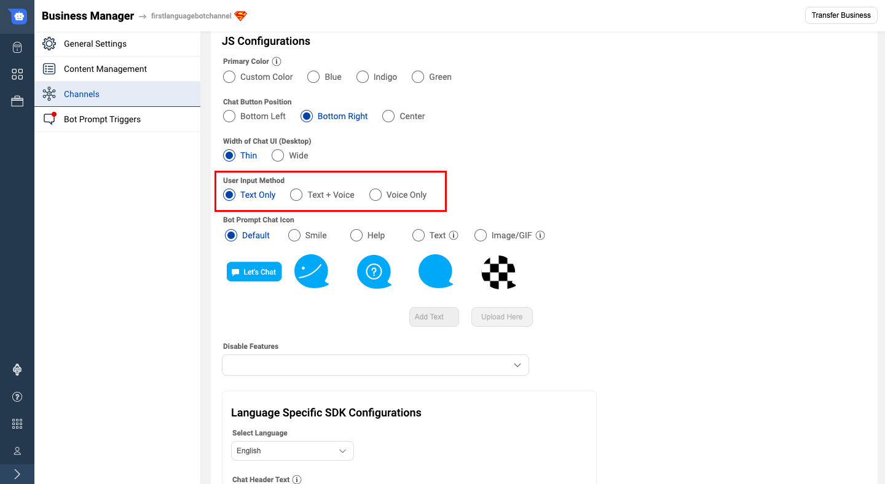
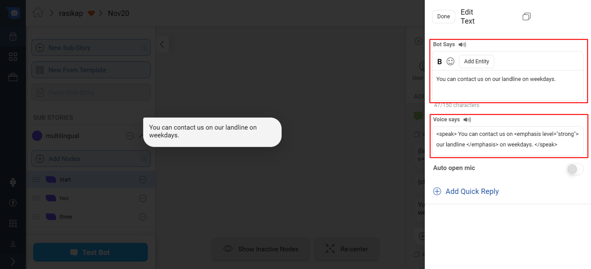
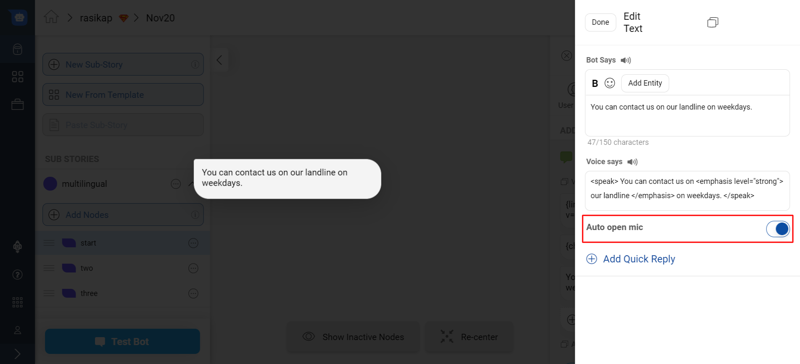
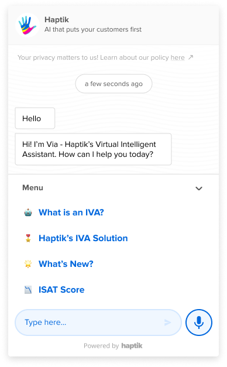
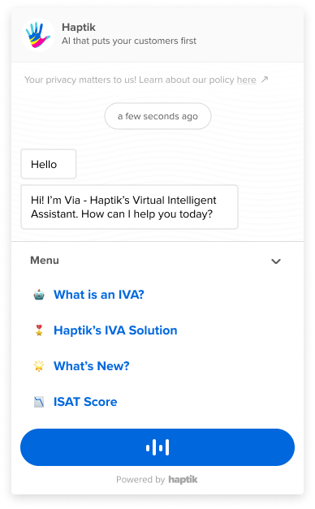
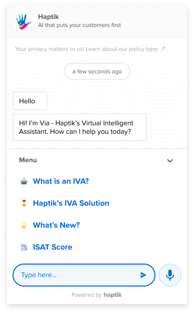
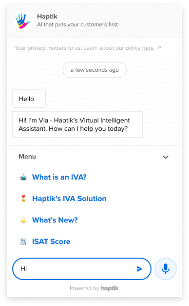
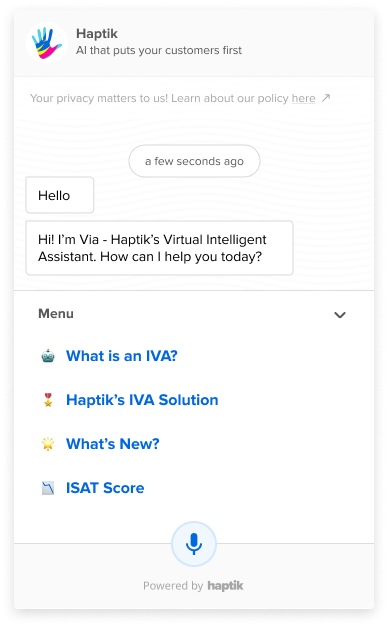
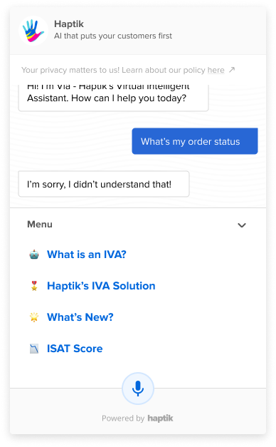

### What is a Voice IVA?

Voice is an efficient mode of communication because of its speed, accuracy and effortless measures. A voice IVA diminishes the user's attempt to type-out a message and leads them to have a hassle-free conversation with the IVA. 
A voice IVA primarily uses voice/audio as an input for communication. Once the voice option is enabled for the business, you can see the audio recorder icon on the IVA as follows

When the user clicks on the audio recorder, the bot captures the audio from the user and converts it into text. This text becomes the user input to the bot and then the bot responds accordingly.

### How to build a Voice IVA?
Firstly, the business needs to be configured to accept voice input. From the Partner Settings page of Business Manager, enable the Text + Voice user input method, as shown below.

Once this is configured, you should be able to see the voice recorder icon on the bot, as visible in the first screenshot.

To configure a Voice Bot on our Conversation Studio, go to any node to set voice-specific bot responses. On a node, you can tap on +Add a chat element in Bot says. Once you click on it, a slide bar opens on the right-hand side.

Click on the preferred chat element. Here for your element, you can configure the voice bot via two fields:

Bot Says: This is the text on UI as a bot message bubble i.e. Add bot says, which will be sent as a text to the user.

Voice Says: This is what the bot says out loud i.e. the output from your device speaker. You tap on +Voice support and add message details. Once the message is added, tap on the Done button at the top.

> **Note: Voice Says is not supported on the Raw Text / JSON element.**

It will look as depicted in the image below.

## Enabling Auto Mic option

Enabling the auto open mic, allows the user to talk with the bot, and activate even if the mic button is not pressed on chat. This makes it user friendly depending on the bot personality.

Note - If changes are made in Bot says, you have to save the data to test the bot. If changes are made in User says, you will have to save, then train the bot and later you can test the bot.

## Using SSML Tags:
Let’s suppose you have to add various voice features such as emphasizing the tone on a specific sentence or spell out a word to the user, you can make use of SSML tags in such instances.
SSML tags are used to add various features to your voice bot response.
SSML tags are to be added in the Voice Says field box as shown in the image above. For understanding how SSML tags are to be added, check the syntax details below -
1. Adding a break
`<speak> Not sure. <break time="2s"/> Please reach out on our email-id. </speak>`
As per the SSML tags used above, after Bot says "Not sure." there will be a break time of 2 seconds and then bot speaks the rest. 
2. Adding emphasis
`<speak> You can contact us on <emphasis level="strong"> our landline </emphasis> on weekdays. </speak>`
As per the SSML tags used above, after Bot says "You can contact us on" there will be emphasis on "our landline" phrase and then bot speaks the rest of the text.

## Do's & Don'ts for building a Voice IVA:
- Voice Bot may sometimes not pronounce the words properly. Misspelling the word in “Voice says” may help at times.
- Bot may also not pronounce Hindi words properly. Accordingly, edit the text in "Voice text" field
- Bot tends to read out some special characters. Avoid using special characters which aren't SSML tags.
- Too much content may lead to boredom in the users. Do not use long message copies for Voice support. 
- To make the bot pause while reading out a sentence add respective punctuations like commas, full stops.
- Bot does not read two separate messages together, it takes a pause before reading the second message.
- Add spaces between numbers so that the Bot will read them individually. Example - you type “99” in voice support, bot will read it as “ninety nine”. Instead type “9 9” in voice support, and the bot will read it as “nine nine”
- Keep different message copies for text support and Voice support.
- Bot does not read out the Button Text and Quick Reply Text, it will only read the header message.

### How to use a voice IVA?
There are two main ways to configure a Voice IVA. 
## 1. Using Text + Voice Input
You can configure an IVA which can take both Text and Voice an input. When the IVA has this combination, you can see both, the message composer and an audio recorder icon.
The following image depicts a default state of IVA with a taskbox and both inputs enabled.

When the user selects their mode of input, for instance, voice, the audio recorder icon is highlighted and the user can start recording their message by clicking on the button.

When the user is recording the audio, the message composer disappears and the bot goes into voice reading state, to record what the user is speaking.

> **Note: If you click on the taskbox items while recording the message, the task message will be sent to the bot and the recording would stop.**

Once the message is recorded, the NLU translates the audio to text and it is sent as a user message to the bot. The taskbox closes as soon as the message is sent and then the bot replies according to the message.

When the user wants to provide text input to the bot they can switch to send a text message. When the user chooses Text as input type, the message composer is highlighted and appears as follows

The user can then type their message and then send it to the bot. The bot will process the user message and reply accordingly.

In certain cases where there is no taskbox configured, the bot would appear as follows,

## 2. Only Voice IVA
When the IVA is only accepting voice as an input the message composer disappears and only an audio recorder button appears on the IVA.
In the following image you can see a Voice only IVA having a taskbox, in its default state.

When the user clicks on the audio recorder button, the IVA goes into Voice reading state. This is how the IVA looks when it is recording the message into text.

> **Note: If you click on the taskbox items while recording the message, the task message will be sent to the bot and the recording would stop.**

Once the user has finished recording the message, the IVA converts the message into text and sends it as a text message. The IVA then sends responses according to the user message.

And now you are ready to exchange a pleasant conversation with the bot using voice as well.
