## What are Chat Elements?
 In the *Bot Says* documentation, we saw how we can respond to the users based on different inputs. In this document we will look at the different ways in which the bot can respond to the user.

 > Tip: In the haptik platform these elements can also be called as HSL elements. HSL stands for Haptik Specific Langauge.

## ***Text Responses***
The first type of Chat Element we will look at is `Text Responses`. These are simple chat elements where you can use simple text messages as responses.

You can use this chat element by opening *Bot Says* and going to the **Bot Says** section within it. Here you can click on the `Tap to add` faded button to create a text response.

After you click the button, a new menu should slide out with an input field where you can enter the text you want to respond with.

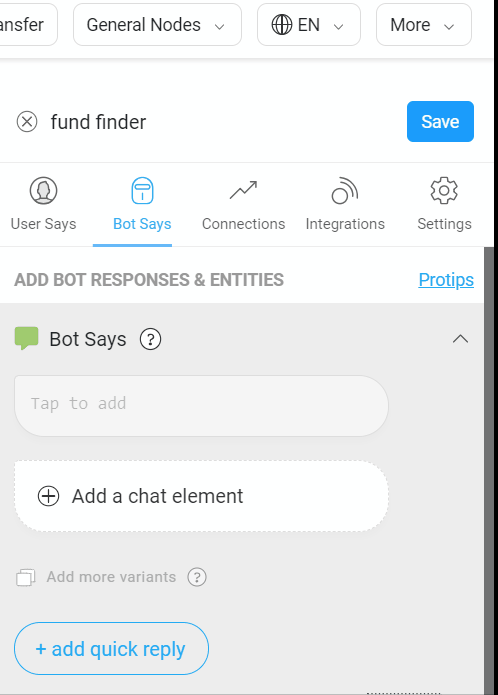

## ***Quick Replies***
The second type of chat elements we will look are `Quick Replies`. Quick Replies provide a way to present buttons to the user. The users can tap these buttons to send a message to the bot. 


Once the users tap on these buttons they automatically disappear and a text message gets sent by the user.

There are two ways to use Quick Replies:

### The Quick way to add Quick Replies
The first way is by clicking on the `+ add chat elements`. This is useful if you have already added other chat elements as responses and want to add 'Quick Reply' options at the end of the responses.

Once you click the `+ add chat elements` button, you will see a new button show up next to it. Here you can add the message you want to add in the quick reply. The message added here will be shown as the button text. It is also the message that will be sent by the user when they click the button.

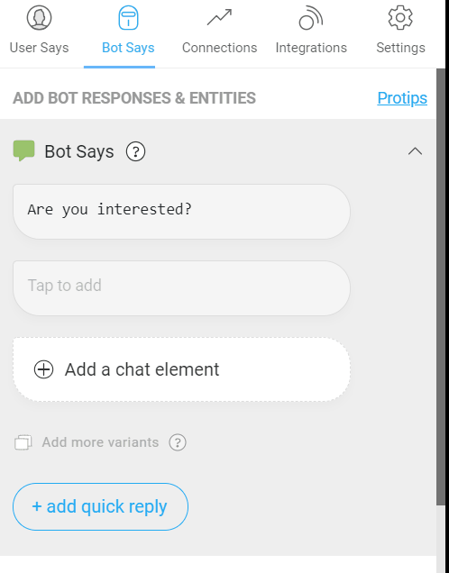

### Advanced options to add Quick Replies
The second way to add quick replies provides you with more configuration options. 

You can add quick replies using this option by clicking on the `+ Add a Chat Element`. This should slide a menu for adding HSL elements. Inside this menu the first option is the `Text & Quick Replies` option.

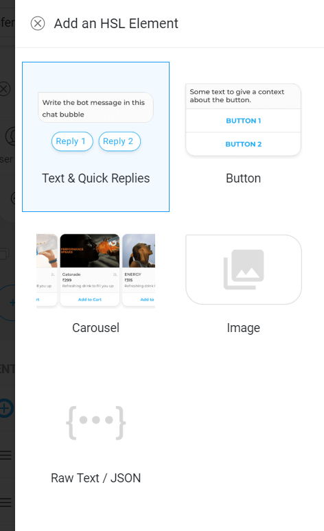

Using this option we can add some text followed by Quick Replies. To do this click on the `Text & Quick Replies` option. This should open a new menu. In this menu you can add any text you want in the Bot Says input field.

After adding the text you can click on the `+ Add Quick Reply` link below the text field. This should create a new quick reply with the default name as Quick Reply 1. If you add another quick reply it will be called Quick Reply 2 by default and so on.

You can edit the quick reply by clicking on it. Or if you have accidentally added it, you can delete it by clicking on the bin icon next to it. Once you open the quick reply for editing you will see three fields.

> Tip: You can see the preview of how any HSL chatbot would look inside the chat on the center of the screen.

#### Quick Reply
Using the first field you can edit the quick reply text. Whatever you put in here is what the user will see as the title of the button. This will also be the text message that will be sent on behalf of the user. 

#### Add a different user message
In some cases you might want to send more information than what can fit inside a button title. For example you might want to send a text message like "Yes, I would like to proceed with the booking". You can't put such a long message as the title of the button.

In such cases we can use this option to send a different user message. Just click on the `+ Add a different user message` link and enter the message you want to send.

#### Add a different gogo message
Additionally, in few cases you might want to send data which you don't want the user to see in the chat window. Your bot backend might need this information and you don't want to add all the info to the user message in the chat window. 

For example we might want to send the flight booking details in the user message like "Yes, I want to proceed. {from: Goa, to:Mumbai, date:31/03/2019, passengers:1}". Showing this message in the chat window is a bad experience but our backend still needs the information.

In such cases we can solve this option by clicking on `+ Add a gogo message`. Here you can add the message that the bot backend will receive when the user taps on the button.

> Note: On click of a quick reply, gogo message is the message that the bot receives. User message is the message that is seen in the chat window as the sent message.

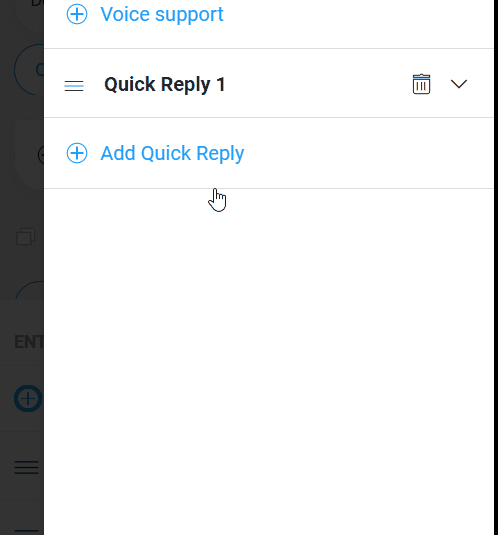

### Reordering Quick Replies
Sometimes you might want to change the order in which the quick replies are shown to the user. You can do this by using the hamburger menu on the left of the quick reply.

Just click and hold the hamburger menu and drag the quick reply to reorder it.


## ***Buttons***
In the previous section we looked at `Quick Replies` which are buttons that disappear after user clicks on them. But in some cases we might want to provide users with buttons that don't disappear after clicking on them. This is useful for menu like buttons which the user can click multiple times.

Also in some cases you might want to do more than just sending a text message on tap of the button. For example you might want to add a button to make a phone call or send an email.

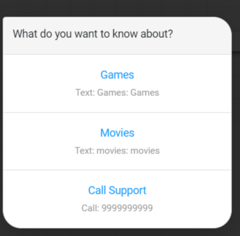

In such cases you can add persistent buttons of different types by choosing the `Buttons` option from the HSL menu.

On opening the Button menu, you have an option to enter the text message to be sent with the buttons. After adding the text message, you can click on the `+ Add Button` link to add a button.

Inside the button menu there are two fields. The first is the Button type and the second is the Button text. Button type refers to the type of the button. The different options available here are:

### Text
The first and most simple type of button is text. On clicking this button a text message is sent from the user to the bot.

To use this button type select the `Text` option in the button type dropdown. Then fill in the title of the button in the button text field. Finally, you can enter the message that needs to be sent in the Message to send field.


### Open Screen
In some cases you might want to open a new visual screen to collect some information or show some information. An example is opening a link to show a form or display information. In such cases you can use the `Open Screen` button type.

To use this button type just set the button type as `Open Screen`. Then set the button text and choose the type of screen you want to open. Some of the screen types available are:

* Carousel Detail: Opens a screen which has a carousel of image on the top and space underneath for text.
* Gallery Picker: Pops up the dialog to choose an image from camera / gallery.
* Launch Channel: Opens up a new channel. The details of the channel to be opened is given in the payload.
* Self Serve Recharge: Takes you the Recharge & Bills Screen. By default, the first tab (Recharge) is selected.
* Electricity: Takes you the Recharge & Bills Screen and selects Electricity tab.
* Send Location: Opens Place Picker and enables a user to send a particular location.
* Carousel Default: Opens up a screen which has little space on the top for text, followed by a carousel of images underneath it and a message sending area underneath it. Primarily built for the Food Delivery channel but still useful in many ways.
* App Authenticate: Used to get Uber authentication. Launches Uber app if available other wise fires up a web view.
* Profile: Opens up the Profile screen in the app.
* Wallet: Opens up the Wallet screen in the app. Useful to show the wallet balance.
* Wallet History: Opens up the Wallet screen and switches to Wallet History.
* Link: Fires up web view with a link provided in the payload.
* Send Multiple Locations: Used mostly in the Cabs channel to allow a user to select two locations and send it back as a message.
* Saved Addresses: Opens up the Saved Addresses screen with the list of saved addresses, if any. Otherwise, opens up the screen to save a new address.
* Transaction History: Opens up the Transaction History screen.

> Note: Most of these options are only available on the Android/IOS SDKs.

### Call
This option is useful when you want the user to be able to make a call on click of the button. Clicking this button will open the default calling app and prefill the number to be called.

You can use this by setting the button type as `Call`. Then you can set the button text and the Phone Number to be prefilled.

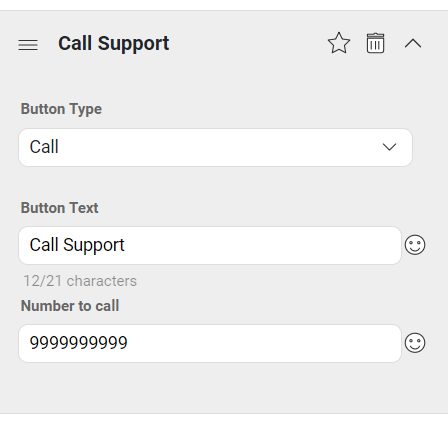

> Note: This option is only available on Android and IOS sdk.

### SMS
This option is useful if you want to let the user send an SMS on click of a button. Clicking this button will open the default SMS app on the users phone with a prefilled SMS message.

You can use this by setting the button type as `SMS`. Then you can set the button text and the SMS message to be prefilled.

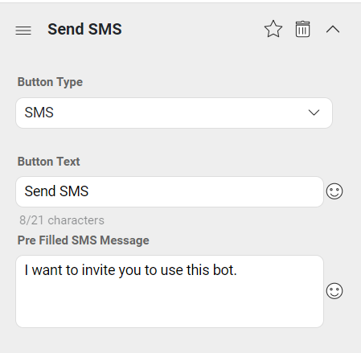

> Note: This option is only available on Android and IOS.

### Email
This type of button is useful when you want to let the user send an email on click of the button. You can configure the "to email address","subject" and "message" of the email in button settings. When the user clicks on the button, the bot will open the default email client of the user. It will preload the email data into the client as well.

You can use this button by setting button type as `Email`. Then you get options to set the button title, to email address, subject and the message body.


### Feedback Flow
This type of button can be used to trigger a feedback flow. The feedback flow asks the user to rate the bot on a scale of 5 stars. The user can also provide any specific feedback in free text form after that.

You can use this button by setting button type as `Feedback Flow`. After that you set the button text and click on Done to complete the setup.

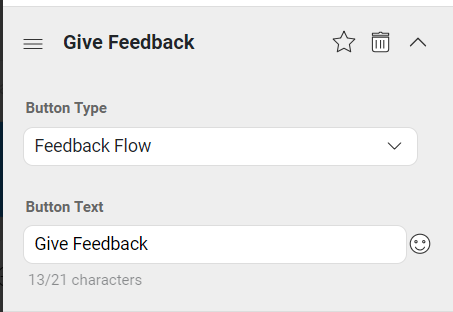

### Share
There might be cases where you want to let users share some content. In such cases you might want to provide a share button. 

You can add this button by setting the type as `Share`. After that you have options to provide

* Button text: The title or text inside the share button
* Image: The image to be shared on the click of the button
* Share Message: The message to be shared
* Whatsapp Share Message: In whatsapp there is an option to provide additional message while sharing things. This field can be used to add that message.
* Gogo Message: The message to be sent to the bot backend when user clicks the share button. This message can be used to track message clicks.
* Show Share Option: This option can be turned on if you want to show the native share options from Android/IOS.

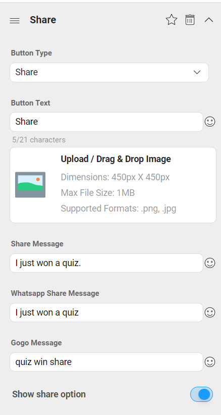

> Note: This option is only available on Android and IOS SDK.

## ***Carousel***
This type of chat element helps you build a carousel of elements. Each of these elements can have a thumbnail image, title, subtitle, description and buttons.

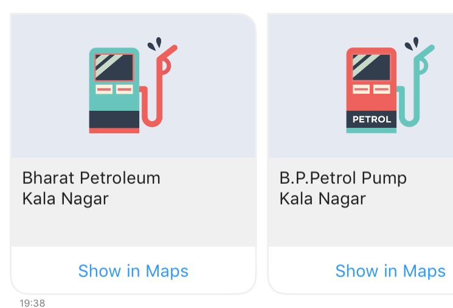

You can use this type of chat element by clicking on add a chat element and then selecting carousel. Inside the carousel menu we can edit the size of the carousel and also set the aspect ratio. You can then add a notification text to be sent with a carousel.


Then you can go into carousel details and add a image, a URL to open on click of the image, title, subtitle and description. Finally you can edit the button for the carousel with all the same options as the buttons in the previous section. You can also add or remove buttons as you need.

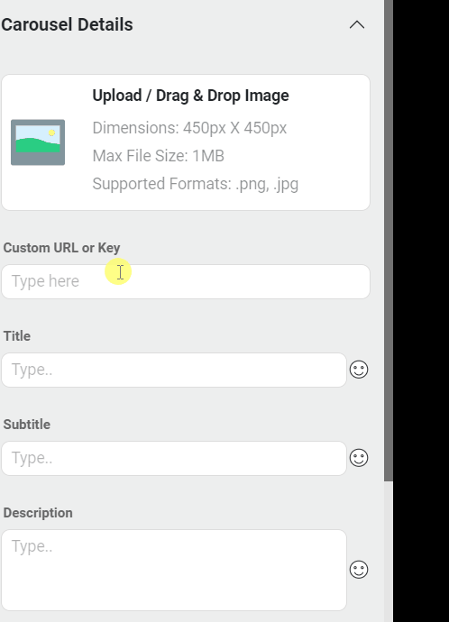

## ***Image***
This option allows you to send an image as a response to a user query. You can configure this by clicking on the `Add a chat element` link and then selecting Image.

After choosing Image as the chat element option you have several configuration choices. You can select the size and set the aspect ratio for the image. You can then add a text message to be sent with the notification and finally upload the image to be sent.

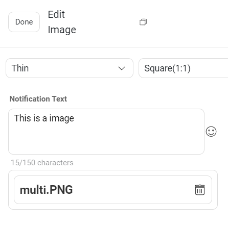

## ***Raw Text/HSL***
If you want to use a custom chat element you can use this option. A custom chat element is something that is not part of the standard elements mentioned above. 

In such cases you can enter the raw HSL code directly and that element will be rendered by the bots.

## ***Forms***

Whenever the input is expected from a user in a structured format, its best taken in a form. For example, address would be best taken over form with 3-4 fields.

Forms should have minimum two fields or else it would not make sense to use forms. Example, when you want to ask user their Name, Phone, Email and Address to register on your website.

You can configure Forms by clicking on the `Add a chat element` link and then selecting **Form Builder**.


After choosing Forms Builder as the chat element option you can set the **Form Title** and **Form Description**.

1. **Form Title**: This field should convey the action needed from the user. For example, if you are making a form to take delivery address, **Form Title** can be *Please help me with your Delivery address*. Also, it is an optional field.

2. **Form Description**: This is a description for the form. This will be visible on the form. Form Description is also an optional field.

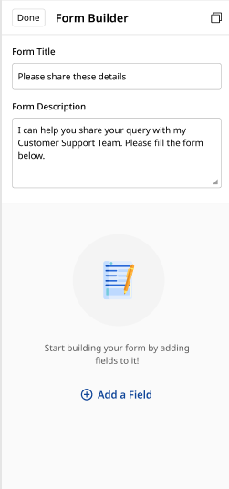

To add a new field on the Form, click on `Add a Field` button. A pop-up opens up with a list of all the different types of form fields you can choose from.

- **Text**: This can be used when you want a text input from the user.
- **Picker**: This can be used when you want a user to select any one option from the given multiple options using the dropdown.
- **Number**: This can be used to get number inputs from the user. Example - Mobile number, SSN, etc.
- **Email**: This can be used to get the Email-id from the user.
- **Date**: This can be used to get the date from the user. It uses the calendar widget where users can select the date.
- **Time**: This can be used to get the time from the user. It uses the clock widget where user can select the time.
- **Search**: This field will help you create search options on the IVA.

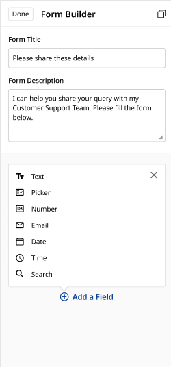

Let us look at each of these fields in detail.

### Text

Text Field allows user to provide input in textual or alphanumeric format.

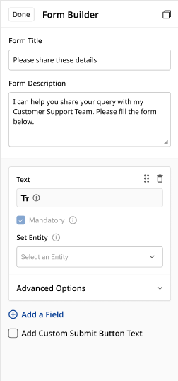

You will have to provide the following details to configure a text field on the form.

#### 1. Text: 

This text is a placeholder for the field and will be visible on this **Text field** before user starts typing on this field. To add the placeholder click on **Text** as shown below.


Example for **Text** -


#### 2. Form Icon: 

There is a dropdown of form icons available which can be used to add an icon for this **Text field**. The default icon is 
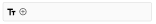

To select another icon, click on the **+** symbol

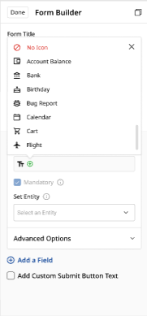

#### 3. Mandatory: 

Marking a field **Mandatory** will ensure that the user is providing a value for this **Text field**.


> Mandatory field will be automatically enabled if a mandatory entity is set in the **Set Entity** field.

#### 4. Set Entity: 

This option will provide you a dropdown of all the entities present on the node where you are adding Form HSL. You can select the entity whose value you want to capture using this **Text field**.

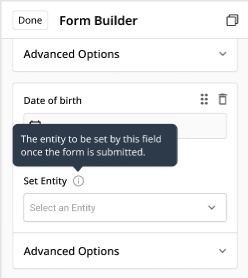

#### 5. Advanced Options: 

This option lets you add validation and the corresponding error message to display if the user is providing incorrect input in this particular field.

##### i. Validation

###### Default Validations

These are the existing types of validations present that you can choose from.

 - **Any**: As the name suggests. This will allow any text to pass. Basically, there will be no validation to this field.
 - **Alphabet (without whitespace)**: This can be used to capture one word entries like first names. Example, Bruce, Clark, Diana, etc.
 - **Alphabet (with whitespace)**: This can be used to capture multiple word entries like full names. Example, Bruce Wayne, Clark Kent, Diana Prince, etc.
 - **Alphanumeric (without whitespace)**: This can be used to capture Alphanumeric values without any space. Example, Card number - ABCH1234N
 - **Alphanumeric (with whitespace)**: This can be used to capture Alphanumeric values containing spaces. Example, Address in one line - 221B Baker Street, London
 - **Fixed Length** This can be used when the text entered has to be of a specific length. Example, if the length validation is set to be 4, then only words of length 4 characters will be allowed like tree, milk, etc.
 
 
 
 ###### Custom Validation
 Custom Validation accepts custom regex patterns. This is the most powerful validation functionality. The bot builder can use varied regex patterns to enable their fields to validate different input formats like credit card number, PAN card numbers, etc.

##### ii. Error Message

If any validation goes wrong, to inform the users that they have given an incorrect input, we can configure Error Message.

### Picker

 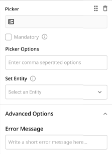

**Picker** field is used when you want a user to select any one option from the given multiple options using the dropdown. Example, list of cities in India.

To configure a Picker field, you will have to provide following details -

- [**Picker**](https://docs.haptik.ai/bot-builder/basic/chat-elements#1-text) - Click on the **Picker** text to add a placeholder for the Picker field. 

    `Example, Please select a city`

- [**Icon**](https://docs.haptik.ai/bot-builder/basic/chat-elements#2-form-icon) - Select an icon from the dropdown.

- [**Mandatory**](https://docs.haptik.ai/bot-builder/basic/chat-elements#3-mandatory) - Enabling the Mandatory checkbox will ensure the user is selecting a value from the dropdown.

- **Picker Options** - Enter the comma separated dropdown values

    `For above example of list of cities - Mumbai, Delhi, Kolkata, Chennai, Banglore`

- [**Set Entity**](https://docs.haptik.ai/bot-builder/basic/chat-elements#4-set-entity) - Select the entity to capture the value from dropdown.

- [**Error Message**](https://docs.haptik.ai/bot-builder/basic/chat-elements#ii-error-message) - If the user does not select a value from the dropdown, this error message will be shown to the user which will indicate the user to select an option from the dropdown.

### Number

Number field can be used to get number inputs from the user. Example, Mobile number.


To configure a Number field, you will have to provide following details -

- [**Number**](https://docs.haptik.ai/bot-builder/basic/chat-elements#1-text) - Click on the **Number** text to add a placeholder for this Number field.

    `Example, Please enter your mobile`

- [**Icon**](https://docs.haptik.ai/bot-builder/basic/chat-elements#2-form-icon) - Select an icon from the dropdown.

- [**Mandatory**](https://docs.haptik.ai/bot-builder/basic/chat-elements#3-mandatory) - Enabling the Mandatory checkbox will ensure the user is providing a value.

- [**Set Entity**](https://docs.haptik.ai/bot-builder/basic/chat-elements#4-set-entity) - Select the entity from the dropdown to capture the number.

- **Validation** - There are two different types of validation available

**i. Fixed Length** - This validation specifies that the number entered has to be of a specific length.

**ii. Range** - This validation mentions the range of digits it can accept. If a user inputs anything more or less than the range, it is treated as an invalid value.


- [**Error Message**](https://docs.haptik.ai/bot-builder/basic/chat-elements#ii-error-message) - If the user does not provide a value of either fixed length or in the specified range, this error message will be shown to the user which will indicate the user to provide a number value.

### Email

Email can be used to get the email id from the user.

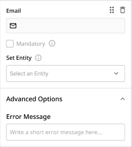

To configure an Email field, you will have to provide following details -

- [**Email**](https://docs.haptik.ai/bot-builder/basic/chat-elements#1-text) - Click on the **Email** text to add a placeholder for the Email field. 

    `Example, Please provide your email id`

- [**Icon**](https://docs.haptik.ai/bot-builder/basic/chat-elements#2-form-icon) - Select an icon from the dropdown.

- [**Mandatory**](https://docs.haptik.ai/bot-builder/basic/chat-elements#3-mandatory) - Enabling the Mandatory checkbox will ensure the user is providing the email id.

- [**Set Entity**](https://docs.haptik.ai/bot-builder/basic/chat-elements#4-set-entity) - Select the entity from the dropdown to capture the email id.

- [**Error Message**](https://docs.haptik.ai/bot-builder/basic/chat-elements#ii-error-message) - If the user does not provide an email id, this error message will be shown to the user which will indicate the user to provide their correct email id.

### Date

Date field type can be used to accept dates from the user.

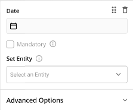

To configure a Date field, you will have to provide following details -

- [**Date**](https://docs.haptik.ai/bot-builder/basic/chat-elements#1-text) - Click on the **Date** text to add a placeholder for the Date field. 

    `Example, Check-in Date`

- [**Icon**](https://docs.haptik.ai/bot-builder/basic/chat-elements#2-form-icon) - Select an icon from the dropdown.

- [**Mandatory**](https://docs.haptik.ai/bot-builder/basic/chat-elements#3-mandatory) - Enabling the Mandatory checkbox will ensure the user is providing the date.

- [**Set Entity**](https://docs.haptik.ai/bot-builder/basic/chat-elements#4-set-entity) - Select the entity from the dropdown to capture the date.

- **Validation** - You can mention both the Start Date and End Date from which the user can select any one date or you can set either of them.

    `Example, if the Start Date is 01-01-2001 and End Date is 01-01-2099, then the user will only be able to see the dates between these range`

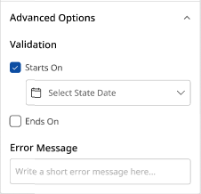

- [**Error Message**](https://docs.haptik.ai/bot-builder/basic/chat-elements#ii-error-message) - If the user did not select any date, this error message will be shown to the user which will indicate the user to select a date.

### Time

Time field is used to get the time from a user. It uses the clock widget where user can select the time.

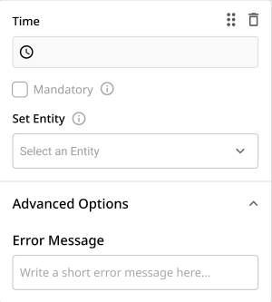

To configure a Time field, you will have to provide following details -

- [**Time**](https://docs.haptik.ai/bot-builder/basic/chat-elements#1-text) - Click on the **Time** text to add a placeholder for the Time field. 

    `Example, Check-in Time`

- [**Icon**](https://docs.haptik.ai/bot-builder/basic/chat-elements#2-form-icon) - Select an icon from the dropdown.

- [**Mandatory**](https://docs.haptik.ai/bot-builder/basic/chat-elements#3-mandatory) - Enabling the Mandatory checkbox will ensure the user is providing the time.

- [**Set Entity**](https://docs.haptik.ai/bot-builder/basic/chat-elements#4-set-entity) - Select the entity from the dropdown to capture the time.

- [**Error Message**](https://docs.haptik.ai/bot-builder/basic/chat-elements#ii-error-message) - If the user does not provide any time, this error message will be shown to the user which will indicate the user to provide the time.

### Search

Search field will help you create search options on the bot. This is similar to Picker field. In Picker field, you have to mention comma separated values whereas in Search, the dropdown is populated using API.

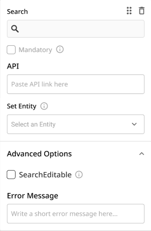

To configure a Search field, you will have to provide following details -

- [**Search**](https://docs.haptik.ai/bot-builder/basic/chat-elements#1-text) - Click on the **Search** text to add a placeholder for the Search field. 

    `Example, Search my City`

- [**Icon**](https://docs.haptik.ai/bot-builder/basic/chat-elements#2-form-icon) - Select an icon from the dropdown.

- [**Mandatory**](https://docs.haptik.ai/bot-builder/basic/chat-elements#3-mandatory) - Enabling the Mandatory checkbox will ensure the user is either selecting or providing a value.

- **API** - When we want some custom response or inputs from an external API, we put the API URL here.

This API's Request and Response format is mentioned below -

```
Request:

<YOUR API URL>?query=<the actual search string>&user_id=<actual user_id of that user>&user_name=<user name if present else undefnied>

Response:

{
	"success": true,
	"data": [{
		"title": "<title of the first element in the search result>"
	}, {
		"title": "<title of the second element in the search result>"
	}],
	"query": "pune",
	"error": ""
} 
```

- [**Set Entity**](https://docs.haptik.ai/bot-builder/basic/chat-elements#4-set-entity) - Select the entity from the dropdown to capture the value.

- **SearchEditable** - This field makes the Search option flexible by allowing users to select a value which is not present in the dropdown.

    `Example - If the API is not returning Pune as a dropdown option, then the user can type Pune and it will be captured by the Set Entity`

- [**Error Message**](https://docs.haptik.ai/bot-builder/basic/chat-elements#ii-error-message) - If the user does not select any option from the dropdown, this error message will be shown to the user which will indicate the user to provide or select the value.

### Deleting a Form Field

You can delete a particular Form Field using the delete button visible on the right side of the field. 

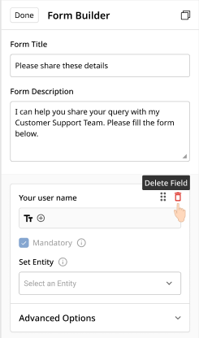

The pop-up appears to confirm if you want to delete the field.

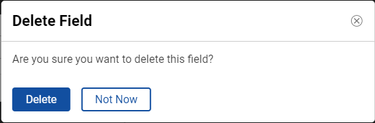

### Customize Send Button

There is a **Send** button which appears on the form which the user has to click to send the form details. Once the user clicks on **Send** button, the text appearing on the button changes to **Sent**.

You can customize this text which appears on the button by enabling the **Add Custom Submit Button Text** checkbox and providing the before and after text for the buttons.

    `Examples for custom Button Text - Register, Submit, Proceed, etc`

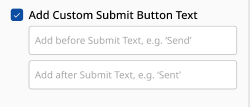

### Re-order the Form Fields

You can restructure the form fields and organize them again once they all have been created using the grip option as shown below.

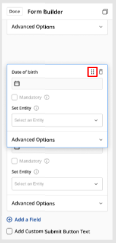

### Form HSL on the bot

Using the fields above once we have completed building the bot, it will be displayed as shown below -

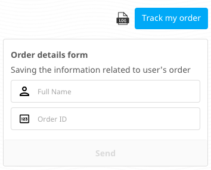

Error messages on the various form fields which we have configured come up right below the field as shown below -


