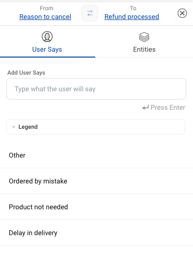
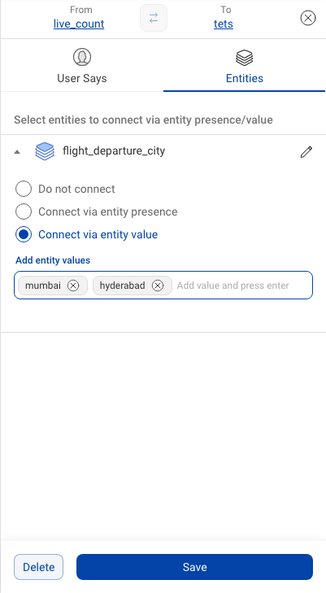
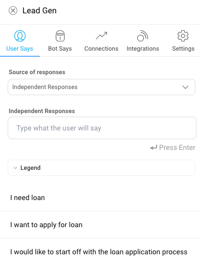
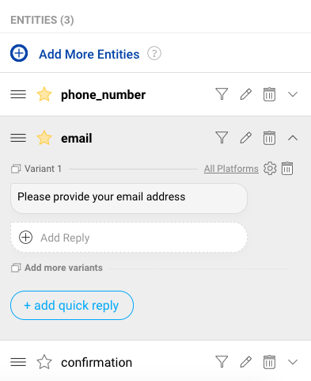
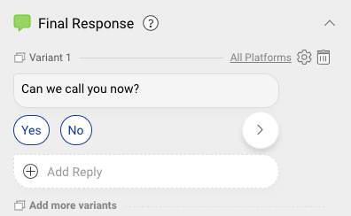
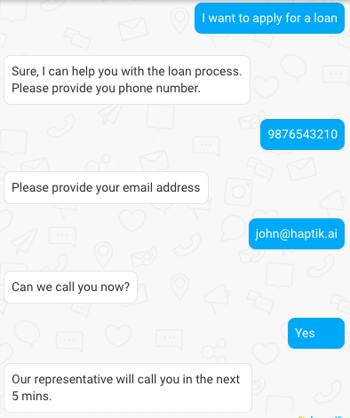
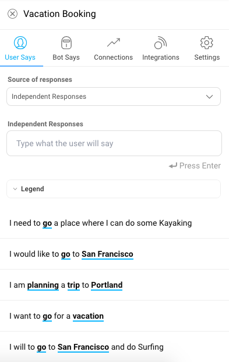
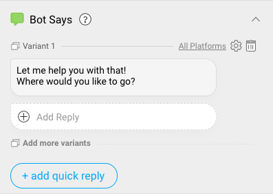
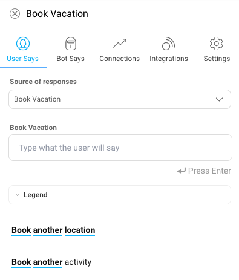
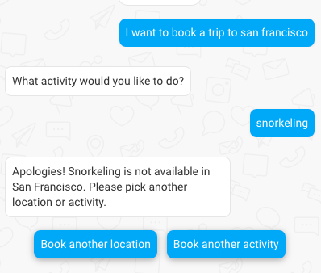

### What are Connections?

Connections represent the **path a conversation takes** from node to node. Depending on the response a user inputs to the bot, they traverse down a different connection to the appropriate next node. 

Bot builders must modify every connection they create to indicate which user inputs correspond to which nodes.

### Creating Connections?
You can create a connection between two nodes by clicking on the parent node, holding shift and dragging to the child node as shown below:

### Static Node to Static Node Connection Transition 
You might want to transition from one static node to another based on the user's input to branch into a different information collection flow.

The connections you create can prompt a user to transition from one node to the next in the following three ways:

#### 1. Transition based on messages sent by user (User Says based Connection):

This is when a conversation moves from one node to another based on a particular keyword/phrase or set of keywords sent by a user.

* To set a connection based on a user input, click on the arrow linking the two nodes you need to connect

* The **User Says** tab opens up, here you can add the user variations as shown below - 

> The User Says section on the connected node (a non-start node) will only contain Negative Responses as the **Source of responses**. Negative Responses are the user says for which you do not want the connection to happen. This is being shown in the GIF below

#### 2. Transition based on values of entities given by user (Entities based Connection):

You can create a connection between two nodes on the basis of the values collected from the user in the forms of Entitites.

There are 3 options when you open the Entities tab on the Connection line.

**1. Do not connect**:

This option will not use the selected entity for the connection. For example, if you do not wish to connect Node 1 to Node 2 on the basis of person_name, you can select the Connection as **Do not connect**.

**2. Connect via entity presence**:

When you’ve added an entity to a conversation, you can define the transition from the node with the entity to the next as only being possible if the user has input a response that falls within the entity. This is particularly helpful when you are setting a conversational flow in which a user needs to input something like a phone number or email ID. All values within the entities are accepted, but the bot will be able to determine whether or not the user has input the correct type of value (i.e. a 9 digit number or a complete email address)

**3. Connect via entity value**:

You can create a connection on the basis of a particular value(s) of an entity.

* Here, you **add the entity value** and **press the enter key** on your keyboard. You can add multiple values for this entity.

> The entities from the first node automatically appears in a drop down menu. Select from the list to complete the creation of a transition based on entity presence.

### Static Node to Code Node Connection Transition 

Transition from a static node to code node happens automatically once all the required entities are collected. 

However, if the static node is connected to another static node and has a user says or entity based transition and the condition for these transitions get satisfied then the transition will happen to the connnected static node and not the connected node.

### Code Node to Output Node Connection Transition 

You can transition from a code node to any output node basis a set of rules/conditions applied on the output JSON from the code node.

**Transition Basis Rules on Output JSON:**

You can apply a combination of rules combined by either `AND` or `OR` to traverse from one node to the other.

You can add rules in the following way:

* Click on the connection between a code node and an output node to open the RHS window.
* Select the condition combination type as `AND` or `OR`.
* Next select the variable from the JSON on which you want to add condition. For example, choose the `Salary` field from the JSON output.
* Next select the conditional operator that you want to apply from the dropdown. For example, choose the operator as `Greater Than`. 
* Finally enter the value to complete the rule. For example we can enter the value as `25000`. Now the rule becomes `Salary Greater Than 25000` and the node will be traversed whenever this condition is true.
* You can add another rule using the `+ Add Condition` button from the top menu of the RHS window. 

### Output Node to Static Node Connection Transition 

You can transition from an output node to a static node based on User Says or Entities. This functions the same way as **Static to Static Connection**.

### Unsupported Connections

Following are **unsupported types of connection**:

1) Static Node to Output Node Connection Transition
2) Code Node to Code Node Connection Transition
3) Output Node to Output Node Connection Transition
4) Output Node to Code Node Connection Transition

### Connection Guidelines

#### *When should you add a connection?*

1. If chat flow contains a conditional logic and you need to take action based on the user response or entity value

	For example: When you would like the user to select the preferred language before continuing with the chat flow.
	
	

2. If the chat contains a linear flow, but as we have a conditional logic for validation, split the logic into two nodes and transition to child node is done using dependent response or entity based transition.

	
	
3. Do not mark the Node as **Context Clear Node** if there is a connection to another Node on the basis of **entity**. As marking a Node as Context Clear Node clears out all the entity values collected till the present Node, the connection won't proceed further because the IVA will lose the information at the Context Clear Node.

#### *When should you have an incoming connections to a non-start node?*

Parent node connected to two child nodes and entity value based transition

When user wants to apply for a loan. **_‘Lead Generation node’_** should be able to understand the users goal and guide user through loan application process  and collect the _phone_number_ , _email_, _confirmation_ entities. Check with the user if representative can call the user right away and save the users response in ‘_confirmation_’ entity. Use entity value based transition to traverse to the child node.

* **_User says_** - User says section should contain different patterns of user utterances. Consider ‘Lead Generation’ node - 

* **_Bot says_** - Add a message to confirm that the bot understood user’s goal and ask user to provide the phone number.

* **_Entity_** - Create mandatory entities _phone_number_, _email_ and _confirmation_ entities. Add the default message for all these entities.

* **_Final Response_** - Once the user selects one of the quick responses ‘Yes’ or ‘No’. Use that to traverse to the child node. User chat -

Make the _confirmation_ entity non-mandatory and use the final response to get a confirmation from the user to transition to the child node.

### Self Connecting Nodes

Self connecting nodes are used for maintaining the conversation state at the same node by entering user says and for entity based node identification for start nodes.

1. Conversation state maintains the same node by default when new entities for that node are detected in most recent user says and they are not used for transitioning to other nodes. However bot will break in above scenarios if there is no change in entities unless sentences such as ‘**Show me more options, I need other alternatives, I did not like this item. Is there any better product?’** are present in connection responses while connecting node to itself.

	*For example: When you need pagination to display a carousel of nearby ATMs and based on the entity value ‘***_Show me more_***’ transition, the same node is triggered to show the next set of ATMs.*

2. Entity based node detection for start nodes is done by creating a Start Node with a self connection and an Entity Presence/Value Based transition. If you start a new conversation with a message that contains the specific entity you used for transition, then the node will be detected. 

	*For example: When user wants to book a vacation in a _city_ to do an _activity_. **_‘Vacation Booking node’_** should be able to understand the users goal to book a vacation and collect the _city_ and _activity_ entities.*

	* **_User says_** - User says section should contain different patterns of user utterances. Consider ‘Vacation Booking’ node - 

	

	* **_Bot says_** - Add a message to confirm that the bot understood user’s goal and ask user to provide the city information.

	

	

	* **_Entity_** - Create mandatory entities _city_ and _activity_. Add the default message for both these entities.

	

	* **_Final Response_** - Perform validation via integrations and send out a message based on the validation result. 

	

	

> *Warning*: Perils of self connected nodes - When the node is self connected with the purpose to retry the collection of user’s phone number. Phone number used under a different context will still lead the user to the self connected node.

