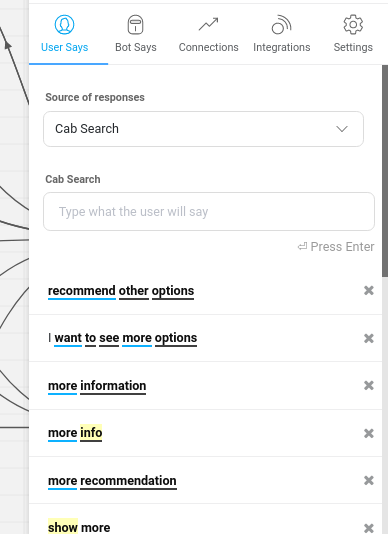
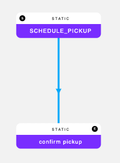
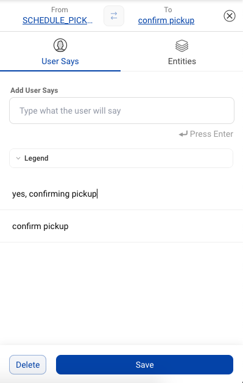
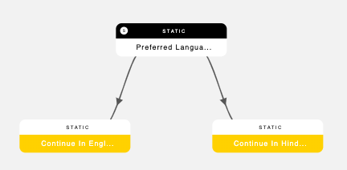
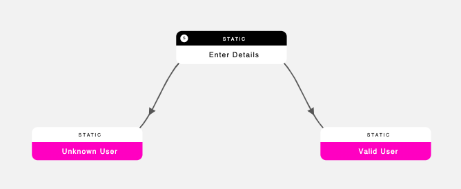

This section will cover the following topics:  
[What are connections?](#what-are-connections)  
[Connection Transition](#connection-transition)  
[Dependent Response](#dependent-response)   
[Connection Guidelines](#connection-guidelines)   

### What are Connections?

Connections represent the path a conversation takes from node to node. Depending on the response a user inputs to the bot, they traverse down a different connection to the appropriate next node. Bot builders must modify every connection they create to indicate which user inputs correspond to which nodes.

### Connection Transition 

The connections you create can prompt a user to transition from one node to the next in the following three ways:

**1. Basis message input by user:**

This is when a conversation moves from one node to another based on a particular keyword/phrase or set of keywords sent by a user.

* To set a connection based on a user input, click on the arrow linking the two nodes you need to link

* Click on 'Connection Responses,' which will take you to the following screen.

* Decide which type of user input you want to set as an indicator to transition to the next node.

    * Independent Responses: Adding potential user inputs here indicates to the bot that a user may transition to this next node from any point in the conversation as long as their input sufficiently matches the responses input by the bot builder.

    * Negative Responses: Adding user inputs for which, you do not want the connection to happen.

    * Responses from 'Previous_Node': This lets you limit the flow of conversation so that a user can only reach the next node if the bot has received a response from the specific preceding node.

**2. Basis a particular entity value**

(a.k.a. a Step Transition): The last type of transition that you can create is where a user may only move to the next node if a user inputs a specific value(s) from within an entity on a node.

* To set a step transition value, click the arrow between the two nodes for which you're creating a connection

* Select Step Transition Values, which will take you to the screen below

* Here, you add the entity value and press the enter key on your keyboard. You can add multiple values for this entity.

**3. Basis a particular entity presence**

When you’ve added an entity to a conversation, you can define the transition from the node with the entity to the next as only being possible if the user has input a response that falls within the entity. This is particularly helpful when you are setting a conversational flow in which a user needs to input something like a phone number or email ID. All values within the entities are accepted, but the bot will be able to determine whether or not the user has input the correct type of value (i.e. a 9 digit number or a complete email address).

* To set a connection based on an entity presence, click on the arrow connecting the two nodes you're looking to connect. This will take you to the following screen:

* The entities from the first node should automatically appear in a drop down menu. Select from the list to complete the creation of a transition based on entity presence.

### Dependent Response

If you have connecting nodes, and you want the child node to be detected only when the user says something on the parent node, then you can use Dependent Responses.

**How to add Dependent Responses?**

To add dependent responses to transition from parent node to the connecting child node, follow the steps mentioned below -  

1. Click on connection between the two nodes

1. This should show a Menu on the right side of the screen, which will allow you to add user says utterances, that will transition user from parent node to the connecting child node.

For example, consider a use case where you want to confirm the **‘scheduled pickup time’** with the user. You will have two connecting child nodes - confirm pickup and refuse pickup. All user says variations added here are ‘Dependent Response’. The right child node is detected when user utterance matches the dependent response.

### Connection Guidelines

#### *When should you add a connection?*

1. If chat flow contains a conditional logic and you need to take action based on the user response or entity value

	For example: When you would like the user to select the preferred language before continuing with the chat flow.

	

2. If the chat contains a linear flow, but as we have a conditional logic for validation, split the logic into two nodes and transition to child node is done using dependent response or entity based transition.

	For example: When you want to validate a user’s phone number to ensure that it is a valid user before continuing with the char flow. ***_Enter Details _*** contains an integration function that validates user’s phone number and transition to the child node is done based on the response.

	

#### *When should you have an incoming connections to a start node?*

When user message on connection and on the independent response on the start node is different

For example: When you would like to transition to the child based on single words such as voice or data.

	User says: I want to recharge

	Bot says: What would you like to recharge? Data plan or Voice plan?

	User says: voice

	Bot says: Sure! Let me go ahead and fetch the voice recharge plans

Adding single words like voice, data, recharge, plan or phrase like data plan, what is the process, how to get without any context around the word or phrase is a bad practise. It will cause conflicts and lead to a false response.

#### *When should you have an incoming connections to a non-start node?*

Parent node connected to two child nodes and entity value based transition

When user wants to apply for a loan. **_‘Lead Generation node’_** should be able to understand the users goal and guide user through loan application process  and collect the _phone_number_ , _email_, _confirmation_ entities. Check with the user if representative can call the user right away and save the users response in ‘_confirmation_’ entity. Use entity value based transition to traverse to the child node.

* **_User says_** - User says section should contain different patterns of user utterances. Consider ‘Lead Generation’ node - 

* **_Bot says_** - Add a message to confirm that the bot understood user’s goal and ask user to provide the phone number.

* **_Entity_** - Create mandatory entities _phone_number_, _email_ and _confirmation_ entities. Add the default message for all these entities.

* **_Final Response_** - Once the user selects one of the quick responses ‘Yes’ or ‘No’. Use that to traverse to the child node. User chat -

Make the _confirmation_ entity non-mandatory and use the final response to get a confirmation from the user to transition to the child node.

### Self Connecting Nodes

Self connecting nodes are used for maintaining the conversation state at the same node by entering user says and for entity based node identification for start nodes.

1. Conversation state maintains the same node by default when new entities for that node are detected in most recent user says and they are not used for transitioning to other nodes. However bot will break in above scenarios if there is no change in entities unless sentences such as ‘**Show me more options, I need other alternatives, I did not like this item. Is there any better product?’** are present in connection responses while connecting node to itself.

	*For example: When you need pagination to display a carousel of nearby ATMs and based on the entity value ‘***_Show me more_***’ transition, the same node is triggered to show the next set of ATMs.*

2. Entity based node detection for start nodes is done by creating a Start Node with a self connection and an Entity Presence/Value Based transition. If you start a new conversation with a message that contains the specific entity you used for transition, then the node will be detected. 

	*For example: When user wants to book a vacation in a _city_ to do an _activity_. **_‘Vacation Booking node’_** should be able to understand the users goal to book a vacation and collect the _city_ and _activity_ entities.*

	* **_User says_** - User says section should contain different patterns of user utterances. Consider ‘Vacation Booking’ node - 

	

	* **_Bot says_** - Add a message to confirm that the bot understood user’s goal and ask user to provide the city information.

	

	

	* **_Entity_** - Create mandatory entities _city_ and _activity_. Add the default message for both these entities.

	

	* **_Final Response_** - Perform validation via integrations and send out a message based on the validation result. 

	

	

> *Warning*: Perils of self connected nodes - When the node is self connected with the purpose to retry the collection of user’s phone number. Phone number used under a different context will still lead the user to the self connected node.

