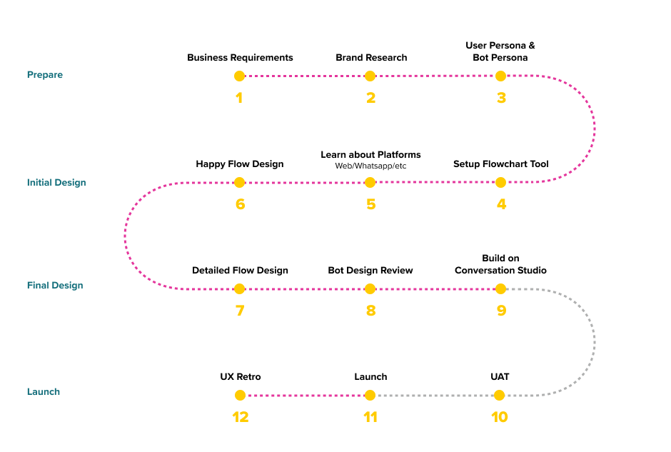

**Welcome to Conversation Design**. 

As per a Gartner report, 70% of white-collar workers will interact with conversational platforms on a daily basis by 2022. But success for any conversational platforms depends heavily on the Conversation Design that goes behind the functioning of that platform. Hence, before you begin to build your Intelligent Virtual Assistant, it is essential to create a design framework with the user's conversational journey first.

At Haptik, we define **Conversation Design** as the art and science of crafting an experience between a virtual assistant and the end-user. The end objective is to craft conversations that are natural and intuitive while scaling these conversations across platforms for all users.

For a successful Conversation Design, you have to think like an architect, mapping what users can do in the space while considering the use-cases and the technological constraints. As a Conversation Designer, you create the conversations, define the flow and its underlying logic in a detailed design document to represent the complete user experience. Conversation Designers partner with stakeholders and developers to iterate on the designs and bring the experience to life. 

💡 Getting through clarity early in the design phase minimises the effort spent at making changes in the bot building phase.

## What is the process

Conversation Design entails the entire structure of your Intelligent Virtual Assistant that spearheads your bot building process.

- Start with prioritising the use cases basis the business requirement and understand the channel where you will be deploying your IVA. For example, Website, Mobile App, WhatsApp, Facebook Messenger, SMS, etc.

- Now review user data and behaviour to define a set personality for the IVA

- Select a design tool to start designing user journeys as per the use case specified 

- Iron out edge cases and roadblocks through review and testing

- Finally use this framework to build and deploy conversational journeys on our Haptik platform for a seamless IVA building experience
