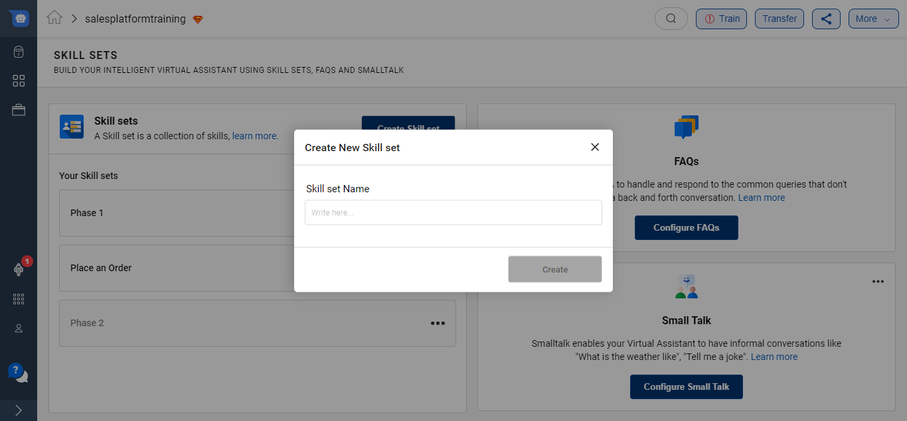
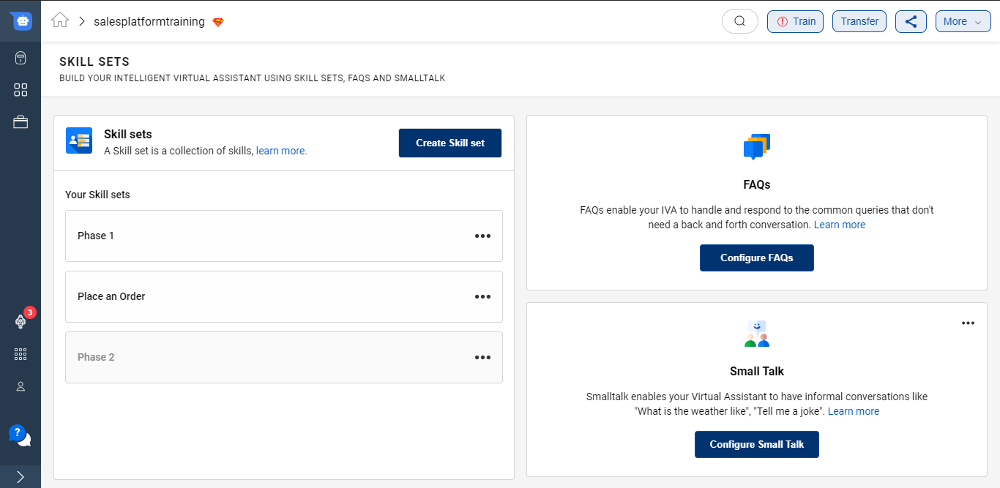
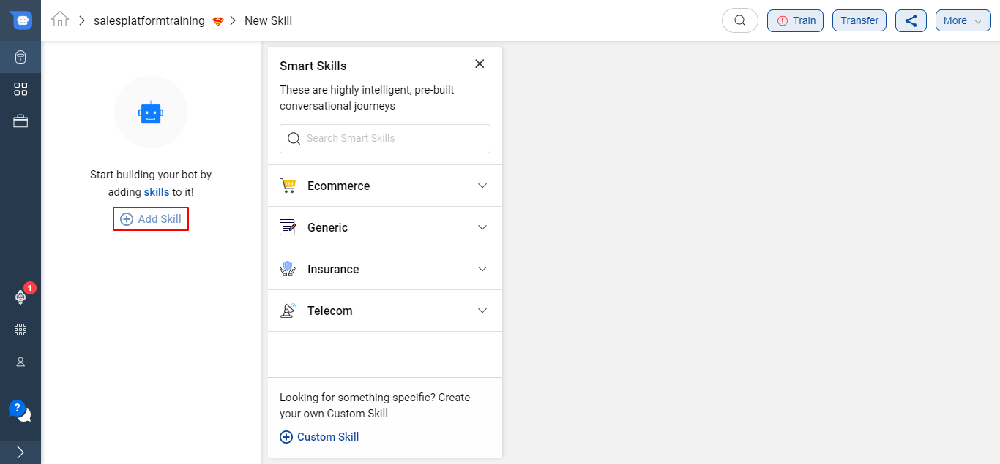
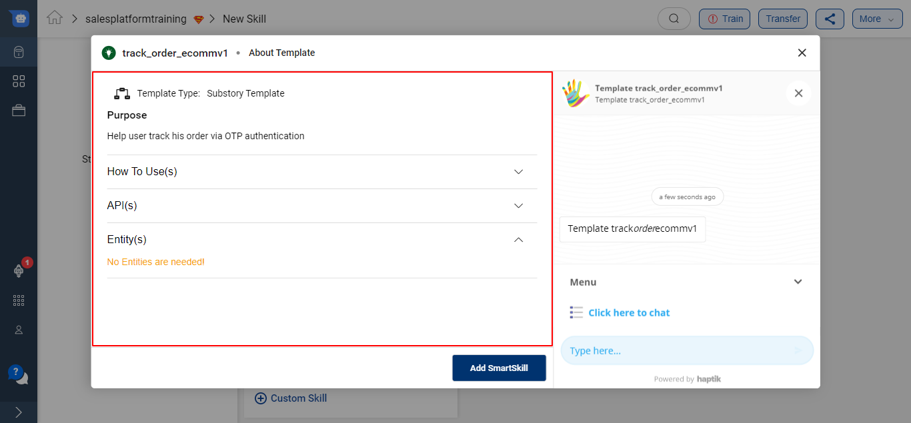
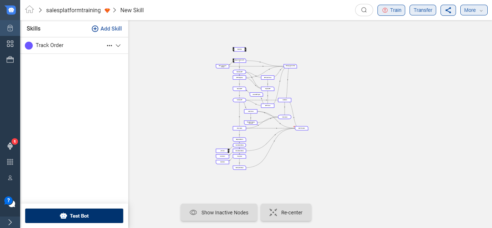
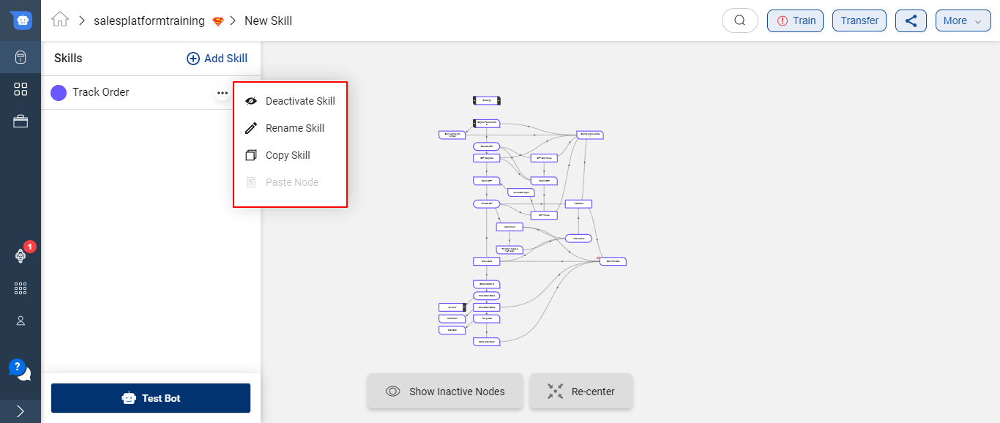
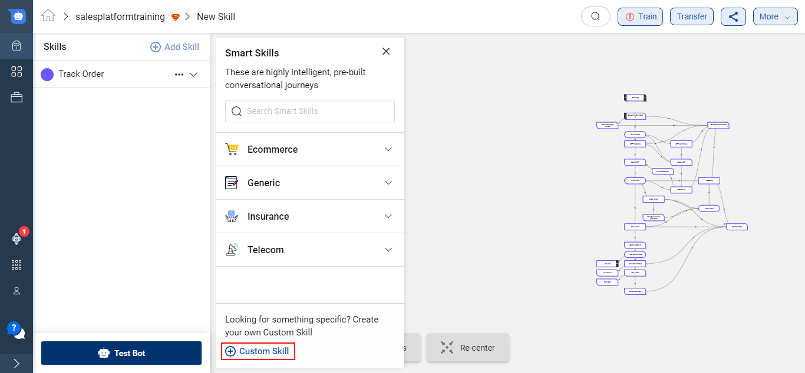
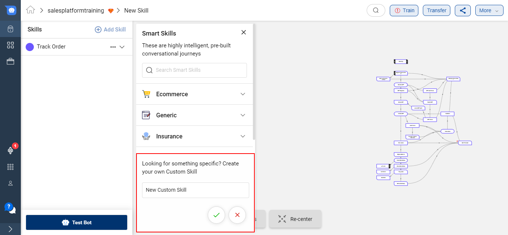
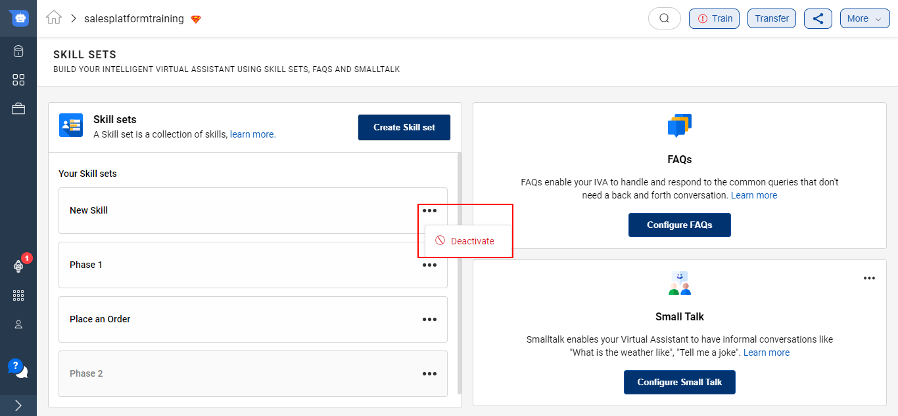
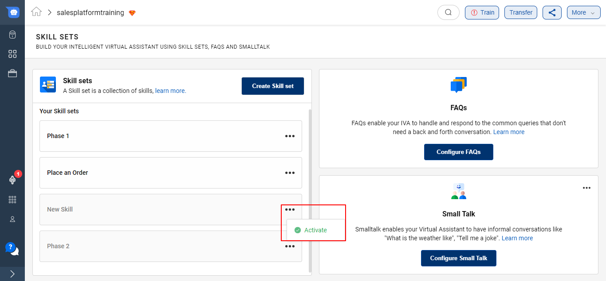

Conversation Studio allows you to build **Intelligent Virtual Assistants (IVA)s** which is equipped with various skills, handles FAQs and responds to casual conversations. **Skill Sets**, **FAQs** and **Small Talk** sections handle all these requirements respectively.

## Skill Sets

A **Skill Set** is a collection of skills that enable your IVA to handle queries that need a complex conversational journey. These skills help the user to resolve their queries. A Skill Set aligns with the overall goals of the IVA.  

On Conversation Studio, a varied array of these skills are already present and are known as **Smart Skills**. You can read more about them [**here**](https://docs.haptik.ai/bot-builder/basic/smartskills).

### Create Skill Set

To add a new Skill Set to your IVA, click on **Create new Skill set** button. Provide a name to your skill set.

Once you give a name you will be able to see the following screen - 

### Use Smart Skills

Click on the Skill Set to go inside and add skills to the respective skill set. **Skills are the smaller tasks that helps to accomplish the broader Skill sets.**

Click on the **+Add Skills** button to add required skills on the IVA. As soon as the button is clicked, a modal would open showcasing all skills available on the platform.

> **Smart Skills** are highly intelligent, pre-built conversational journeys.

There smart skills are available for specific industries like **Ecommerce**, **Insurance** and **Telecom**. There are also few **Generic** ones which are most widely used in all IVAs.

There is a **Search option** available to look for your desired Smart Skill as well.

Once you click on any Smart Skill, a pop-up modal opens up which mentiones all the details about the Smart Skill.

You can also test out the Smart Skill under the modal before using it in your IVA. This **preview and test option** helps to understand the capabilities of the skill in more detail.

Once you have tested the Smart Skill and if it aligns with your use-case, go ahead and click on the **Add SmartSkill** button.

The entire Smart Skill will be imported on your IVA as shown below - 

On the Left hand side, you will be able to see the list of all the Skills added on your IVA.

There are 4 options available for every Skill -

1. Deactivate Skill - This is deactive the selected Skill and the IVA will no longer respond to users query from this Skill.
2. Rename Skill - You can rename the select Skill
3. Copy Skill - This option will allow you to copy the entire Skill and then you can paste it on onther IVA.
4. Paste Node - This options allows you to paste node that you copies from another Skill.

### Create a Custom Skill

If the Smart Skills available on the Conversation Studio are not aligning with your use-case you can create a Custom Skill.

To add a Custom Skill, click on the **+ Custom Skill** button. This button would be at the bottom of the modal which opens up on the click of **+ Add Skill** button.

Provide the purpose of the skill i.e. name to your Custom Skill and click on the green tick

Once a new Skill is created successfully, you can start adding Nodes on the skill to start with your conversational journey. To know more about Nodes, click [**here**](https://docs.haptik.ai/bot-builder/basic/creating-nodes).

### Activate/Deactivate a Skill Set

If your Skill Set is no longer required on your IVA, you can simply deactivate it, as shown below -

You can re-activate the Skill set as well

## FAQs

**FAQs section** enable your IVA to handle and respond to the common queries that don't need a back and forth conversation. You can either upload all FAQs at once using a CSV or add it one by one. To know more about FAQ Nodes, click [**here**](https://docs.haptik.ai/bot-builder/basic/general-nodes).

## Small Talk

Smalltalk is a plugin that enables your IVA to have informal conversations like "What is the weather like", "Tell me a joke". This plugin provides 99+ such conversational intents with their predefined responses. You can go ahead and tweak these responses suiting your brand and IVA. To know more about Small Talk, click [**here**](https://docs.haptik.ai/bot-builder/basic/smalltalk).
