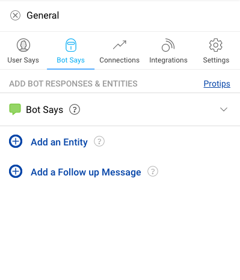
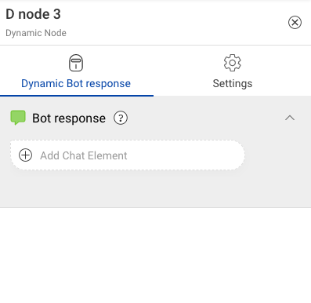

### What is a Node?

**Nodes** are the interlinked building blocks of an IVA. Each node acts like a gatekeeper which detects user inputs, sends out appropriate responses, and directs users to the next node. They are the points where conversation converges or diverges basis the information users input to the IVA. 

Nodes are comprised of several important sub-components, which house important pieces of information.

### Different Types of Nodes
The Conversation Studio tool provides three types of nodes. Each node has a specific purpose and the different nodes can be used together in different combinations based on the use case.

The three types of nodes are:

* Static Node
* Code Node
* Output Node

### Purpose and Subcomponents of Static Nodes

The purpose of a static node is to present static information to the user like greeting message, menu options etc and to then collect information from the user that is required to perform business logic.

**Subcomponents**

#### 1. User Says

User says are the inputs from the user that the IVA needs to interpret the user’s goal. It is important to add and train the IVA with a variety of different sample user says for each node, so that the IVA can identify the correct intents and extract information (entities) from the user utterance.

Whenever a user sends a message, IVA tries to understand what the User is saying using various Machine Learning algorithms and find the corresponding node. One of the key modules which is used for node identification is **Intent Detection Module**, which is a suit of many Machine Learning algorithms that help in finding the right node.

To know more about User Says, click [**here**](https://docs.haptik.ai/bot-builder/basic/user-says-guidelines).

#### 2. Bot Says

Once you've completed the User Says component of a node, you'll need to define the node's Bot Says section. Bot Says is where a Node stores the replies that are sent in response to the user's message.

To know more about Bot Says, click [**here**](https://docs.haptik.ai/bot-builder/basic/bot-says).

#### 3. Connections

Connections represent the path a conversation takes from node to node. Depending on the response a user inputs to the IVA, they traverse down a different connection to the appropriate next node. Bot builders must modify every connection they create to indicate which user inputs correspond to which nodes.

To know more about Connections, click [**here**](https://docs.haptik.ai/bot-builder/basic/connections).

#### 4. Integrations

Integrations allow you to connect your IVA to external services to perform dynamic operations like fetching data, posting data or performing some business logic over the collected entities from the IVA.

To know more about Integrations, click [**here**](https://docs.haptik.ai/bot-builder/integrations/introduction).

#### 5. Settings

When you drag and drop a node on the Conversation Studio graph, the **Settings** tab opens up.

To know more about the fields on the Settings tab, click [**here**](https://docs.haptik.ai/bot-builder/basic/creating-nodes#creating-a-node).

### Purpose and Subcomponents of Code Nodes

The purpose of a code node is to take the input collected from the static and use custom code to perfrom business logic on it. The advantage of moving this to a seperate node is that it helps you in seperating out the code and non-code features of bot building. 

The code node takes the input from the static node in a JSON format with certain [parameters](../integrations/integration-parameters.md). It processes this input JSON according to business logic and returns an output JSON.

Additionally, this gives you more power with respect to what you can do with the output from the integration code as we will in the next section and the [connections](connections.md) section.

**Subcomponents**

1. [Integrations with Custom Code](../integrations/integrating-custom-code.md)

### Purpose and Subcomponents of Output Nodes

The purpose of output node is to take the JSON output from the code node and build dynamic bot says that use parameters from this output in the HSL.

Bot Builders can take advantage of an easy-to-use JSON picker in the bot says section to build the HSL using parameters from the output JSON.

The output node also allows you to collect non mandatory entities that might be needed to proceed in the chat flow. Because the entity is non mandatory there will be no reprompts if the user enters an incorrect value.

**Subcomponents**

1. [Bot Says](bot-says.md)

### Creating a Node

You will create your nodes within a sub-story. To make a node, click the sub-story on the left-hand-side. Now, click on the 'Add Nodes' button just below your sub-story title, as depicted here:

This will open a sidebar, as shown below, on the left-hand side of the graph. You can drag and drop the node you want from this sidebar

Once you drag and drop any of the node type from the sidebar, a new sidebar is opened with the RHS of the ndoe type you selected. You will need to fill in some information about the node before saving it.

You'll need to add the following inputs:

- **Node Name**: The label that will appear on the node on the graph.

- **System Name**: The system name is used to uniquely identify the node in the backend. Only underscores and capital case alphanumeric characters are allowed in this field.

- **Node Type**: Use node type to indicate if a node is a **Start Node** or a **Context Clear Node**. Start Nodes indicate that this is the node that will initiate a conversation, while a Context Clear Node clears the entities, user's selection in a conversation.

      Tip: When the user is in the middle of a conversation and the system cannot find a match 
      to the connecting nodes, our system will go over all the start nodes to see if it can 
      find a match to what the user said. 

- **Status**: Indicate whether the node will be active or inactive. When you are first making a bot, we'll assume all the nodes you create are active. Instances when you will deactivate nodes will arise later on.

Click **'Save'** when done.

Post creation of a node, the node will be displayed as depicted below:

#### Uploading Nodes

You can also create nodes by uploading a CSV. You can read more about it [**here**](https://docs.haptik.ai/bot-builder/basic/upload-graph-nodes)
