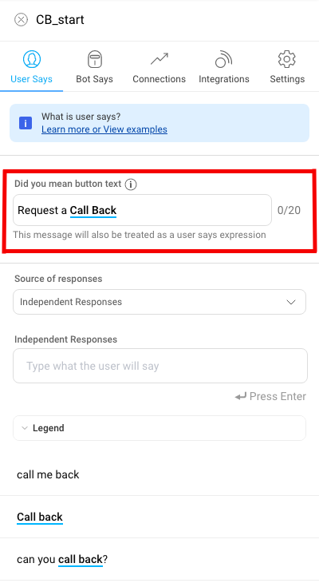
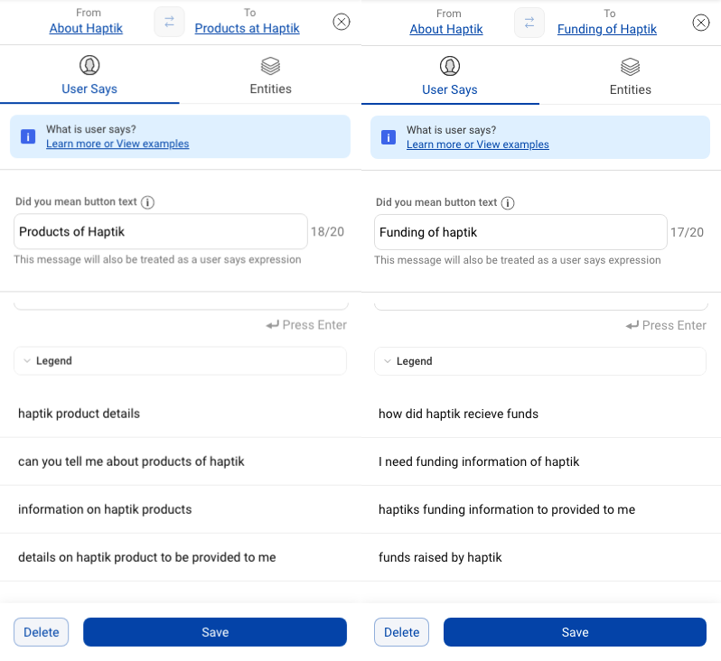

**What is the Feature?**

As the word disambiguation suggests, it aims to remove ambiguity. The feature triggers when the IVA is not fully confident on it’s intent detection amongst the intents that it has shortlisted based on User Utterances and the Training Data.

(Read Intent = Node)

Hence, there will be multiple nodes from which the response can be provided to the user. The confidence scores for each response are in close range to each other, leading the bot to disambiguate.

**When does it occur?** - Applying the above conditionality, we can find multiple scenarios due to which Disambiguation can trigger - 

1. When the User Utterances are vague or incomplete, the IVA is not able to map the user’s intent to 1 single node.

2. When User Says added across multiple nodes are showing an overlap, there is a chance that the IVA will have low confidence in classifying intent to a particular node. In this case, even when a User Utterance is displaying single intent, the IVA finds that there are multiple nodes which can respond to that intent.

**Misconception** - If one keyword is present in the **User Says** of both nodes, the IVA will **always** show the **Disambiguation** Button.

**Illustration** - A case where one keyword “**Order**” responded directly from a node and didn’t display **Disambiguation Feature**, even though the word “**Order**” is present in USER SAYS of multiple nodes.

**How does Disambiguation appear to the end user?** - 

When a user utterance is received on the IVA, the IVA tries to find candidate nodes which can respond to the intent. If it finds nodes with confidence scores in close vicinity, it sends a **Disambiguation Message** (shown in attached image). The message has **two or three buttons** which IVA shortlisted as per the intent of the user. 

**For example** - when user types "Tell me about plans" in a IVA and if there are multiple intents around that User Utterance, we disambiguate by sending the message as shown below -

On Whatsapp, the above message goes as a text message with the shortlister node options in bullet points, as shown below - 

*Sorry, I did not understand you right.*

*Did you mean?*

*1 - Show Your Plans*

*2 - Browse new plans*

*3 - Something else*

The User can send 1, 2, 3 as a response, basis which we will detect the chosen intent by the user from the above options.

**How to set up Disambiguation?** - 

The text that appears on the button on the UI is controlled at a node level through a node-wise copy. It can be set by adding the **Did you mean?** button text in the User Says section of either the static node which is marked as a start node or on the connection where dependent responses are there. 

**It is mandatory to add this text.**

There is a **limit of 20 characters** on the "Did you mean?" button text.

**Note**: The **Did you mean?** button text also acts as a User Says expression. This is the message that will be sent to the user, so it's critical that this message is similar to the user intent represented in the other user says.

**Few rules incorporated** in the IVA to ensure a good user experience with Disambiguation - 

1. The disambiguation response is not sent for consecutive user messages. This implies, if the last user message received a disambiguation response (i.e the Button UI), the next user message would not get a disambiguation response. In this case - 

    a. If the User Utterance is above threshold of the IVA, the response from NODE with highest confidence will be sent.

    b. If the User Utterance is below the threshold of the IVA, the IVA will break.

2. While shortlisting disambiguation node options, the IVA will disambiguate between only those nodes which are eligible candidates for sending responses to the user. Hence - 

    a. When a user sends his first message in a chat, only **(Start nodes / FAQ Nodes)** will be considered for disambiguation, and not dependent nodes.
    
    b. When a user has reached a start node and then sends another message, All **(immediate dependent nodes + Start nodes + FAQ Nodes)** become eligible candidates for disambiguation. Goes without saying, the user utterance will determine the actual response that goes out.
 
**Illustration - The **Disambiguation Feature** is better explained through some images taken from a sample IVA built on Haptik Version 2.0. The illustration depicts various scenarios in which Disambiguation occurs.

Here is the structure of the IVA taken from Bot Builder. The **“Careers at Haptik”** and **“About Haptik”** are start nodes. The **“Funding of Haptik”** and **“Product of Haptik”** are dependent nodes branching from **“About Haptik”** start node.

Below are the USER SAYS present in both the START nodes - 

  
Below are the USER SAYS present in both the DEPENDENT nodes - 

**Disambiguation at work**

**Example 1** - Between **two start nodes** - In this case, dependent nodes are not eligible candidates for Disambiguation Button UI. 

**Example 2** - Disambiguation between **one start node and 1 / 2 dependent node** - As shown in the image below, the **“Careers at Haptik”** is a start node, while other 2 buttons are from dependent nodes of the **“About Haptik”** node.

- Once the IVA reaches a start node, it can disambiguate between all eligible nodes, including dependent and start nodes, depending upon the User Utterance.

**Example 3** - Disambiguation between **only 2 Dependent Nodes** - Both **“Product of Haptik”** and **“Funding of Haptik”** are dependent nodes of **“About Haptik”** start node.

**Example 4** - Disambiguation between **a START NODE** and **a FAQ Node** - **“Funding of Haptik”** is a START Node and **“Founders of Haptik”** is an FAQ Node.

Below two images show the “User Says” of a START NODE and a FAQ Node.

Below image shows how disambiguation can occur between a START Node and FAQ Node.

**Example 5** - Disambiguation between **a Dependent NODE** and **a FAQ Node** - **“Haptik Location”** is a Dependent Node of the **“About Haptik”** START node and **“Cofounder_Haptik”** is a FAQ Node.

Also shown are the “User Says” present in the **“Haptik Location”** node, which is a dependent node of the **“About Haptik”** START Node.

* Once the IVA reaches a START node through a User Utterance, it can disambiguate between a FAQ node and a Dependent Node as well.

In the image below, User Utterance “can information about haptik be given?” leads to a response from “About Haptik” node. The subsequent utterance was not clearly distinguishable and, hence the IVA disambiguated between **“Cofounder haptik”** FAQ Node and **“Haptik Location”** Dependent Node.

