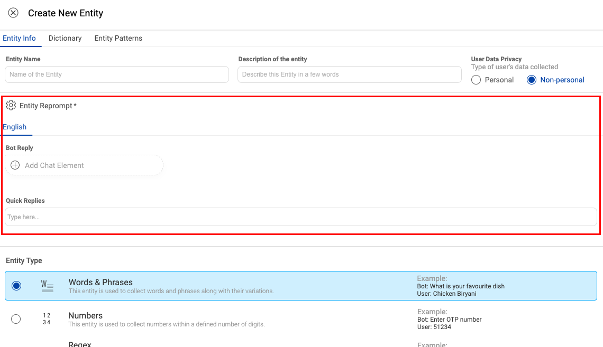
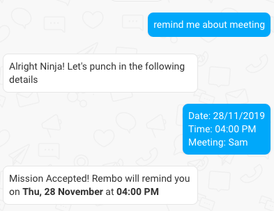
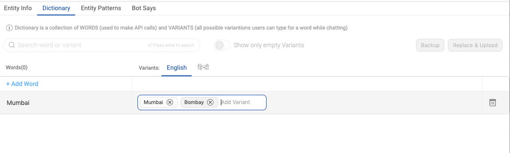
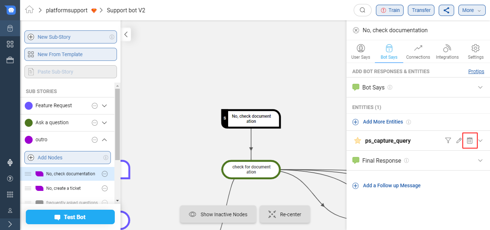

Before you start how to create entities and understand how to use them in bots, you can start with understanding what are entities by referring to this [**documentation**](https://docs.haptik.ai/bot-builder/basic/intent).  

## How to add an entity?

After selecting the node on which the entity is to be added, click on "*Add an Entity*":

On the popup below, one can search for an entity, from the already existing list of entities.

Simply click select on one of the existing entities to add it to your node.

**Public Entities**

Entities which you find in your search results are called as **public** or **system entities**. We have kept few generic entities as public like to store the name of the person, phone number, age, email, etc.

These are the most common public entities -

    'flight_arrival_city', 'phone_number', 'location', 'product_id', 
    'completion_phone_number', 'flight_seat_number', 'utils_city', 
    'product_type', 'device_name', 'person_name', 'departure_date', 
    'phone_number_without_validation', 'product_name', 'completion_city', 
    'completion_email', 'flight_departure_city', 'arrival_date', 'user_name', 
    'origin_lat', 'origin_lng', 'date_of_birth', 'date', 'pincode', 
    'color', 'age', 'otp_four_digit', 'time', 'time_with_range', 
    'completion_location', 'email', 'profession', 'age_range', 'pan_card', 
    'feedback_request', 'website_company_name_regex', 'feedback_regex', 
    'nps_feedback_range', 'feedback_thumbs', 'url_capturer', 
    'disambiguation_negation', 'disambiguation_choice', 'international_phone_number'
    
## How to create a new entity?

If you are creating a new entity, then that is called a **local** or **private entity** as they are specific to your bot. To create a new local entity -

- Click on Create Entity if an appropriate entity doesn't exist.

- Enter the name (must be a lower case, underscore separated text) and description of an Entity. Try to make the description as relevant as possible, as it will help you better search for your entity in the future.

- Choose the privacy of the entity based on whether the entity collects any personal information like name, phone number, insurance number. Any information that can be used to identify the user is considered personal.

  

- Choose the type of the entity from the following options as shown in the image below

  
  
- Enter the Entity Reprompt Message which will be used to ask the values of the entity if there is an incorrect input given by the user in the first chance

  

- On clicking 'Save', the entity will be created

- You can add the newly created entity to the existing node, or you can edit the newly created entity.

## How does using an entity affect the other Bot Says responses?

The flow of Bot Says responses goes from top to bottom in terms of evaluation. **The order of the entities, and their order relative to Bot Says inputs, matters**. First the initial bot reply comes, then the entities, and then finally the final bot reply. The delay message is sent only after a certain level of inactivity. The initial/final bot replies might be not needed in some scenarios. **Note** that to change the order of the Bot Says inputs, simply click and drag the reorder handle.

> **Entity Scenarios**
>
> - _**If there are no entities**_: If it’s a simple node that doesn’t need to collect entities or data, a simple bot says is all that’s needed. You won’t be able to add a final bot reply as that would be redundant as there are no middle steps.
> - _**If there is one entity**_: If there’s only one entity, then there is no initial bot reply as that entity’s responses serve as the initial bot reply.
> - _**If there are multiple entities**_: If there are multiple entities, then all the responses are required. (Intial Bot Says, Entity Responses as well as the final bot reply).

## Mandatory and Optional Entities

An intent is the desired outcome of the whole user utterance, while entities are data extracted from the user utterance.

Intents are mandatory as they are important pieces of the puzzle to identify the user action or goal.  

Entities are optional. You do not need to create entities for every node in your bot, but only for those where it required for the bot to perform an action.

> *IMPORTANT: If there is transition based on entity value or entity presence, it is recommended to make the entity non-mandatory. Use Default or Final Response to respond to the user message*

For example, your reminder bot could consist of three entities -

<table>
  <tr>
    <td><b>Entity</b></td>
    <td><b>Type</b></td>
    <td><b>Description</b></td>
  </tr>
  <tr>
    <td>date</td>
    <td>mandatory</td>
    <td>‘date’ entity is mandatory to set up meeting reminder</td>
  </tr>
  <tr>
    <td>time</td>
    <td>mandatory</td>
    <td>‘time’ entity is mandatory to set up meeting reminder</td>
  </tr>
  <tr>
    <td>phone_number</td>
    <td>optional</td>
    <td>‘Phone_number’ entity is an optional entity. This is only needed if the user wants a message notification before the meeting</td>
  </tr>
</table>

**How does this work?**

Add user utterance to the ‘**Meeting reminder node**’.

When user wants to setup a reminder, the conversation would go as follows -

1. User utterance consists of all the information needed to schedule a meeting.

2. User utterance only consists of the action information and the entities are missing. In such cases, bot will prompt the user to enter details for mandatory entities.

> **_Myth_**: Don't add entity values in user says
> 
> **_Reality_**: Add entity values in user says. If the values are added to the entity dictionary, entities get auto-tagged in the user says. 

For example:

<table>
  <tr>
    <td><b>User says</b></td>
    <td><b>Entity captured</b></td>
  </tr>
  <tr>
    <td>What is the weather like tomorrow in San Francisco</td>
    <td>$location - ‘San Francisco’
$time - ‘tomorrow’</td>
  </tr>
</table>

## How to list all entities of the bot?
You can also view all the entities used in the bot in a single place along with their privacy information. This is useful if you want to quickly review all entities and their privacy settings.

You can view this by clickin on `More` in the top navigation bar and selecting `List of Entities`. You should then be able to view all entities used in the bot.

## Entity Types

There are multiple types of entities supported on the Platform. Below image showcases those various types -

### Words & Phrases Entity

**Words & Phrases** entity is meant to extract "specific" text values e.g. name of a person, name of a city, etc. from user utterances.

There are two ways in which this entity can be used.
1. Dictionary
2. [**Entity Patterns**](https://docs.haptik.ai/bot-builder/basic/entities#entity-patterns)

#### Dictionary

`Dictionary` allows bot builders to do a full-text search on user queries to extract matching strings and phrases.
`Dictionary` has two concepts - 

1. words - value of an entity.
2. variants - For a given value, different variations of those words or phrases.

Example -  For **city** entity.

You need to enter the details of the dictionary. You can use ‘tab’ to quicky add words and variants. Once variants for a particular word are entered, press enter to store and to add new words and variants.

  

  **A few technical details**:

  > The ‘Backup’ button will download the current data set for a dictionary.
  >
  > The ‘Upload New Dictionary’ button will upload data from a csv into the dictionary.
  >
  > Format for upload and backup: word1|variant1,variant2,variant3 word2|variant4,variant5,variant.
  >
  > Any other format will be rejected.

### Numbers Entity

**Numbers** entity is meant for collecting numbers within a defined number of digits. You can have a minimum and maximum range of digits.

In the above image, you can see a number type entity. Following image shows the range of digits it can accept. If a user inputs anything more or less than the range, it is treated as an invalid value.

### Regex Entity

**Regex** entity is meant for detecting patterns like email ID, phone number etc. and collect relevent information from user says.

In the above example, if the user is not giving a valid PANCARD number, matching the regular expression pattern, then the entity message would be asking the user for a valid input. 

You can refer https://regex101.com/ to learn more about regular expression.

### Currency Entity

**Currency** entity is meant for matching amounts of money with an indication of a currency type like, "50 rupees",  "three hundred and fifty dollars". It returns an object type value consisting of two attribute-value pairs: 

<table>
  <tr>
    <td><b>User says</b></td>
    <td><b>Entity captured</b></td>
  </tr>
  <tr>
    <td>I want to pay 50 rupees for the form</td>
    <td>{"unit": "rupees","value":"50.00"}</td>
  </tr>
    <tr>
    <td>I want to transfer three hunders and fifty dollars to Jane</td>
    <td>{"unit": "dollars","value":"350.00"}</td>
  </tr>
</table>

### Attachment Entity

**Attachment** entity is meant for collecting attachments from the user message.

There are these three types of attachments allowed -

- Image
- Document (pdf, docx, xls, csv)
- Video (Only for Whatsapp)

You would need to create a Button HSL for letting the user upload the image and document. 

In the above example, if the user is not uploading an image file then the **entity reprompt message** would ask the user for a valid input.

**Video** attachment type is only for **Whatsapp bots** as the user will be able to upload videos only on Whatsapp. Once the user successfully uploads the video, he will get an automated message along with the predefined Bot Says messages -

"Please wait while we process your video message."

For video entity to be captured on a Whatsapp bot, we need to enable the settings from Business Manager as shown below -

> NOTE - The uploaded video will get deleted in 3 days.

You can refer to the below video to see an example in action.

<iframe width="560" height="315" src="https://www.youtube.com/embed/R-ht3jXgiOg" frameborder="0" allow="accelerometer; autoplay; clipboard-write; encrypted-media; gyroscope; picture-in-picture" allowfullscreen></iframe>

## Entity Patterns

Entity Patterns allow the entities to be defined in such a manner that they can be detected on the basis of the context under which the utterance has been made by the User.

> **Entity patterns can be added only in English for now.**

### When to use?

It can be used in following cases - 

1. When an entity can take an infinite set of values and using a pre-defined and limited list of values (read - Dictionary) isn't sustainable or possible.
    - Examples of such entities could be:
          a. person_name (Bob Marley, Nick Jonas, etc)
          b. movie_name (Harry Potter, Matrix Reloaded); or
2. When names of things i.e nouns (proper or common) from a user utterance are to be extracted, 

3. *When not to use* - Phrase extraction tasks involving action oriented statements like extracting set up a reminder from I want to set up a reminder should not be done through Entity Patterns. It is prone to unpredictable behaviour.

### How to use?

**1.** Go to the Entity Patterns section of an entity. This section is meant to train the bot on the context in which the entity will be detected. 

- The context is provided to the bot through sample user utterances or patterns. In this section, those sentences are to be added which contain the entity and the user is expected to utter them. 

- It is shown in the image below where the names of courses are detected as an entity.

**2.** Once sample utterances have been added, the entity value in the utterance needs to be tagged. The tags are used to explain the IVA about the presence of an entity in that mentioned pattern. 

- The tags of the entity can be added by selecting the phrases and clicking “Add Tag" as shown below.

 
**3.** Provide some sample utterances which contain the entity value but not the context in which they are to be detected. They are called Negative examples. These utterances should be added but the entity value should not be tagged.

- The below image can be checked where pattern number 7, 9, 10 in the image are negative examples. A side image showing a working example where negative intents have been added - 

             
One more illustration below where row number 67 is an example where the pattern is with an appropriate intent, but a different object has been entered to create a negative example.

**4.** After you are done adding or updating variations, please Train the bot. The entities that are tagged in the ‘Entity Patterns’, get auto-tagged in the User Says section of the node as well.

- As illustrated in the images below, the phrases with a green underline are entity values of the entity added on the node. You can select the phrase and see which entity was detected for the phrase.

   
**5.** To ensure that the IVA learns the context accurately, it’s recommended to Add a minimum of 10 sentences for every intent which the user might utter while providing the entity value. User’s Intents form a crucial part of the context in which the entity will be detected.

- If the IVA is to be trained on detecting a new intent from a user utterance, then 10 more variations should be provided to improve detection of the entity.

The emphasis on adding more variants in entity patterns is for ensuring that there is a **reduced probability of false detections.**

E.g - for the entity courses -  The intent is to search a course.

- *I want to search a course on Machine Learning*

- *I need to find a course on Marketing and so on till 10 variants have to be added.*

- But if intent in the context expands to a new "Buy" intent and entity value has to be detected in that context as well, then 10 more variations need to be provided.

E.g - for the entity courses -  The intent is to buy a course.

*I want to buy a course on Machine Learning*

*Can you help me buy  a course in Marketing and so on till 10 variations.*

**6.** Population of **DICTIONARY** for Entity Patterns - Dictionary in the context of entity patterns serves a different purpose, compared to normal text based entities. It can be explained through an illustration - 

- Let’s assume 10 patterns have been added to the Entity Patterns  section. If no dictionary values are present, the IVA will be trained with training data of 10 variations. 

- However, if 10 dictionary values are entered in the Dictionary section, the IVA will be trained on 10 patterns X 10 dictionary values i.e 100 variations.  

- This helps in making the model **more robust to the variations** in contexts and values.

- It also helps the IVA understand the variation in the nature of entity values, as illustrated better in the example below.

**Example** - Here is the list of entity patterns - 

Below is the dictionary for the same. Please check that there are variations in the character and word length of entity values as well. This will make the IVA understand variations better.

The below image shows the detection due to presence of character and word count variation in the entity values.

Some guidelines to make Entity Patterns more robust -  

1. Vary the position of the entity in sentences in training data

2. Avoid spelling errors

3. Ensure variety in usage of verbs. E.g if the intent is to find a course, it can be shown with verbs like look, search, find, show, etc. 

4. Use complete sentences whenever possible. This enables the IVA to perform better on paraphrases

Aforesaid guidelines are illustrated in the image of Entity Patterns below - 

### How do Entity Patterns work?

When the entity patterns are defined, the IVA is trained on both the tagged term and the context in which the term is used. This enables the IVA to calculate a confidence score on every User Utterance, on how likely a word or phrase is going to be a value of an entity. 

- When a User Utterance is received, the IVA looks for the context of the sentence in which the entity is mentioned to detect.

### Troubleshooting

**Entity Detection Failure - Case 1**

The IVA should have detected an entity in a particular User Utterance,  but it didn't detect the same. Following steps can be taken to fix the same - 

Add that User Utterance to the Entity Patterns, ensuring that for a particular intent, 10 entity patterns are provided.

**Example** - Let's say the following User Utterance failed to get detected - 

Add variations to the Entity Patterns as shown below. They are variations of the Buy intent in 10 different forms - 

The IVA has been trained again after adding 10 variations and Entity Pattern has been detected.

**Case 2 - False Detection**

This is a case where the IVA is detecting wrong phrases as an entity value. Illustration in the image below - 

To fix the same, some Negative Variations without tagging the entity value have to be added to the Entity Patterns section, as shown in the image below. They communicate those cases to the IVA where detection need not occur.

Below is the case where the detection stopped once the Negative Variations were added to the Entity Patterns. Once the IVA is trained after adding Negative Variations, the detection doesn’t occur.

## Entity Reprompt

Entity Reprompt message gives a second chance to the user to provide an appropriate value to an entity. 

When a user has not entered an expected entity value, for example, if there is an entity which captures phone-number and the user has entered his name, i.e. a value that does not match the phone number entity, the IVA will throw an Entity Reprompt message which would guide the user to enter an appropriate value.

When you are defining the Entity Reprompt messgae, you can state examples of an entity to give direction to the user.

Example -

`I see you have not entered an appropriate phone-number. Can you please retry?
Tip: The format accepted for a phone number is XXX-XXX-XXXX`

> Note: Please make sure the previous_context_tag is updated if you are adding different message for Entity Reprompt.

## Entity Settings

We have 4 main Advanced Settings options under entities.

### 1. Previous Context Tags

**What is Context from an IVA perspective?**

Context is linguistically defined as the background in which the conversation is taking place. From the IVA perspective, it can involve retaining the memory of any piece of information that has been either derived from past user behavior, the action performed by the IVA, or has been explicitly given by the user.

**What is stored in the form of Context on an IVA?**
- It can involve information like Nodes traversed by the IVA in the conversation, Entity values collected, ML Module which sent the last reply e.g Disambiguation, Small Talk, etc. 
- The user’s name, email, phone number, etc explicitly provided by him, will also form a part of the context. The context needs to be stored before it can be used.

**When is the context information deleted?**
The context is deleted by the system in case if any of the following events occur:
- When a Context Clear Node is encountered by the IVA in the conversation 
- When an agent marks the conversation as COMPLETE from Agent Chat tool
- When a chat auto-completes after 8 mins of inactivity

**Where can you configure the previous_context_tag?**
- The previous_context_tag is configured at an entity level and is present in the Entity under the Advanced options.

**Why and when to use the previous_context_tag?**
- It should be used when you want an entity value to be filled after the bot has asked for it

For eg. If you have a use case where you have two similar types of entity in the same flow with different values to be filled in each one of those, then you can differentiate them using the prev_context_tags. So an entity value will be filled up only if certain words are present in the previous bot says which we have put under prev_context_tags (the unique words/phrases present in the bot says is the prev_context_tags for that entity)

**Is it mandatory to use it on every entity?**
- No, it is not mandatory to use previous_context_tags on all entities, it entirely depends on the use case, and if it is required.

**How to use a prev_context_tag?**
- Let’s take an example where we need to store 2 different mobile numbers from a user in the same flow as the primary & secondary mobile number.

There is a node where we will be asking a user to provide primary & secondary mobile numbers, so here we will need 2 different entities with the same type and validation to store them separately.

Created an entity for the **primary number** which has a Bot Says as “Please enter your primary number” and for **secondary number** with Bot Says as “Please enter your secondary number” as shown below

So here as you can see the unique word which differentiates both the entities is **“primary”** which we will use as **prev_context_tag** for primary mobile number entity.

and **“secondary”** for secondary mobile number entity as shown below

Now whenever the Bot Says has **“primary”** word it will store the user entered mobile number in the **primary_mobile_number** entity only as primary keyword is used as a **prev_context_tag** in that entity and will not store it in **secondary_mobile_number** entity.

Check below image with debug logs how the **prev_context_tag** works and stores the value in the respective entity.

> **It is not mandatory to only use words, you can also use phrases for the context retention in prev_context_tag.**

### 2. Payload Keys

**What is Payload?**

Payload is the data that you want to send with a user text via button/Quick reply which is not visible to the user but can be stored in the entity and we can use this data in further flows wherever required.

**Where can you use this?**

You can use this functionality when you are showing the same user message for various options but want the selected option to be saved in the entity.

**How does a payload functionality work?**

In a flow where we have multiple products to display with the same text, we will pass a unique value as a hidden message in the button using the payload, and whenever a user selects an option, the data is passed as a hidden message button gets stored in the entity. Once we have the payload value stored in the entity, we can use this entity to start a certain flow or if required we can use this entity value in future flows.

**How to use the payload?**

Implementation of the payload can be divided into 2 parts 

A. Storing the payload values in the entity
B. Passing the correct payload values in the CTA

Here is an example to understand this concept -

Let’s take a use case where we need to display multiple plans for Netflix with the same button text as **Know more**. So after the user selects any particular plan by clicking on Know more button, it should land on that particular plan & start the flow.

So here we need to pass a unique value for every plan in the payload and store these values in an entity. After the user selects an option using **Know more** CTA, a payload will be passed with the entity value which will trigger the required flow using a connection of entity by value.

**Why do we need an Entity here?**
- If we do not use an entity to store the value and distinguish the flow for the same **Know more** button, the bot will not understand which button was selected by the user and will trigger the wrong flow by treating it as a user says. So instead we pass a hidden message with a value that is stored in the entity that helps in transition or future flows.

**Implementation**

1. Creating & storing the values in the entity

a. Create a Word & phrases entity 

b. Click on Advanced options and enter the **Payload_keys** & **Context_keys** you want as per your use case, in the below example we have used **plan** & **planid** for **purchase a plan** use case

c. Click on the Dictionary option present in the top and enter all Entity values you need for your buttons. In this case, as we have 4 plans so we created 4 dictionary values with proper variations as shown below

d. Save the entity and click on **Add to bot says** to add the entity on that node.

As the entity is already created with all the values, now we need to create a CTA from where the user can select the option.

In the below example, we are using a carousel to display the different plans to users i.e Mobile, Mobile+, Standard, and Premium as added in the Entity which will have the same button text as **Know more**.

2. Passing the payload value in the CTA

a. Add a **Know more** button with button type as Text in the carousel and pass the payload value with the proper syntax in the Message to send box

b. Syntax: **Button text{api_name:payload_key, completion_key:entity_value}**
  
This is the basic syntax for creating a payload where Button text is nothing but the text which is displayed as a user message on the bot after clicking on the button as shown below, in this case, it is **Know more**

**api_name** key will stay as it is for all the implementation.

**payload_key** is the name you have given under Advanced Settings of the entity. This will be the same in all buttons for this use case, in this case we have used **plan** as the payload key.

**completion_key** is the name you have given for **context key** under Advanced Settings of the entity, in this case we have used **planid** as the context key.

**entity_value** is the value you want to store in the entity when a user clicks on a CTA and this value will be different for every Button, in this case the entity values are mobile, mobile plus, standard, premium which we have entered under the Dictionary of the entity. 

> **The entity value is the only parameter that will be different in each Know more button.**

As you can see after selecting the **Mobile+ plan** the entity value is Mobile plus which was passed in the payload - **Know more {api_name:plan, planid:mobile plus}**

**Note:**
1. payload_key, completion_key, and entity_value will be needed while creating the entity. 
2. You cannot use capital letters to create any payload parameters.

## Node Entity Filter

### What is the feature?

The *Node-Entity Filter is the property of the Node-Entity combination*. The filter **MAY** come into picture **after** the ML Intent Detection algorithms have shortlisted NODES as per the User Utterance **and** a decision is being made on which is the perfect NODE to respond to the User Utterance.

The Node-Entity Filter MAY cause a NODE to be removed from the above shortlist of NODES. But it can’t get a particular NODE added to the shortlisted NODES, if Intent Detection algorithms haven’t found such a NODE suitable. It is shown in subsequent sections below.

### When to Use?

1. When a Bot Builder wants a NODE to be shortlisted for response only when a specific entity value is present in a particular User Utterance.

2. When a Bot Builder wants to set a particular entity value as default when a User arrives at a particular node.

### How to Use? 

Below is a snapshot from the dictionary of the sample entity demo_city_entity_filter which has been used to illustrate this feature.

The **Node-Entity Filter** can be added by clicking the “**filter**” icon shown in the black circle in the  below image.

Once the icon is clicked, a dialog box appears where the values can be set. The entity value has to be entered in the **“Add a new word”** section. Press Enter to save the filter after entering the value.

Please note that **“ENTITY VALUES” have to be added and not variants** as shown in the images below for the same. Here, “HYD” is added as a filter value. **HYD in this case is an entity value and not an entity variant**.

Once a filter has been added, the “**filter**” icon appears blue as shown in the image below.

Let’s take a few illustrations as shown in images below - An **Entity Filter Demo Node** has been created with User Says as shown below. The **demo_city_filter_node** entity has been added with **filter HYD** to the same node.

**Illustration 1** - As shown in the image below, When an **entity variant (Mumbai)** was present in the User Utterance, but was not present in the Node-Entity Filter, the **Entity Filter Demo Node was not shortlisted** and hence the Bot Broke. 

As per Intent Detection ML Algorithm, Entity Filter Demo Node was shortlisted for responding, but since Node-Entity Filter was set to HYD, the NODE was rejected as a candidate while responding.

**Illustration 2** - As shown in the image below, when the **entity variant (Hyderabad)** corresponding to entity value **HYD** was present in the User Utterance and in the Node-Entity Filter as well, the Entity Filter Demo Node was shortlisted. Hence, the Bot responded from that node. 

This is how normal Intent Detection works, with no impact of Node-Entity filter coming into play.

Illustration 1 and 2 can be compared to get a complete understanding of the Node-Entity Filter feature.

**Illustration 3** - Here’s another illustration on what Node-Entity Filter **doesn’t do**. 

- When the entity variant corresponding to entity value HYD was present in the User Utterance but the NODE Entity Filter Demo Node was not an appropriate node for response as per the ML Intent Detection Algorithms, that particular node was not shortlisted for responding.

Another more appropriate node was chosen to respond as shown below.

But when **ENTITY FILTER DEMO NODE** was the correct candidate as per the Intent Detection ML Algorithm, then that NODE was shortlisted and a response was sent from that Node.

**Illustration 4** - Below image shows a case when User Utterance had no mention of any entity value. User Utterance matched the **Entity Filter Demo Node** through ML Intent Detection Algorithms. However, when the User reached that NODE, the **Node-Entity Filter** was set as default value for the **demo_city_filter_node entity**. Please notice that no filtering is applied in such a scenario.

**Illustration 5** - If there are multiple values present in the filter list as shown in the image below, the **most recently added value** would be set as default for that entity, which is BOM in the below illustrated case.

### How does it work?

For understanding, Let’s take the above entity **demo_city_entity_filter**. It’s values are DEL, HYD, MAD, BOM and **HYD** has been set as a Node-Entity Filter.

If an entity value HYD is set as a Node-Entity Filter, then that NODE will be eligible to be shortlisted only if 2 cases mentioned below occur -  

**1.** When **variants of HYD** from the entity dictionary are present in the User Utterance.

**As a corollary**, it can be said that if entity demo_city_entity_filter is added to a NODE with HYD Node-Entity Filter, and any other entity variant of demo_city_entity_filter is present in User Utterance like BOM, then that particular NODE will not be shortlisted to respond. It’s shown in **Illustration 1** above.

**2.** When **no entity value** corresponding to the entity **demo_city_entity_filter** is present in the User Utterance.

- There is an additional impact in this use-case. When a User Utterance contains no entity value for **demo_city_entity_filter** entity and the User Utterance selects a NODE to respond where a Node-Entity filter is set, the Bot will make the value of entity **demo_city_entity_filter** default to that value for which filter has been set. It’s shown in **Illustration 4 and 5 above**.

**Note -** 

1. There is no deterministic rule or an assurance that whenever a User Utterance contains a particular entity variant which is a Node-Entity Filter at a NODE, then that NODE will be automatically chosen to respond irrespective of the Utterance. It’s shown in Illustration 3 above.

The response to the User will still be from a Node which has Highest Confidence score as per the Intent detection Algorithm. The Node-Entity Filter only removes a particular NODE from the shortlist of candidate nodes.

2. **LIMITATION** - The Node-Entity Filter works only in cases where the Entity is either a **“Words or Phrases”** or a **Regex Type** and the entity should not return a dictionary, but only a specific value. For “Words or Phrases” entities, the value entered in Node-Entity Filter is **case sensitive** as well.

3. Say, there are 2 entities having Node-entity Filter on a particular NODE, then the NODE will become eligible for being shortlisted only if 
        a. The User Utterance has no entity values, or
        b. The User Utterance has both the entity values on which filter has been applied.

## Delete an entity

You can delete an entity from the a particular node by clicking on the **delete icon** present beside the entity name.

> Note: Even if the entity is deleted it would still appear in the debug logs section since the entity is not permanently deleted from the IVA.

## Using Entity Flusher

 When the user switches context by typing something in free form in between some conversational flow which has not ended, the old entities are not cleared. In such scenarios you can use entity flusher function.
 
 **How to use Entity Flusher?**

Step 1: Add **integration.utils.lead_campaigns.generic_entity_flusher** function in the integrations tab to the start nodes.

Step 2: Add an entity **bot_flush_exception_list** on the start node where you want to use this function and add all entity names separated by pipe(|) in the filter value of this entity.

> Mark the bot_flush_exception_list entity as non-mandatory.

This will clear all the entities except person_name and city. 

**Do's and Don't of Entity Flusher**

- This function needs to be added only on nodes which are just start nodes.

- Do not add this function on Context Clear nodes.

- Adding the entity flusher on nodes which have other mandatory entities will clear those as well. 

## Language Support for Different Entities

<table>
  <tr>
    <td><b>Entity type</b></td>
    <td><b>Description</b></td>
    <td><b>Example</b></td>
    <td><b>Supported languages - ISO 639-1code</b></td>
  </tr>
  <tr>
    <td>Time</td>
    <td>Detect time from given text.</td>
    <td>tomorrow morning at 5, कल सुबह ५ बजे, kal subah 5 baje</td>
    <td>'en', 'hi', 'gu', 'bn', 'mr', 'ta'</td>
  </tr>
  <tr>
    <td>Date</td>
    <td>Detect date from given text</td>
    <td>next monday, agle somvar, अगले सोमवार</td>
    <td>'en', 'hi', 'gu', 'bn', 'mr', 'ta'</td>
  </tr>
  <tr>
    <td>Number</td>
    <td>Detect number and respective units in given text</td>
    <td>50 rs per person, ५ किलो चावल, मुझे एक लीटर ऑइल चाहिए</td>
    <td>'en', 'hi', 'gu', 'bn', 'mr', 'ta'</td>
  </tr>
  <tr>
    <td>Phone number</td>
    <td>Detect phone number in given text</td>
    <td>9833530536, +91 9833530536, ९८३३४३०५३५</td>
    <td>'en', 'hi', 'gu', 'bn', 'mr', 'ta'</td>
  </tr>
  <tr>
    <td>Email</td>
    <td>Detect email in text</td>
    <td>hello@haptik.co</td>
    <td>'en'</td>
  </tr>
  <tr>
    <td>Text</td>
    <td>Detect custom entities in text string using full text search in Datastore or based on contextual model</td>
    <td>Order me a pizza,मुंबईमें मौसम कैसा है</td>
    <td>Search supported for 'en', 'hi', 'gu', 'bn', 'mr', 'ta', Entity Patterns supported for 'en' only</td>
  </tr>
  <tr>
    <td>PNR</td>
    <td>Detect PNR (serial) codes in given text.</td>
    <td>My flight PNR is 4SGX3E</td>
    <td>'en'</td>
  </tr>
  <tr>
    <td>Regex</td>
    <td>Detect entities using custom regex patterns</td>
    <td>My flight PNR is 4SGX3E</td>
    <td>NA</td>
  </tr>
  <tr>
    <td>City</td>
    <td>CityDetector detects cities from the text</td>
    <td>From Mumbai, To Mumbai, via Mumbai, atms in Mumbai</td>
    <td>'en'</td>
  </tr>
  <tr>
    <td>Budget</td>
    <td>Detects the budget from the text. This detector captures additional attributes like max_budget, min_budget whether the budget is normal_budget</td>
    <td>shirts between 2000 to 3000</td>
    <td>'en'</td>
  </tr>
  <tr>
    <td>Shopping size</td>
    <td>Detects size which are used for shopping from the text</td>
    <td>Suggest me shirt of size X-Large</td>
    <td>'en'</td>
  </tr>
  <tr>
    <td>Currency</td>
    <td>Detects currency and the value from the given text</td>
    <td>My Salary is $100000</td>
    <td>'en'</td>
  </tr>
  <tr>
    <td>Number Range</td>
    <td>Detects number range from the given text</td>
    <td>Suggest a phone in the price range of 10000 to 15000</td>
    <td>'en', 'hi', 'gu', 'bn', 'mr', 'ta'</td>
  </tr>
</table>
