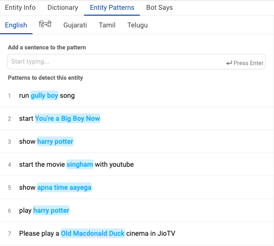
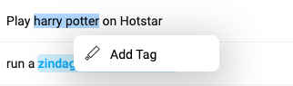

In this section, we'll cover the following topics:  
[What is an Entity?](#what-is-an-entity)  
[Intent vs Entity](#intent-vs-entity)  
[When to Use Entities](#when-is-the-appropriate-time-to-use-an-entity)  
[How Adding Entities Affects Bot Says](#how-does-using-an-entity-affect-the-other-bot-says-responses?)  
[How to Add an Entity](#adding-an-entity)  
[Creating a New Entity](#making-a-new-entity)  
[Mandatory and Optional Entities](#mandatory-and-optional-entities)  
[Entity Types](#entity-types)

### What is an entity?

**Entities**: An entity represents the set of values from which a user’s response must come in order for that user to progress onwards in a conversation. Depending on the context of the conversation, the required response can either be a single value or limited group of specific values from the entity, or any value from within the entity. Entities are always added in connection with the bot’s query the required response is associated with, so that they may detect whether the required response was given.

Entities are auto-tagged in the user utterance as long as the entity dictionary is pre-populated. You can find more details about Entity tagging here.

### Intent vs Entity

It is important to understand the difference between intent and an entity. 

Intent represents an action that the user wants to perform and the entity represents a keyword that you want to be extracted from the user utterance. 

<table>
  <tr>
    <td><b>Intent</b></td>
    <td><b>User utterance</b></td>
    <td><b>Entity extracted</b></td>
    <td><b>Explanation</b></td>
  </tr>
  <tr>
    <td>Book_flight</td>
    <td>Book a flight from Mumbai to Delhi</td>
    <td>From: Mumbai,
To: Delhi</td>
    <td>Departure and arrival locations are important information for Book_flight intent</td>
  </tr>
  <tr>
    <td>Play_content</td>
    <td>Play Avengers on Hotstar </td>
    <td>Content_name: Avengers,
App_name: Hotstar</td>
    <td>Content name and App name information are extracted from the user utterance</td>
  </tr>
  <tr>
    <td>Need_support</td>
    <td>Customer care number</td>
    <td>-</td>
    <td>No entity to be extracted from the utterance</td>
  </tr>
  <tr>
    <td>Apply_loan</td>
    <td>I would like to apply for a home loan</td>
    <td>Loan_type: home loan</td>
    <td>Loan type entity is extracted from the user utterance. Entity value transition can be used here to traverse to the next node </td>
  </tr>
  <tr>
    <td>Cylinder_price</td>
    <td>What is the price of 12 kg cylinder</td>
    <td>Cylinder_size: 12kg</td>
    <td>Cylinder size entity is extracted from the user utterance to fetch the price</td>
  </tr>
  <tr>
    <td>Login_issues</td>
    <td>I am unable to login</td>
    <td>-</td>
    <td>No entity to be extracted from the utterance. </td>
  </tr>
</table>

#### When is the appropriate time to use an entity?

Some examples of when you would use an entity in Bot Says:

- When you need a user's email ID and need to verify that inputs are valid IDs or not. The ‘email’ entity allows the detection of an email id.
- When you need a user's phone number and need to verify that inputs are valid phone numbers. The ‘phone_number_without_validation’ entity detects a 10 digit number.
- When you need to gather the city a user wants to fly into and need to verify that the user has indicated a city with an airport in it.

#### How does using an entity affect the other Bot Says responses?

The flow of Bot Says responses goes from top to bottom in terms of evaluation. **The order of the entities, and their order relative to Bot Says inputs, matters**. First the initial bot reply comes, then the entities, and then finally the final bot reply. The delay message is sent only after a certain level of inactivity. The initial/final bot replies might be not needed in some scenarios. **Note** that to change the order of the Bot Says inputs, simply click and drag the reorder handle.

> **Entity Scenarios**
>
> - _**If there are no entities**_: If it’s a simple node that doesn’t need to collect entities or data, a simple bot says is all that’s needed. You won’t be able to add a final bot reply as that would be redundant as there are no middle steps.
> - _**If there is one entity**_: If there’s only one entity, then there is no initial bot reply as that entity’s responses serve as the initial bot reply.
> - _**If there are multiple entities**_: If there are multiple entities, then all the responses are required. (Intial Bot Says, Entity Responses as well as the final bot reply).

#### Adding an entity:

After selecting the node on which the entity is to be added, click on "*Add an Entity*":

On the popup below, one can search for an entity, from the already existing list of entities.

Simply click select on one of the existing entities to add it to your node.

#### Making a new entity:

To create a new entity

- Click on Create Entity if an appropriate entity doesn't exist.

- Enter the name (must be a lower case, underscore separated text) and description of an Entity. Try to make the description as relevant as possible, as it will help you better search for your entity in the future.

- Choose the privacy of the entity based on whether the entity collects any personal information like name, phone number, insurance number. Any information that can be used to identify the user is considered personal.

    > This feature is currently a work-in-progress. Currently this is treated just as a flag but in the future all personal entities will be encrypted.

  

- Enter the details of the data dictionary. You can use ‘tab’ to quicky add words and variants. Once variants for a particular word are entered, press enter to store and to add new words and variants.

  

  **A few technical details**:

  > The ‘Backup’ button will download the current data set for a dictionary.
  >
  > The ‘Upload New Dictionary’ button will upload data from a csv into the dictionary.
  >
  > Format for upload and backup: word1|variant1,variant2,variant3 word2|variant4,variant5,variant.
  >
  > Any other format will be rejected.

- Click 'Next Step' once you're satisfied with your dictionary

- In the final step you can add a default message that the node should respond when the entity is detected

- On clicking 'Save', the entity will be created

- You can add the newly created entity to the existing node, or you can edit the newly created entity.

#### Listing all entities of the bot:
You can also view all the entities used in the bot in a single place along with their privacy information. This is useful if you want to quickly review all entities and their privacy settings.

You can view this by clickin on `More` in the top navigation bar and selecting `List of Entities`. You should then be able to view all entities used in the bot.

### **Mandatory and Optional Entities**

An intent is the desired outcome of the whole user utterance, while entities are data extracted from the user utterance.

Intents are mandatory as they are important pieces of the puzzle to identify the user action or goal.  

Entities are optional. You do not need to create entities for every node in your bot, but only for those where it required for the bot to perform an action.

> *IMPORTANT: If there is transition based on entity value or entity presence, it is recommended to make the entity non-mandatory. Use Default or Final Response to respond to the user message*

For example, your reminder bot could consist of three entities -

<table>
  <tr>
    <td><b>Entity</b></td>
    <td><b>Type</b></td>
    <td><b>Description</b></td>
  </tr>
  <tr>
    <td>date</td>
    <td>mandatory</td>
    <td>‘date’ entity is mandatory to set up meeting reminder</td>
  </tr>
  <tr>
    <td>time</td>
    <td>mandatory</td>
    <td>‘time’ entity is mandatory to set up meeting reminder</td>
  </tr>
  <tr>
    <td>phone_number</td>
    <td>optional</td>
    <td>‘Phone_number’ entity is an optional entity. This is only needed if the user wants a message notification before the meeting</td>
  </tr>
</table>

#### **How does this work?**

Add user utterance to the ‘**Meeting reminder node**’.

When user wants to setup a reminder, the conversation would go as follows -

1. User utterance consists of all the information needed to schedule a meeting.

2. User utterance only consists of the action information and the entities are missing. In such cases, bot will prompt the user to enter details for mandatory entities.

> **_Myth_**: Don't add entity values in user says
> 
> **_Reality_**: Add entity values in user says. If the values are added to the entity dictionary, entities get auto-tagged in the user says. 

For example:

<table>
  <tr>
    <td><b>User says</b></td>
    <td><b>Entity captured</b></td>
  </tr>
  <tr>
    <td>What is the weather like tomorrow in San Francisco</td>
    <td>$location - ‘San Francisco’
$time - ‘tomorrow’</td>
  </tr>
</table>

### Entity Types

#### **Currency Entity**

**Currency** entity is meant for matching amounts of money with an indication of a currency type like, "50 rupees",  "three hundred and fifty dollars". It returns an object type value consisting of two attribute-value pairs: 

<table>
  <tr>
    <td><b>User says</b></td>
    <td><b>Entity captured</b></td>
  </tr>
  <tr>
    <td>I want to pay 50 rupees for the form</td>
    <td>{"unit": "rupees","value":"50.00"}</td>
  </tr>
    <tr>
    <td>I want to transfer three hunders and fifty dollars to Jane</td>
    <td>{"unit": "dollars","value":"350.00"}</td>
  </tr>
</table>

#### **Text Entity**

**Text** entity is meant to extract words/phrases from user utterances.

There are two ways in which text entities can be used.
1. Dictionary
2. Entity Patterns

##### **Dictionary**

`Dictionary` allowes bot builders to do a full-text search on user queries to extract matching strings and phrases.
`Dictionary` has two concepts - 
1. values - value of an entity.
2. variants - For a given value, different variations of those words or phrases.

Example -  For **City** entity.

##### **Entity patterns**

`Entity patterns` allows bot builders to define entities based on their context in the utterance. You do this by adding the user utterance in `Entity Patterns` section and tagging the entities in the user utterance.

When you define entity patterns, a model is trained on both the tagged term and the context in which the term is used in the sentence you tag. This model enables us to calculate a confidence score that identifies how likely a word or phrase is to be an instance of an entity, based on how it is used in the user input.

Entity patterns can be added only in English for now.

Entities such as
1. person_name (Bob Marley, Nick Jonas, Mark Norman Sr.)
2. content_name (Harry Potter, Matrix Reloaded, Bumble Bee, John Wick)

have infinite number of possibilities that need to be added to the entity dictionary. Entity Patterns will help you tackle such scenarios by not making it a content heavy task.

###### **How does it work?**

1. When to use?

   - Infinitely many entity values present. Using `Dictionary` isn't sustainable.

   - `Entity Patterns` was built to extract names of things, in other words nouns(proper or common).
   
   - It doesn't work on phrase detection tasks like extracting `set up a reminder` from `I want to set up a reminder`

2. You go to the `Entity Patterns` section of the node, add user says variations.

3. Find any mentions of the entity in the utterance, and add a tag.

4. If you are adding <a href="#negative-examples">Negative examples</a> (See Guidelines) then don't tag anything.

For example, you might go to the #play_content node, and find a user says, ‘Play harry potter on Hotstar’. You can tag ‘harry potter’ as a mention of the @content entity.

For training purposes, the term you tagged, ‘harry potter’, is added as a value of the @content entity dictionary.

At run time, model evaluates terms based on the context in which they are used in the sentence only. If the structure of a user says that mentions the term matches the structure of an intent user example in which a mention is tagged, then the model interprets the term to be a mention of that entity type. 

For example, the user input might include the utterance, ‘Play matrix reloaded on Hotstar’. Due to the similarity of the structure of this sentence to the user example that you tagged (Play harry potter on Hotstar), model recognizes ‘matrix reloaded’ as a @content entity mention.

When a context based entity model is used for an entity, model does not look for exact text or pattern matches for the entity in the user input, but focuses instead on the context of the sentence in which the entity is mentioned.

​	The entities that are tagged in the ‘Entity Patterns’, get auto-tagged in the user says section of the node.

If you choose to define entity values by using entity patterns, then you can follow certain guidelines to ensure better performance.

#### **Guidelines for training data**

There are two things needed for training a model - 
**Training patterns(User utterances)** for training the model. Minimum 10 sentences.
Eg  - `I want to buy apples`,  `I need to purchase apples.` 

**Dictionary** - A list of examples for each entity . Minimum 10 examples.
Examples - **Grocery_item**: `Guava juice`, `apples`, `ashirwaad atta`

##### **Training patterns**

1. Longer Sentences 
    Enables model to perform better on paraphrases. Example - 
    `tell me apple price on bigbasket` instead of `apple price on bigbasket`
    What is the price of apple today?  instead of price of apple

2. Variety in usage of synonyms especially verbs.
    Examples -  
    If `I want to buy apples` is already present 
    `I need to purchase apples` is better than  `i want to purchase apples`. You can add the latter too if you want.

3. Try and vary the position of the entity across sentences in training data
    Prevents the model from getting biased towards a particular position
    Examples -  
    `I would like 2 packets of cow milk` - *entity in the end*.  
    `Help me purchase some bananas from that shop` - *entity in middle* 

4. Spelling errors in the training data are harmful.

5. Number of sentences should increase if context of model expands  
    For example in *Grocery Shopping*, if context is limited to `buying grocery` then 10 sentences like `I want to buy apples` are fine.
    But if context expands to say `information about items` in addition to `buying grocery` then add at least 10 - 15 more variations like  `price of butter` or `What is the price of apple on grofers?`

  
##### **Dictionary**

This is a list of examples for each entity. This list is used to multiply data while training. Bot builders should enter these examples as variants in the `Dictionary`.
These examples are used to multiply training data to enable the model to se multiple spans, while resucing the effort of the bot builder.
For eg. If you have the following training examples.

| SENTENCE                                     | GROCERY_ITEM |
|----------------------------------------------|--------------|
| I want to buy an apple from grofers          | apple        |
| Help me purchase some bananas from that shop | bananas      |
| I would like 2 packets of cow milk           | cow milk     |

Then entity examples for this data would be

|GROCERY_ITEM           |
|-----------------------|
|Guava juice            |
|Shuddha ashirwad atta  |
|Pure cow ghee          |
|Cadbury dairy milk silk|
|Grape wine             |

**Objective of adding examples in Dictionary is to try and cover entity values with multiple spans. For eg. `apple` is a single word and `cadbury dairy milk silk` has 4 words. This helps the model generalize better.**

Tips -  
1. Try and add entity values of variable spans. For example -
Guava juice(2 tokens), Cadbury dairy milk silk(4 tokens)  
2. Sometimes it ends up happening that all of the examples are non english words. Try to prevent this.
For example in case of person name detection, if all the names seen by the model are non-english, it will get biased towards non-english words.

#### **Work around on failures**

If a corner case occurs and your system fails. 
You should take the following steps.

1. Add that data point to your training data.
2. Add some paraphrases of that data point.  

Example: 
A model trained was trained on following data points.

| Data             |
|----------------------------------|
| I want to eat apple              |
| I am hungry. Need to have banana |
| is apple good for health         |
| how many calories in icecream?   |
| tell me apple price on bigbasket |

It failed on the query - `where can i buy stuffed cheese paratha from?` and this query was added to training data

Now system handles all the followig examples too. 

| Examples                                 |
|------------------------------------------|
| where to buy vanilla ice cream from?     |
| where to get vanilla ice cream from?     |
| where can in buy vanilla ice cream from? |

##### **Negative Examples**

Negative examples are useful in case the system detects something it shouldn't have.

For example - If a model trained to detect  person names from questions like `Who is virat kohli?` detects `machu pechu` as name from `What is machu pechu?`.

**To solve this just add `What is machu pechu?` in the entity patterns and don't tag anything**

### **Entity types and language support**

<table>
  <tr>
    <td><b>Entity type</b></td>
    <td><b>Description</b></td>
    <td><b>Example</b></td>
    <td><b>Supported languages - ISO 639-1code</b></td>
  </tr>
  <tr>
    <td>Time</td>
    <td>Detect time from given text.</td>
    <td>tomorrow morning at 5, कल सुबह ५ बजे, kal subah 5 baje</td>
    <td>'en', 'hi', 'gu', 'bn', 'mr', 'ta'</td>
  </tr>
  <tr>
    <td>Date</td>
    <td>Detect date from given text</td>
    <td>next monday, agle somvar, अगले सोमवार</td>
    <td>'en', 'hi', 'gu', 'bn', 'mr', 'ta'</td>
  </tr>
  <tr>
    <td>Number</td>
    <td>Detect number and respective units in given text</td>
    <td>50 rs per person, ५ किलो चावल, मुझे एक लीटर ऑइल चाहिए</td>
    <td>'en', 'hi', 'gu', 'bn', 'mr', 'ta'</td>
  </tr>
  <tr>
    <td>Phone number</td>
    <td>Detect phone number in given text</td>
    <td>9833530536, +91 9833530536, ९८३३४३०५३५</td>
    <td>'en', 'hi', 'gu', 'bn', 'mr', 'ta'</td>
  </tr>
  <tr>
    <td>Email</td>
    <td>Detect email in text</td>
    <td>hello@haptik.co</td>
    <td>'en'</td>
  </tr>
  <tr>
    <td>Text</td>
    <td>Detect custom entities in text string using full text search in Datastore or based on contextual model</td>
    <td>Order me a pizza,मुंबईमें मौसम कैसा है</td>
    <td>Search supported for 'en', 'hi', 'gu', 'bn', 'mr', 'ta', Contextual model supported for 'en' only</td>
  </tr>
  <tr>
    <td>PNR</td>
    <td>Detect PNR (serial) codes in given text.</td>
    <td>My flight PNR is 4SGX3E</td>
    <td>'en'</td>
  </tr>
  <tr>
    <td>Regex</td>
    <td>Detect entities using custom regex patterns</td>
    <td>My flight PNR is 4SGX3E</td>
    <td>NA</td>
  </tr>
  <tr>
    <td>City</td>
    <td>CityDetector detects cities from the text</td>
    <td>From Mumbai, To Mumbai, via Mumbai, atms in Mumbai</td>
    <td>'en'</td>
  </tr>
  <tr>
    <td>Budget</td>
    <td>Detects the budget from the text. This detector captures additional attributes like max_budget, min_budget whether the budget is normal_budget</td>
    <td>shirts between 2000 to 3000</td>
    <td>'en'</td>
  </tr>
  <tr>
    <td>Shopping size</td>
    <td>Detects size which are used for shopping from the text</td>
    <td>Suggest me shirt of size X-Large</td>
    <td>'en'</td>
  </tr>
  <tr>
    <td>Currency</td>
    <td>Detects currency and the value from the given text</td>
    <td>My Salary is $100000</td>
    <td>'en'</td>
  </tr>
  <tr>
    <td>Number Range</td>
    <td>Detects number range from the given text</td>
    <td>Suggest a phone in the price range of 10000 to 15000</td>
    <td>'en', 'hi', 'gu', 'bn', 'mr', 'ta'</td>
  </tr>
</table>

