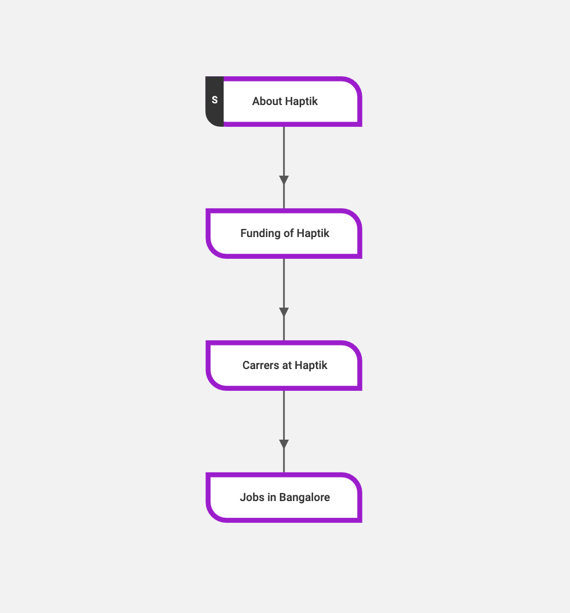

### Context Retention in an IVA

Context is linguistically defined as the background in which the conversation is taking place. From the IVA perspective, it can involve retaining the memory of any piece of information that has been either derived from past user behavior, the action performed by the IVA or has been explicitly given by the user.

It can involve information like Nodes traversed by the IVA in the conversation, Entity values collected, ML Module which sent the last reply e.g Disambiguation, Small Talk, etc.

User’s own name, email, phone number, etc explicitly provided by him, will also form a part of the context. The context needs to be stored before it can be used. Before we understand when the context is used, it’s important to know when it’s deleted.

**When is the context information deleted?** 
The context is deleted by the system in case of any of the following events -

* When an END NODE is encountered by the IVA in the conversation

* When an agent marks the conversation as COMPLETE from ATHENA

**When is the context used?**
If the context has not been deleted as per the above 2 cases, the IVA can use the context up to 2 hours from the last activity of the user. The parameter of 2 hours is customizable up to 48 hours.

Illustration - Let’s say there is a conversation that ideally can get 4 levels deep as shown in the image below. It has a START node, a CHILD node, a Grand-Child node and a Great Grand-child Node with the Great Grand Child node being the END NODE.

Let’s say the user starts the conversation from a Start Node ABOUT HAPTIK and then chooses an option to reach the child node FUNDING OF HAPTIK. At this point, if a user leaves the conversation, the IVA will retain the context for 2 hours since the no END NODE has not been encountered in the conversation, so far.

So if a user comes back after, say e.g, 1.5 hours and taps a button or a Quick Reply on FUNDING OF HAPTIK node, he can reach the Grand-Child node i.e CAREERS AT HAPTIK Node directly.

**How does Chat Complete work?**
There are two types of CHAT COMPLETE - Hard Complete and Soft Complete.

SOFT COMPLETE occurs in the following cases when a user -

* Doesn’t reply to the query of a Human Assistant for 8 mins after a chat has been marked as “WAITING FOR USER” by the Assistant. It will also move the Chat from the “WAITING FOR USER” section to the “COMPLETED” section.

* Chats with the IVA and leaves, but doesn’t return within 8 mins.

In the above SOFT COMPLETE cases, the context is retained by the IVA for 2 hours. Again, the parameter of 2 hours is customizable per IVA basis, but most IVAs have kept it at 2 hours, which is the default value currently. The 2-hour limit can be extended to 48 hours as already mentioned.

HARD COMPLETE occurs when a conversation -

* Has encountered an END NODE

* Has been marked as COMPLETE by the assistant from ATHENA.

The context is immediately deleted and is not retained even for 2 hours when such a HARD COMPLETE has been reached.

### What is Bot State

Bot State is nothing but data or information associated with a user or contextual data for the specific conversation that the user is having. 

The Bot Builder Platform allows you to set and access data for both of these scopes with the help of `context variables` to help you manage your bot's state.

Based on the scope of the bucket your data will be available within all nodes of the bot. The two scopes that are currently supported are:

* **User Details** for user level data.
* **Conversation Details** for conversation level data.
  

### User Details

Data stored in this context variable will be saved at a user level and will be available for all the conversations that the user has with any of the businesses for a given [partner](https://docs.haptik.ai/bot-builder/basic/bot-hierarchy#partner-business-bot).

This context variable should be used for storing permanent details about the user that are not specific to a given conversation like their email, phone number or other such details.

### Conversation Details

Data stored in this context variable will be saved at a conversation level for a given user. This means that the data will only be available till the conversation is active and is not marked as complete. Once the conversation is marked as complete, any data stored in this scope for the given user will be lost.

This data is maintained on a redis server for a maximum of 3 hours after which it is permanently lost.

This scope should be used for storing contextual information related to the current conversation that the user is having with the bot. Some examples of this are policy id or policy details that the user is exploring in the current conversation.

### Using Context Variables

The Context Variables are available as part of the `Event` payload that is passed to the integration functions. The integration function can then `SET/GET` data from these variables.

Post the execution of the integration function, the data is committed to a permanent store and the permanance is based on the scope the data belongs to.

You can read more about using context variables within integrations [here](https://docs.haptik.ai/bot-builder/integrations/integration-parameters) and read more about using it with custom tools in agent chat tool [here](https://docs.haptik.ai/agent-chat/adding-custom-tools).
