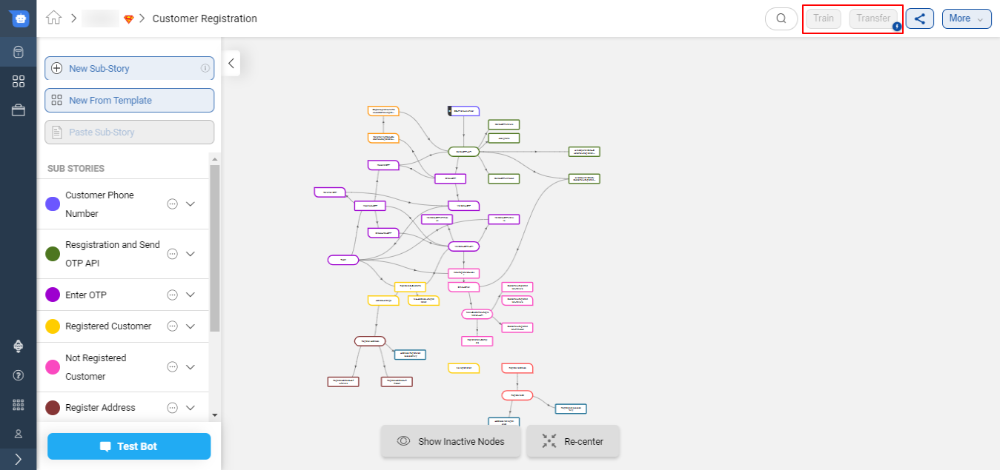
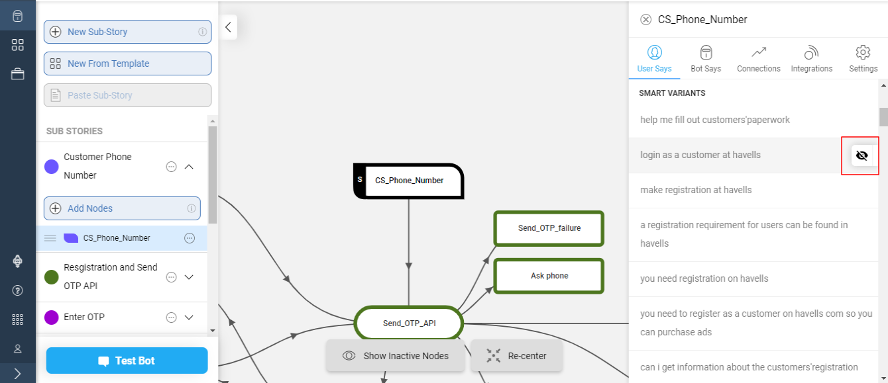

## Introduction

When the user enters a message on the IVA, the IVA processes what the user meant to say in order to identify the intent of the user. While developing the IVA, a bot builder has to enter a set of meaningful user variants (at least 10) on every start node to set an intent for the node. This activity takes a significant amount of time since the bot builder has to formulate the user says for every node. The major goal of Smart Variants is to reduce the development effort of adding User variants of the bot builder.

## What are Smart Variants?

Smart variants are paraphrase generation systems to automatically generate linguistically similar user variants.

## How to add Smart Variants?

To add Smart Variants, simply click on the **Transfer** button on the top right corner Conversation Studio page.

Once you click on the Transfer button, a popup will appear which will contain information about the number of smart variants which can be added on the IVA.
Click on **Add Smart Variants**

Once you click on Add Smart Variants, the **Transfer** and **Train** button will be disabled since the IVA is getting Trained for the new added Smart Variants.

When you click on the small blue icon present on the disabled Transfer button, you can see the following screen

Once the IVA has been populated with all the Smart Variants, you will receive an email with the summary. It will have details about newly added Smart Variants. Here a snippet of the email - 

On the same email, you will receive a CSV file with the name **augmentations.csv** which will have details of every Smart Variant added on the IVA with a corresponding link to its Node.

You can disable any Smart Variant added by the algorithm by clicking on the disable button.

