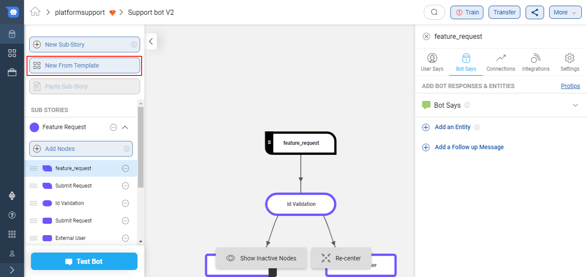

## What are Smart Skills?

SmartSkills are carefully curated, pre-designed, and highly intelligent conversational journeys. These are the starting point to designing journeys that provide end to end solutions to business problems and can be added to your IVAs within a few clicks. They are editable and can be tailored to suit your business processes and needs.

Using SmartSkills in the IVA not only reduces development time, but also ensures that IVAs are more robust since they contain conversational UI using best design practices, pre-trained domain-specific intents, and demo APIs already integrated.

Haptik’s SmartSkills are focused on **three** major verticals -
1. 	E-commerce
2. 	Telecom
3. 	Insurance

### Ecommerce

The Ecommerce SmartSkills are eligible to fulfill critical customer support queries. The SmartSkills are selected based on market research and user behavior of the retail vertical.

#### 1. **Track Order/Order status** – 
Orders in transit can be tracked in real-time by the users through identifiers like order ID.
- The IVA will be trained to fetch the user's order status. 
- The IVA will first present the list of active orders to the user. 
- The user can proceed by selecting a specific order. 
- The IVA will then fetch the status of that order via a **Track Order API.**
- The order details can be fetched with the help of any unique identifier - Order Id, tracking id,  phone number. 

#### 2. **Check refund status** – 
Users can check the status of the refund of canceled or returned orders in real-time. The refund status of multiple orders can also be tracked by the user.
- The IVA will be equipped to give out refund status to the user for a particular order. 
- The IVA will first present the list of orders for whom the refund is an active stage.
- Further to the user's selection of the order, the IVA will display the status of the refund.
- The IVA will fetch the refund status via a **CHECK_REFUND_STATUS_API**

#### 3. **Cancel my order** – 
When users are not satisfied with the placed order, they can cancel their order on the IVA by choosing an in-transit order.
- A user can initiate an order cancellation via the IVA. The IVA will first present the active orders eligible for the cancellation to the user. The user selects the order to be canceled.  
- The IVA will then fulfill the cancellation request via a Cancel Order API. 

#### 4. **Return/Replacement Request** – 
Place a service request to replace a wrong or damaged order on the IVA by choosing from the list of fulfilled deliveries.
- The user can raise a replacement request via the IVA. 
- The IVA will first present the list of items eligible for replacement.
- The user will select the item to be replaced. 
- The IVA will undertake the replacement request via FETCH_ITEM_API, ISSUE_REPLACEMENT_API

### Telecom

*Coming Soon*

### Insurance

*Coming Soon*

## How to add a Smart Skill to your IVA?

SmartSkills can be added to your IVA with a few simple clicks. Select the desired SmartSkill from our catalog, add it to your IVA, edit as desired, and take your IVA live.

**Step 1:** Select any of the pre-built SmartSkills from Haptik’s Conversation Studio by clicking on the New Template button on the left panel.

**Step 2:** Look for the desired SmartSkills from the list of SmartSkills

**Step 3:** Once decided, click on the SmartSkill name to open SmartSkill details. The SmartSkill details will have information about the Purpose of the SmartSkill, How to use the SmartSkill, and, the APIs and Entities used in it. The details section also has a short demo of SmartSkill to let you see it in action. Click on each of these section to know more.

**Step 4:** Finally, once you are sure, click the Use Template button on the Right corner to add the SmartSkill to your IVA. The SmartSkill will be imported as a sub-story in your IVA. You can edit the parts of SmartSkill as per your need and start using it in your IVA.
 

This is your starting point to create IVAs to support your business use cases. You can build up on top of the selected SmartSkills by using the various features and offerings of Haptik’s Conversation Studio.
