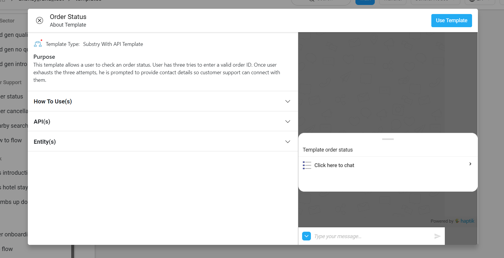
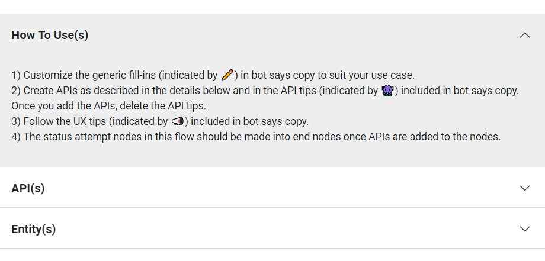
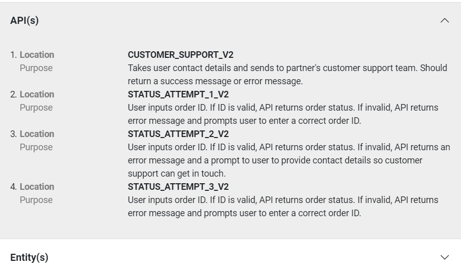
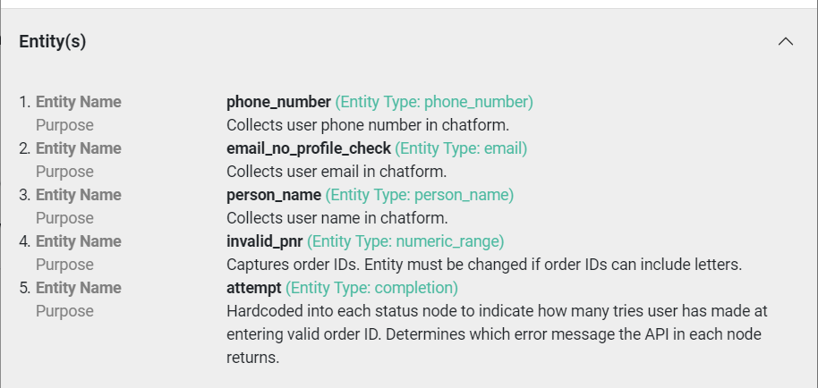
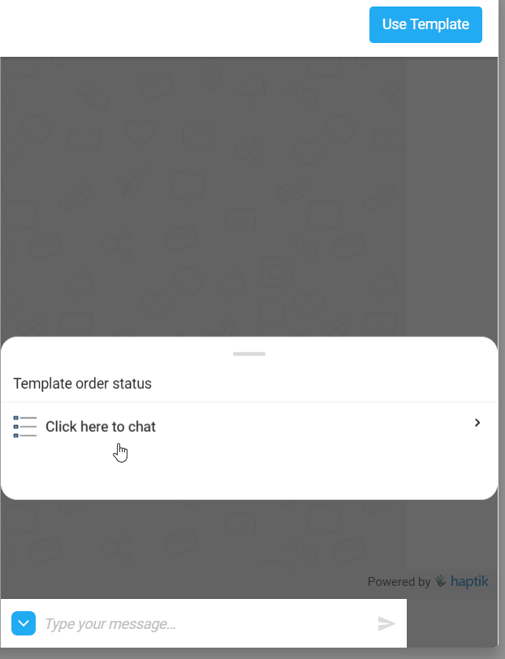
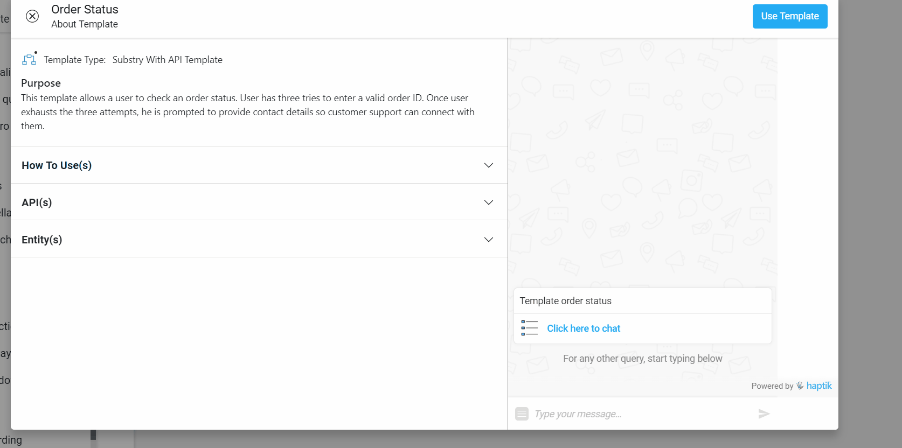

## What are Story Templates?
There are a few use cases which are common across different chatbots. For example the conversational flow for OTP validation or for getting order status could be common across multiple bots. In such cases the sets of nodes and their connections for these flows can be resused across bots.

The bot builder tool provides some of these common flows as a template that can be directly used inside your bot.

> Note: Using a template creates a new sub-story inside the story where you imported the template. The new sub-story includes all the nodes and connections required for the flow.

## Using Story Templates
To use a template open the story where you want to import the template. Inside the story, on top of the left side menu you will see a link called `New From Template`. 

Clicking on this link should open the list of available templates. These templates are organized by the high level bot type they belong to. These categories and their corresponding templates are:

### Banking Sector Templates
1) **Lead Gen Qualification** - Collects personal information from users and sends responses basis the end user's eligibility for the product. 
2) **Lead Gen No Qualification** - This template has two nodes. The first collects personal data from users and second node sends follow-up to users who indicate that they're not interested in a callback. 
3) **Lead Gen Intro** - Provides introductory details of sponsored financial products, sponsoring partner benefits, and buying instructions. Join with a lead gen qualification template to create a full lead flow. 

### Customer Support Templates
1) **Order Status** - This template allows a user to check an order status. User has three attempts to enter a valid order ID. Once user exhausts the three attempts, he is prompted to provide contact details so customer support can connect with them.
2) **Order Cancellation** - This template allows end users to cancel an order. User must input a valid order ID, review the order which will be cancelled, and confirm the cancellation. When prompted to input order ID, user can ask instructions for finding order ID.
3) **Nearby Search** - This template lets users input a locality and search for the nearest location of a particular outlet. If search returns no nearby locations, the user is prompted to try again with a different locality. 
4) **How To Flow** - This template walks users through step-by-step instructions to resolve a problem. At the end of the flow, if the issue remains unresolved, the user is prompted to input contact details which are sent to customer support team.

### Feedback Templates
1) **NPS Introduction** - This template prompts users to respond to the initial question of an NPS survey. Once users have been divided into promoters, neutrals, and detractors, they are asked the appropriate follow-up question so their explanation of why they selected their rating can be collected. 
2) **NPS Hotel Stay** - This is a NPS collection flow for a customer who has stayed at a hotel. After the customer's stay a feedback request is initiated. This template contains generic probing questions related to the stay if a negative response is provided.
3) **Thumbs Up Down Feedback** - To collect feedback in the form of thumbs up and down and initiate a chat flow.
   
### Generic Templates
1) **User Onboarding** - This template gives end users an overview of which tasks the chatbot can assist with.
2) **OTP Flow** - This template gathers user phone number, generates an OTP, and then validates it. User has the chance to resend OTP or change phone numbers at any point in the flow.

You can select any of the above templates by clicking on the one you need. Once you click you should see a modal with details about the template.

### Template Information Modal
At the top left of the modal you can see the basic information about the template like its name and description. Apart from this you can also see the type of template it is. This can either be substory or substory with API integration.

Apart from this the template information modal has 4 different sections. Below the basic information you will find three of these sections. These sections are:

* **How To Use(s)** - This section explains how you can use the templates with step by step instructions.
  
* **API(s)** - This section gives details about the APIs used in the template.

* **Entity(s)** - This section gives details about the entities used in the template.

The final section which you can find on the right side of the modal is the **demo chat**.

* **Demo Chat** - This section of the modal lets you chat and try out the templates' conversational flow.
 

Finally you can click on the `Use Template` button on the top right of the modal to start using the template. On clicking this the template will be imported as a sub story in your bot. You can edit the parts of template you need modified and start using it in your bot.

