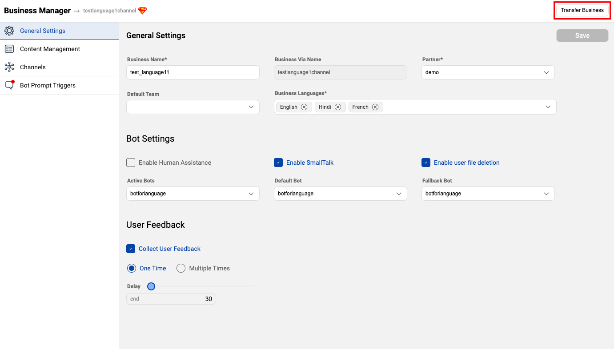

## When and Why to use the Transfer option?

Once the IVA is ready and needs to be taken live on production environment, that is when we use the transfer option. On clicking the Transfer button, the IVA and business manager are made available on the production environment as well.

> **Staging** is our Development environment and **Production** is our Live environment

- Only the IVA and Business are needed to be transferred, a new Partner on production should be created before the transfer process.

- The Business Manager should be transferred to production before the bot.

## Transferring your Business from Staging to Production

The Business Manager is responsible for the configuration of multiple key characteristics of the IVA such as the appearance of the bot, bot break messages, deployment settings, bot prompts and taskboxes. Hence, the business needs to be transferred to the production environment.

You can click on the **Transfer button** as shown in the below image.

> The Business should be transferred again if there are modifications made after the Business is live.

## Transferring your IVA from Staging to Production

Whenever the Transfer button is clicked, all the Story(s), Sub-Story(s), entities, connections and details of the IVA are transferred to the production environment. The transfer button is on the top-right corner of the IVA screen.

You will be shown a pop-up if there are any issues with the IVA before Transfer starts. You can confirm to proceed by clicking on the **Transfer** button.

> The IVA should be transferred again if there are modifications made after the IVA is live.
