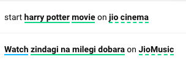
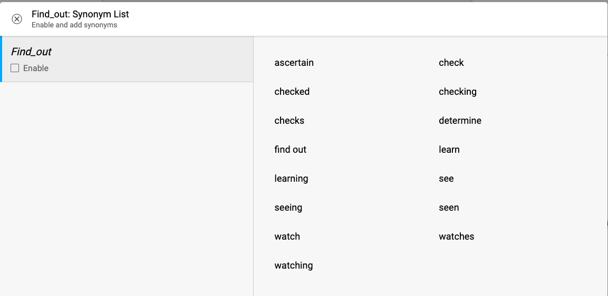
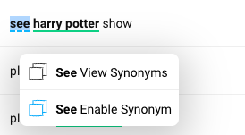
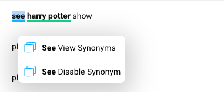
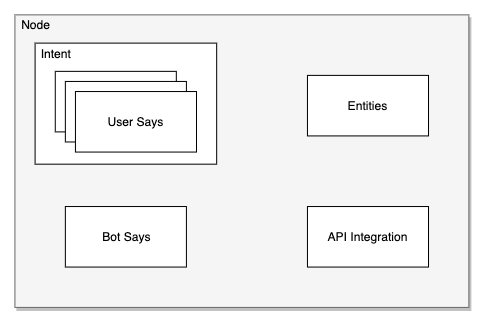
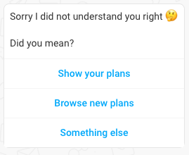
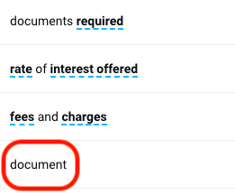
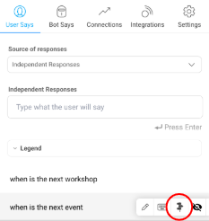

## **Introduction**

By the end of this section, you will learn how you can train a bot to understand a User’s message so that the bot can reply back with an appropriate response. 

## **What is User Says?**

User says are the inputs from the user that the assistant needs to interpret the user’s goal. it is important to add and train the bot with a variety of different sample user says for each node, so that the bot can identify the correct intents and extract entities from the user utterance.

Whenever a user sends a message, we try to understand what the User is trying to say using various Machine Learning algorithms and find the corresponding node. One of the key modules which is used for node identification is intent detection module, which is a suit of many ML algorithms that help in finding the right node.

For example, if you want a node to get detected when a user says "Status of my complaint", then you should add variations of the utterance in the user says section on that node.

        status of my complaint

        I want to know about my complaint

        update me on the status of issues I had raised

### **Things that affect User Says**

* Add a minimum of 10 variations to increase the accuracy of node detection. If you have any node with one or very few example utterances, the system will not be able to accurately detect the node. This is especially important when you have multiple nodes that are very close in their meaning.

* Add user says variants that you think users might enter. Include utterances, which mean the same thing but the sentences are structured in a different form. Add variations to user says which have different patterns, synonyms, sentence structure, tense etc,. 

Consider the following sentence structures - 

* **Length of user says** - Add the sentence with context. Do not add fragments without context.

    <table>
      <tr>
        <td>update me on the status of issues I had raised</td>
      </tr>
      <tr>
        <td>complaint status</td>
      </tr>
      <tr>
        <td>status of my complaint</td>
      </tr>
      <tr>
        <td>give me status of issue raised</td>
      </tr>
    </table>

* **Syntactical structure** - Add sentences with varied structure 

    <table>
      <tr>
        <td>what is the status of my complaint?</td>
      </tr>
      <tr>
        <td>issue resolved or not?</td>
      </tr>
      <tr>
        <td>complaint yet not resolved</td>
      </tr>
      <tr>
        <td>tell me status of the problem I had raised earlier</td>
      </tr>
    </table>

* **Keep the language simple** - Think of how the user would represent the action. User might not be a domain expert, use simple terms in your sentence, that are a part of day to day vocabulary

    <table>
      <tr>
        <td>what is the status of my complaint?</td>
      </tr>
      <tr>
        <td>issue resolved or not?</td>
      </tr>
      <tr>
        <td>problem yet not resolved</td>
      </tr>
    </table>

* **Position of the entity in user says** - Add variations where entities are placed at the beginning or middle or end of the user utterance

    <table>
      <tr>
        <td>Play harry potter on netflix</td>
      </tr>
      <tr>
        <td>On netflix play movie harry potter</td>
      </tr>
    </table>

* **Vocabulary** - The core term in the sample user says is "laptop". Add alternatives like desktop, workstation, computer, machine. 

    <table>
      <tr>
        <td>How can I get a laptop</td>
      </tr>
      <tr>
        <td>Where can I get a workstation</td>
      </tr>
      <tr>
        <td>How to place an order for a machine</td>
      </tr>
    </table>

* **Tense** - Our system understands difference in the tense of a sentence. You can add the utterances to different nodes and handle them as distinct intents

    <table>
      <tr>
        <td>I will do my booking</td>
      </tr>
      <tr>
        <td>I did my booking</td>
      </tr>
      <tr>
        <td>I am doing my booking</td>
      </tr>
    </table>

### **Entity Tagging**

As long as one entity value is tagged in the user says, the system will automatically define alternative values. This identification of entities will be done by itself. If you wish to collect these entities in the user says for use later on, use context entities. TBD: Use when you have infinite variations of a particular entity (Movie names, song names etc)

  <table>
    <tr>
      <td>play harry potter on Netflix</td>
    </tr>
    <tr>
      <td>play harry potter on Hotstar</td>
    </tr>
    <tr>
      <td>play harry potter on Jio Cinema</td>
    </tr>
  </table>

With the feature entity tagging in user says, bot builders no longer have to add similar variations in the user says with all the entity values mentioned in the dictionary. 

Instead, they have to enter one user says variation with the entity value. The entity get auto tagged in the user says if they are added to the dictionary.  

> **_IMPORTANT_**
>
> - _If the bot is on NLU version V2.0 and above, entity tagging feature is enabled by default._
> - _Bots below NLU version V2.0 will not have access to this feature._

*For example: You might have nodes which have sentences like "I want to play bahubali on Jio cinema", “I want to play bahubali on hotstar” etc. on ***_‘Play_Content’_*** node.*

If you notice these utterances, the only difference is "Jio cinema" and “hotstar” which are values in the same content_type entity.

To simplify and reduce the effort of generating such User Responses where a common set of words which belong to the same entity are needed, you can enable entity feature on the bot.

> **Tip**: _Solid Green underline means entity feature is enabled. Dotted Green underline means entity feature for that entity has been disabled on the node._

### **Synonyms**

While building a bot, you might have nodes which have sentences like "I want to buy this product", “I want to purchase this product” etc. on a Shopping Node.

If you notice these utterances, the only difference is "buy" and “purchase” which are words with the same meanings i.e. they are synonyms.

To simplify and reduce the effort of generating such user says where a common set of words with the same meaning are needed, you can enable synonyms for specific words in the bot.

> **Tip**: _Tip: Dotted Blue Underline means synonyms are available. Solid Blue underline means Synonyms for that word have been enabled in the Bot._

#### View Synonyms

For words which have Synonyms, you can double click on the word and select "View Synonyms" from the menu.

This will open up a list of all available Synonyms for the word you selected.

After viewing the synonyms, just select the "Enable" checkbox in the View Synonyms modal to enable the synonym.

#### Enable / Disable Synonyms

For words which have Synonyms, you can double click on the word and select "Enable Synonyms" from the menu to **enable** the synonym. **Disabling the synonyms will disable it on the entire bot.**

Similarly, for words which have Synonyms, you can double click on the word and select "Disable Synonyms" from the menu to **disable** the synonym.

So for our Shopping Node example, if you Double click on "buy" -> Select “Buy Enable Synonyms” from the context menu -> Enable a specific Synonym cluster, then you can avoid adding variations of the word "buy".

> _**Common Mistake**: Ensure that you enable the correct set of synonyms in the user says as 1 word can have multiple meanings. For example, "speaker" could mean the electronic devices as well as a human is speaking at an event.*_

### **Sample user says utterance**

* **_Add_** variations of the sentence that can be used to perform the same action.

  For Example:

  1. _If you are creating a node to get the ‘***complaint status***’, add variations_

        * status of my complaint

        * complaint status

        * I want to know about my complaint

        * update me on the status of issues I had raised

        * what happened to the issues which were raised by me yesterday

        * were you able to resolve my problem?

        * what is the status of my complaint?

        * is my issue resolved or not?

        * are you working on fixing my problem?

        * I filed a complaint 2 days ago. Any update?

        * give me an update on my complaint.

        * provide status for complaint ticket that was raised

        * can you help me with the complaint status

    1. _If you are creating a node to ‘***_generate leads_***(**process of identifying potential customers for a business's products or services**)', add variations:_

        * please call back

        * request a callback

        * provide a demo

        * I requested a callback for a demo

        * I am planning to apply for a home loan. Need a demo

        * I would like to checkout the demo

        * how can I get a demo for home loan application

        * I want to apply for a home loan

        * need a home loan

        * can somebody call to help me to apply for the loan

        * what is the procedure to apply for house construction

        * would like to schedule a callback for home loan application

        * I require home loan to buy a plot

* **_Do not add_** variations that are not related to the same node, just because the response for the intents are similar.

  *For Example:*

    1. _It is not a good practise to add the below mentioned user says variations to **‘complaint status node’**_

        * *"complaint"*

            * **_Why is it wrong_** - Don’t add single words or fragments such as complaint or status to the user says. Please add context around these words. It helps in detection of the right node.

            * **_Do this instead_** - The node will be detected when user types complaint. Solve such cases with disambiguation, but don’t muddle the training data.

        * *"what status"*

            * **_Why is it wrong_** - The node will be detected when user types status. Adding data without proper context will not add proper value to the training data. 

            * **_Do this instead_** - Instead of adding ‘what status’, add ‘what is complaint status’ to user says. This provides context around the sentence

        * *"you are not able to solve my problem"*

            * **_Why is it wrong_** - Expands the scope of intent itself. 

            * **_Do this instead_** - Create a new node to handle user queries that are not related to the same intent

        * *"what is the reason you haven’t resolved my complaint yet?"*

            * **_Why is it wrong_** - Expands the scope of intent itself

            * **_Do this instead_** - Create a new node to handle user queries that are not related to the same intent

        * *"what is the time duration to resolve a ticket"*

            * **_Why is it wrong_** - Scope of intent should be to get the status of the complaint.

            * **_Do this instead_** - Handle such question using the FAQ nodes section

        * *"how to raise a complaint?"*

            * **_Why is it wrong_** - Scope of intent should be to get the status of the complaint.

            * **_Do this instead_** - Handle such question using the FAQ nodes section

        * *"how to check the status of my complaint?"*

            * **_Why is it wrong_** - Scope of intent should be to get the status of the complaint.

            * **_Do this instead_** - Handle such question using the FAQ nodes section. Provide steps on how user can check the status of a complaint

        * *"what is the customer care number?"*

            * **_Why is it wrong_** - There is no mention of complaint status update.

            * **_Do this instead_** - Handle such question using the FAQ nodes section. Create a FAQ node called ‘Find Customer Care Number’

        * *"**tickt**" / “**tckt**” / “**cmplaint**” / “**complant**”*

            * **_Why is it wrong_** - Don’t add spelling mistakes in the user says.** Adding spelling mistakes to the user says muddles the training data.

            * **_Do this instead_** - Let the spell checker module handle cases when user enters incorrect spelling in the user utterance. Real time logs will show the spell corrections performed by the module. If you see any discrepancy in the corrected data, please contact the ML team.

    1. _It is not a good practise to add the below mentioned user says variations to **‘lead gen node’**_

        * *"I have taken first disbursement of home loan from the bank can I get top up for furniture"*

            * **_Why is it wrong_** - Expands the scope of intent itself. Top-up loan intent should not be covered under the scope of lead generation.

            * **_Do this instead_** - All top-up loans related user says should be added to a new node

        * *"transfer it back to XYZ bank will you finance the amount"*

            * **_Why is it wrong_** - Out of scope of the lead generation.

            * **_Do this instead_** - Create new node to handle transfers and financing related queries

        * *"Can you send your executive to collect my documents"*

            * **_Why is it wrong_** - Expands the scope of intent from lead generation to a request to collect documents

            * **_Do this instead_** - Create a new node to handle document collection queries

        * *"Do i need ITR for applying loan"*

            * **_Why is it wrong_** - Expands the scope of the intent.

            * **_Do this instead_** - Handle such queries using the FAQ nodes section

        * *"What documents do I need to apply for a home loan"*

            * **_Why is it wrong_** - Expands the scope of the intent.

            * **_Do this instead_** - Handle such question using the FAQ nodes section. Provide list of documents required to apply for a home loan.

        * *"What is the procedure to apply for a home loan"*

            * **_Why is it wrong_** - Expands the scope of the intent.

            * **_Do this instead_** - Handle such question using the FAQ nodes section. Provide steps to follow to apply for a home loan. 

        * *"I tried to call the number but no one is picking up"*

            * **_Why is it wrong_** - Expands the scope of the intent.

            * **_Do this instead_** - This is a follow up question from the user. Create a new node to handle such queries.

## **Types of ‘User Says’**

Depending on how and when you want your node to get detected, there are 2 types of User Responses that can be configured on a node. :

* Independent Responses

* Negative Responses

### **Independent Response**

If you created a Start Node to get detected at the beginning of a conversation, then you would add the corresponding user responses for the node under this category.

*IMPORTANT: Independent responses are available only on a Start Node. User says section will be disabled on non-start nodes.*

For example, in a lead gen bot as below, we would add the following User Responses on the "Show Services" node and “About Demat Account”.

<table>
  <tr>
    <td><b>Show Services</b></td>
    <td><b>About Demat Account</b></td>
  </tr>
  <tr>
    <td>What products do you offer</td>
    <td>What is a demat account</td>
  </tr>
  <tr>
    <td>Can you show me the services you offer</td>
    <td>Can you help me with info about demat account</td>
  </tr>
  <tr>
    <td>Show services</td>
    <td>Tell me about demat account</td>
  </tr>
</table>

> *Tip: User Responses are case insensitive and ignore punctuation. So don’t and dONt are the same.*

### **Negative Response**

This section will explain how our system is trained to ignore the nodes depending on what the user says.

For example, if you have the following nodes:

<table>
  <tr>
    <td><b>Independent Responses</b></td>
    <td><b>Negative Responses</b></td>
  </tr>
  <tr>
    <td>I want to register</td>
    <td>I don’t want to register</td>
  </tr>
  <tr>
    <td>Your service was amazing</td>
    <td>Your service was very bad</td>
  </tr>
</table>

> **_Myth_***: You need to add keywords to negative responses*
>   
> **_Reality_***: Negative responses on our new pipeline support sentences. Please add the sentence to the negative response.*

Now when a user utterance has similar sentence structure and vocabulary to any of the user says on the node. Due to the high similarity of the sentences, it is possible that an incorrect node may get selected.

To avoid this, you can add this sentences under Negative Responses of the node which will train the system not to pick the node.

For Example, in the above scenario, if we add "Your service was very bad" as a Negative Response on the "Good Service" node, then the Good Service node will not be considered if the User says "Your service was very bad.''

### **Nodes vs Intents vs User Says**

**Nodes** are the interlinked building blocks of a bot. Each node encompasses components such as User says, Bot Says, Entities and API integrations needed to identify the users intention.

**Intent** is a box of expressions that mean the same thing from a *linguistic perspective* but are constructed in different ways. The ‘User Says’ section is simply a representation of this intent.

**User says** are the user utterance that the assistant needs to interpret the user goal. Add variations of the utterance in user says section to make the bot smarter.

For example, if users wants to ‘*track an order*’, user could say any of the following - 

* Track my order

* Why is my order late?

* Delivery executive number

* Order ETA

All the above are their own **nodes** in our system, with their corresponding intents which will help user _**‘track an order’**_

> *Tip: Create separate nodes in the system to handle each of the above mentioned intents.*
>   
> Long story short:  _**1 Node ==  1 Intent**_

### **Best practices for building the bot** 

### **DOs**

* **Define distinct intent**

  Having proper distinction for intents should result in recognition of the right intent.

  If the vocabulary of the sentences in two intents are more or less same, combine the intents, and use entities instead.

  For example, consider the following variants -

    <table>
      <tr>
        <td>I want to book a flight</td>
      </tr>
      <tr>
        <td>I want to book a hotel</td>
      </tr>
    </table>

  > *Tip: Use the data from ‘***_Bot training email_***’ to determine if there are any conflicting sentences in different nodes. Email contains a table that shows the sentences from different nodes that are close to one another.*

* **Balance your user says across nodes**

  The quantity of example utterances in each node must be relatively equal, for the detection to be accurate.

  If you have one node with 100 sample user says and another node with 20 sample user says, the node with 100 user says will have a higher chance of getting detected. 

* **When to create a node vs entity**

  Create a new node for tasks that your bot will perform. Use entities as parameter that make that task possible.

  For a bot that will get offers for phones, create one PhoneOffers node. Do not create nodes for every phone or every model. Add phone or models as entities and use them in the sample user says.

* **Adding new words to vocabulary**

  For the bot to learn new words specific to a domain, they should occur at least 3 times in the bot’s user says. Eg. Aaple, VOLTE.  Another thing which we should add here is, for bots (like RTS etc), which have "domain specific words" like "aaple, pmay etc" which are not "English words" but have meaning in a particular domain, those non-english words should occur at least 3 times in the bot for us to consider them as "domain specific words".

  Higher the number of times in DIFFERENT CONTEXT these words occur, the better will be our understanding (embedding) of these words.

  If a non-english word occurs less than 3 times in the whole bot, we'll consider it to be a spelling mistake

### **DONTs**

* **Expansion of scope of intent**

  If the variations are expanding the scope of the intent, create a new node and add variations on the new node.

  For example, consider the *‘track order’* use case. All the below mentioned utterances have different goals. Avoid adding all these utterances to the same node. Handle them as separate intents and add them to different nodes in your bot.

    <table>
      <tr>
        <td>track my order</td>
      </tr>
      <tr>
        <td>talk to a customer care representative</td>
      </tr>
      <tr>
        <td>my request has not been fulfilled</td>
      </tr>
    </table>

* **Fragments**

  User says should refer to an action or request. Should not be partial fragments. Partial or incomplete phrases decrease the chance of user getting a relevant bot response. We’d want a bot builder to add full sentences as User says, so our classifier understands the correct intent on a node. And in cases when there are similar intents on a bot, our disambiguation feature should handle ambiguous user queries. Read more on disambiguation later in this guide. 

  For partial fragment example, consider the following user says variants - 

    <table>
      <tr>
        <td><b>Correct</b></td>
        <td><b>Incorrect</b></td>
      </tr>
      <tr>
        <td>I want to know the price of a 2kg cylinder</td>
        <td>2kg</td>
      </tr>
      <tr>
        <td>how to apply for a loan</td>
        <td>loan</td>
      </tr>
      <tr>
        <td>play bahubali on Netflix</td>
        <td>play</td>
      </tr>
      <tr>
        <td>how to apply for a loan</td>
        <td>apply</td>
      </tr>
      <tr>
        <td>contact details of the dealer</td>
        <td>dealer</td>
      </tr>
      <tr>
        <td>why were points deducted from my account</td>
        <td>points</td>
      </tr>
      <tr>
        <td>what is the process of scoring points</td>
        <td>score</td>
      </tr>
    </table>

> *Tip:*
>  
>  *Think what the user would say instead of trying to cover all cases by adding one word or smaller sentences (Handle with disambiguation)*
>  
>  *What if user says consists of ‘cylinder’, it could fall under any of the following intents and possibility of selecting the wrong node is higher during conflicts -*
>  
>   *  I want to get a 2kg cylinder
>   *  I want to make a payment for the cylinder
>   *  My cylinder was not delivered

* **Spell checker**

  User says should not contain common spelling mistakes. Spell corrector module will take care of these scenarios.

  <table>
    <tr>
      <td>Wrong </td>
      <td>Right </td>
    </tr>
    <tr>
      <td>thanx | thankss | thankks</td>
      <td>thanks</td>
    </tr>
    <tr>
      <td>rechrg | rechrge | recharg</td>
      <td>recharge</td>
    </tr>
    <tr>
      <td>bouns | bonas </td>
      <td>bonus</td>
    </tr>
    <tr>
      <td>case bones | cash bones</td>
      <td>cash bonus</td>
    </tr>
  </table>

  * Spell checker consists of a normalisation module which deals with scenarios such as -

      <table>
        <tr>
          <td>callback | call back</td>
        </tr>
        <tr>
          <td>set top box | settopbox</td>
        </tr>
        <tr>
          <td>web check in | web-checkin | web check-in</td>
        </tr>
      </table>

> *Important: For this module to work, bot developer should have entered the correct spelling variations at-least once in user says.*

* **Chit Chat:**
  
  Use Smalltalk. Do not create nodes to handle general chit-chat. 

> *Tip:*
>  
>  *Smalltalk can handle general chit-chat with the user. Bot builder can now edit bot says in Smalltalk to be bot specific content. Intents such as Greetings, User upset, user dropout are already present in Smalltalk.*
>  
>  *Send a note to Platform support if any intent is missing or content needs to be edited.*

## **Disambiguation**

**When do we need Disambiguation?**

* When there are two multiple intents in a bot, there’s a good chance of sending the wrong node response to end user. Especially, when keyword(s) in these intents are same.

* And when bot builders add similar user says on multiple nodes. To correct this behaviour and improve end user experience, we use disambiguation.

**How Disambiguation works?**

When we get an ambiguous message from a user on a bot, we send a disambiguation message with possible nodes as options. For reference, when user types "*plans*" in a bot with multiple intents around the keyword, we disambiguate by sending the message below -

>*Tip:*
>  
>To make sure, disambiguation works right on your bot, please account for the points below - 
>  
>* Avoid adding single words in User says
>  
> 
> 
>* Make sure you add at least 10 to 15 User says per node for our classifier to work
> 
> * When there’s a parent node that transitions to multiple child nodes, and the difference in intent is only on the basis of one keyword, there’s a good chance of disambiguation. Check the example of user says on parent/child nodes below - 
> 
>    * Parent node: Suggest a plan 
>  
>    * Child node 1: Suggest a **data** plan 
> 
>    * Child node 2: Suggest a **voice** plan
> 
>As you can see from the example above, the child node intents and parent node intent are differentiated by the presence of only a single word.  

**Setting up Disambiguation**

The Node-wise copy is controlled from the "Disambiguate message" flag in User Says. You can add < 21 characters as the node suggestion go as buttons on the Web SDK. 

> *Note*: If Disambiguate message is not marked on node, we pick *Node name* field as default. 

