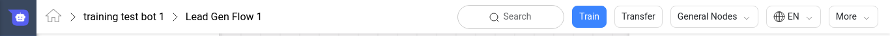
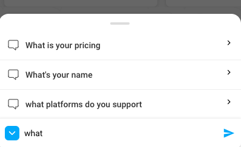

# Introduction

By the end of this section, you will learn how you can train a bot to
understand a User’s message so that the bot can reply back with an
appropriate response.

## What is User Says?
Whenever a user sends a message, we try to understand what the User is
trying to say using various Machine Learning algorithms and find the
corresponding node on mogambo. One such set of algorithms that we use at
Haptik is the **Sentence Similarity** module, which is a suite of many
different ML algorithms that help in finding the right
node.

For example, if you want a node to get detected when a user types *
“Status of my complaint”*, then you should add *“Status of my complaint”
* as a *User Says* on that node.

> **Tip**: Add multiple variations of the response to make the Bot
> smarter and understand more variations.
    For Example: “Status of my complaint”, “Complaint status”, “I want
    to know about my complaint” etc.

Depending on how and when you want your node to get detected, there are
3 types of User Responses that can be configured on a node:

- Independent Responses
- Dependent Responses
- Negative Responses

## Independent Responses
If you created a Start Node to get detected at the beginning of a
conversation, then you would add the corresponding user responses for
the node under this category.

> **Best Practices**: Use independent responses only on a Start Node

For example, in a lead gen bot as below, we would add the following User
Responses on the *“Show Services”* node and *“About Demat Account”*.

Show Services | About Demat Account
--------------| -------------------
What products do you offer | What is a demat account
Can you show me the services you offer | Can you help me with info about demat account
Show services | Tell me about demat account

> **Tip**: User Responses are case insensitive and ignore punctuations.
>  So *don’t* and *dONt* are the same.

## Dependent Responses
If you have connecting nodes, and you want the child node to be detected
**only** when when the user says something on the parent node, then you
can use Dependent Responses.

For example, after asking for Demat Account, if the User wants to know
how to open an account, you could add "Open Account" as a Dependent User
Response on "Open Demat Account" with "Demat".

## Negative Responses
The above sections explained how you can select a node depending on what
the user said. This section will explain how to filter out nodes
depending on what the user says.

For example, if you have the following nodes:
**Good Service** | **Bad Service**
-----------------| ---------------
Your service was *very* good | Your service was **not** good.
Your service was excellent | Your service was bad

Now when a user says "Your service was not good", even though the User meant
something very different, because of high similarity of the sentences in
both the nodes, it is possible that an Incorrect node may get selected.

To avoid this, you can add specific keywords under Negative Responses of
the node which will filter out the node, if the keyword is a part of the
user's message.

For Example, in the above scenario, if we add "bad" as a Negative
Response on the "Good Service" node, then the Good Service node will not
be considered if the User's message has "bad" in it's sentence.

> **Common Mistakes**: Adding similar responses on 2 different nodes

## Synonyms
Sometimes, you might have nodes which have sentences like “I want to buy
this product”, “I want to purchase this product” etc. on a Shopping Node.

If you notice these responses, the only difference is “buy” and
“purchase” which are words with the same meanings i.e. they are synonyms.

To simplify and reduce the effort of generating such User Responses
where a common set of words with same meaning are needed, you can enable
synonyms for specific words in the bot.

> Tip: Black Underline means synonyms are available. Blue underline
> means Synonyms for that word have been enabled in the Bot.

#### View Synonyms
For words which have Synonyms, you can double click on the word and
select “View Synonyms” from the menu.

This will open up a list of all available Synonyms for the word you
selected.

#### Add Synonyms
After viewing the synonyms, just select the "Enable" checkbox in the
View Synonyms modal.

So for our Shopping Node example, if you Double click on “buy” -> Select
“Add Synonyms” from the context menu -> Enable a specific Synonym
cluster, then you can avoid adding variations of the word "buy".

> **Common Mistake**: Ensure that you add the correct set of synonyms as
> 1 word can have multiple meanigs. For example, “speaker” could mean
> the electronic devices as well as a human speaking at an event.

## Spell Correction
To account for user’s mistakes, the Sentence Similarity module accounts
for some spelling mistakes that a user could make.
For example, if a user types “Show me servises” or “Show me serveces”,
they would still be matched to the “Show Services” node as per the above
examples.

## Train Bot
The User Responses added on the node above are processed using the
Sentence Similarity Module to generate the machine learning models.
These models are then used on User’s every message to select the node
which matches the requirements.

To generate these models, you will have to click on Train Bot. This will
send an email with the result of the training process. It will also
contain details of any probable errors which could come up because of
incorrectly entered data.

For example, if you add very similar sentences in two different nodes,
then the resulting email will show details about the conflicting nodes
and responses.

> **Common Mistakes**: Bot Builders often forget to click on Train Bot
> after making changes in the User Says of a node.

> **Tips**: Check email for conflicting responses or other errors in the
> User Responses in the bot.

## Autocomplete suggestions 

For all bots on Web SDK, as users start typing, the Taskbox can turn dynamic in autocomplete suggestions mode (refer the image below). We match the user's typed letters with user says sentences on the bot. 

      You have to enable autcomplete feature manually on your bot. 

Two steps to make autocomplete feature live on a bot -

**Step 1** - The bot builder needs to flag (refer image below) a particular user says sentence on every `start node`. And this sentence will be suggested as user types in the message composer. This control is provided to suggest the grammatically correct i.e. apt user says sentence from a node. 

**Step 2** - In the InitSettings when initializing the sdk, `"enable-typing-suggestions": true` needs to be added.

We built this feature to -
1. Help users discover the scope of our bot while an user starts typing
2. Avoid bot breaks as user selects our suggestion than type a random freeform message.

## Disambiguation

The power to disambiguate poorly constructed user messages can make bots work 10X better as compared to the traditional bot platforms.  

#### When do we need Disambiguation?

When multiple intents are closely tied, there’s a good chance of user landing on the wrong node. Especially, when keyword(s) and user says variants in these intents (nodes) are same. Bot builder sometimes would add similar user says on multiple nodes. To correct this behaviour and improve end user experience, we probe the user by sending a disambiguation message.

#### How Disambiguation works?

When we get an ambiguous message from a user on a bot, we send a disambiguation message with possible nodes as options. For reference, when user types “plans” in a bot with multiple intents around the keyword, we disambiguate by sending the message below -

    Tip: The button options above are diffent nodes. And this node level copy to be marked on User says. 

Only one User says variant will marked as the copy to shown when a node is chosen as a button option in the disambiguation message. Also note that the `Node name` in Node settings section on a node is the default copy in disambiguation message if bot builders don’t mark any user says on a node. 
