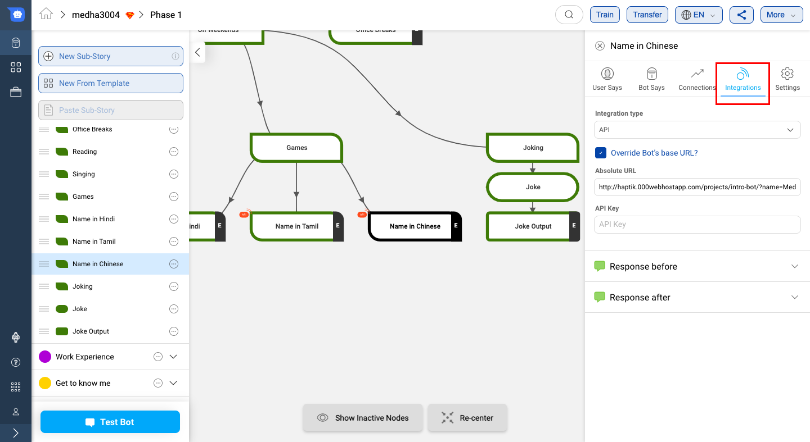
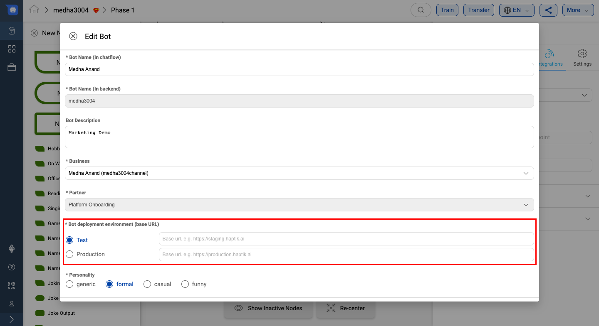

## Introduction
Once a particular node has been detected and the mandatory entities have been collected, these entities can be used to execute your own business logic by passing them to the APIs using Static Node `Integrations` tab.



## Using `Integrations` under Static Node

A node can be configured to call a API once the required entities have been collected.

To deploy a live API that can receive the events, your code must be hosted on a public HTTP server that has the following:

- A Valid SSL Certificate
- An open port that accepts `GET` and `POST` requests

There are two ways to use APIs to integrate external code in your IVA. The two ways are:

### 1. Relative URLs

In the first method, you can set a common base URL for the IVA. And then you can add relative paths in the node where the integration is required. This method allows you to set two base URLs, one for the test environment and one for the production environment.

Having environment specific base URLs allows you to easily test your bot with code from different environments. Also because only the production base URL will be used in production, this helps you avoid issues of accidentally having a production bot linked to non production code.


In your test environment you can configure which environment's base URL to use. However, in production only the production environment's base URL will be used. This is to ensure that the bots in production are only referring to production code.

#### Setting up base URL
You can set the environment specific base URLs while creating the bot as shown below.

1. Click on Create Bot
2. Fill details and scroll down to the `Bot deployment environment` section.
3. Enter the environment specific base URLs.


For existing bots you can set or update these URLs by using the `edit bot` option from the top menubar in the bot builder tool.



#### Adding integration endpoint

1. Click on node on which you want to add integration function
2. Select Integration
3. Select API and put API endpoint like shown in image


***Note***: The endpoint uses the environment specific base URL of the bot. You can see the URL in the label of the textbox.

### 2. Override base URLs and use absolute URLs
The second method is to use absolute URLs. There might be times where you want to use an API endpoint on a domain which is different from the base URL. In such cases you can override the base URL as shown below. Just select the override base URL option and enter the full URL including the path in the text box.


**Request Method**

POST

**Request Headers**

| Header          | Description                                                  |
| --------------- | ------------------------------------------------------------ |
| Content-Type    | application/json                                             |
| X-Hub-Signature | sha1=signature (The HMAC hex digest of the request body. This header will be sent if the node is configured with a secret. The HMAC hex digest is generated using the sha1 hash function and the secret as the HMAC key.) |

**Request and Response Parameters**
Refer the documentation [here](https://docs.haptik.ai/bot-builder/integrations/integration-parameters) for request and response parameters.

**Validate Webhook**

The HTTP request will contain an X-Hub-Signature header which contains the SHA1 signature of the request payload, using the secret_key entered for the node, and prefixed with sha1=. Your API can verify this signature to validate the integrity and origin of the payload.

**Sample python code for webhook**

```python
# !/usr/bin/env python

"""
Simple HTTP server in python for handling haptik webhooks.

Usage::
./test_server.py [<port>]

"""
import cgi
import json
import hmac
import hashlib
from BaseHTTPServer import BaseHTTPRequestHandler, HTTPServer


class WebhookServer(BaseHTTPRequestHandler):
    def _set_headers(self, status_code, content_type):
        self.send_response(status_code)
        self.send_header('Content-type', content_type)
        self.end_headers()

    def do_GET(self):
        self._set_headers(status_code=200, content_type='text/html')
        self.wfile.write("<html><body><h1>Test Server</h1></body></html>")

    def do_POST(self):
        content_type, pdict = cgi.parse_header(self.headers.getheader('Content-Type'))

        if content_type != 'application/json':
            self.send_response(400)
            self.end_headers()
            return

        length = int(self.headers.getheader('Content-Length'))
        if not length:
            self.send_response(400)
            self.end_headers()
            return

        body = self.rfile.read(length)
        data = json.loads(body)
        secret_key = 'test'
        hash_value = hmac.new(secret_key, body, hashlib.sha1).hexdigest()
        sha1_signature = 'sha1=' + str(hash_value)
        request_signature = self.headers.getheader('X-Hub-Signature')
        if sha1_signature != request_signature:
            self.send_response(401)
            self.end_headers()
            return

        entities = data['entities']
        product_name = entities['product_name'][0]['entity_value'] if entities.get('product_name') else None
        if product_name == 'speaker':
            message = 'The Wireless Radio Alarm Clock Speaker can be yours only for Rs.1599'
        elif product_name == 'powerbank':
            message = 'The Ambrane Powerbank can be yours only for Rs.1799'
        else:
            self.send_response(400)
            self.end_headers()
            return

        response = {"status": True, "response": [message]}
        self._set_headers(status_code=200, content_type='application/json')
        self.wfile.write(json.dumps(response))

    def run(server_class=HTTPServer, handler_class=WebhookServer, port=80):
        server_address = ('', port)
        httpd = server_class(server_address, handler_class)
        print 'Starting test server...'
        httpd.serve_forever()

if __name__ == "__main__":
    from sys import argv
    if len(argv) == 2:
        run(port=int(argv[1]))
    else:
        run()
```
