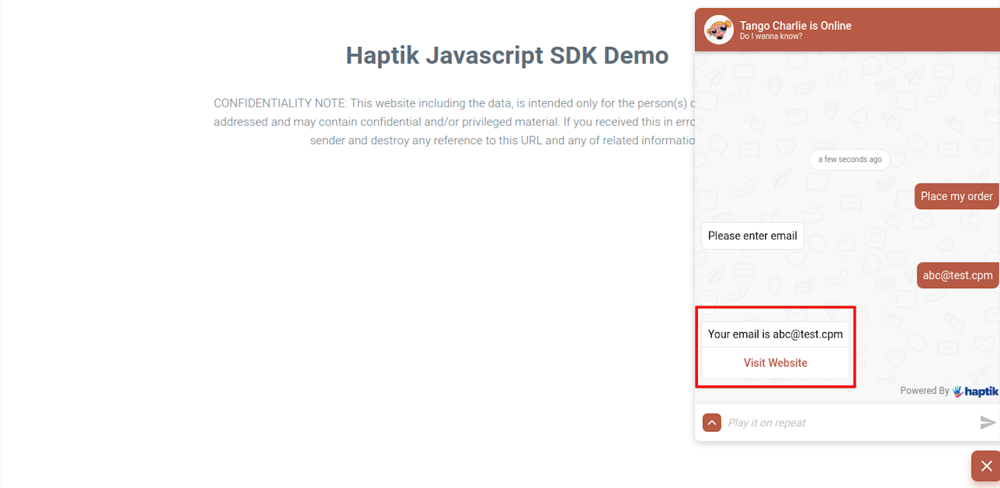
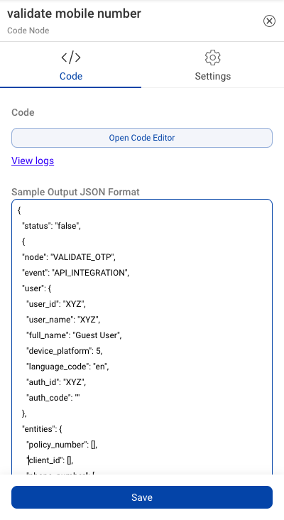
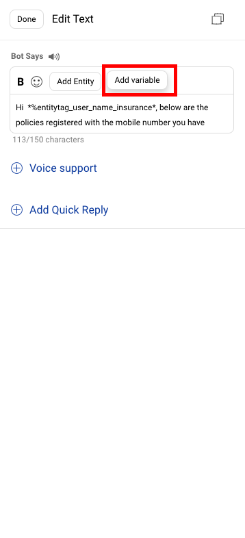
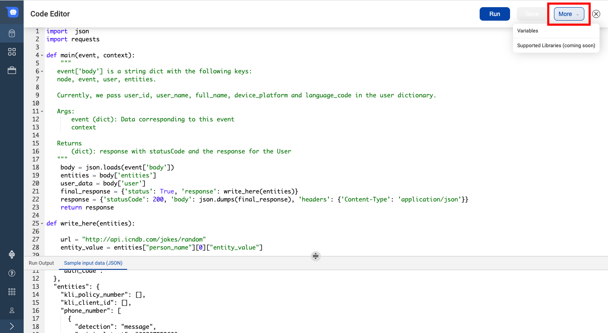
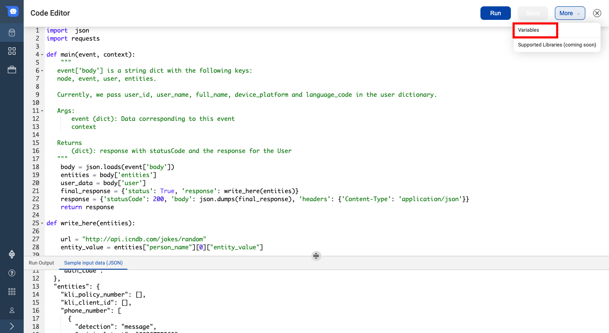
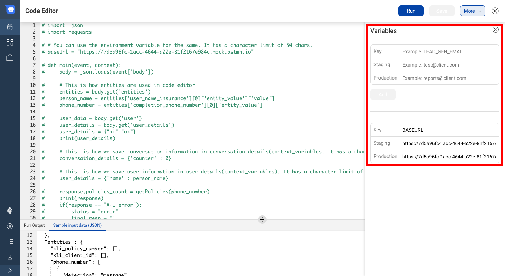
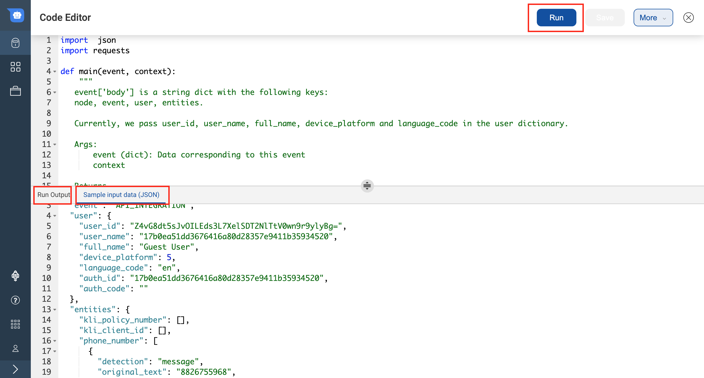
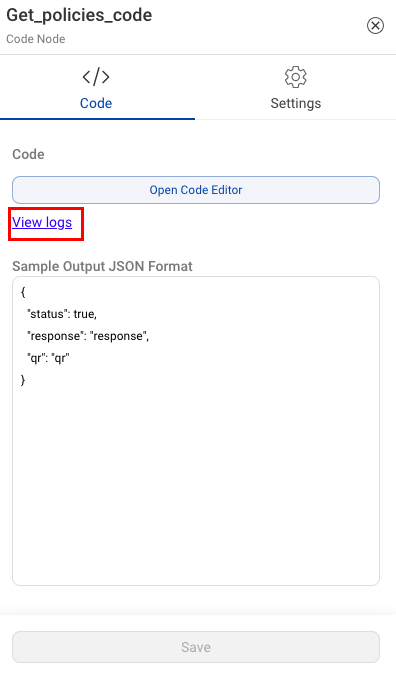
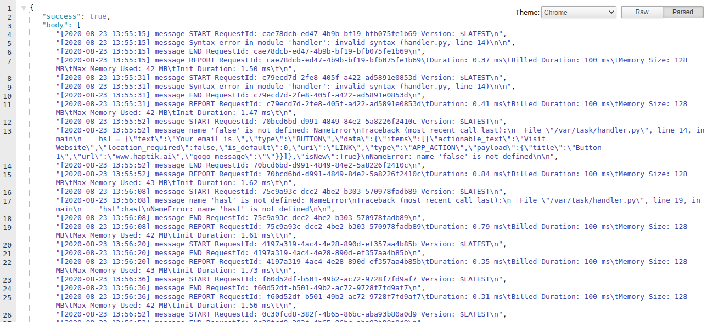

## Introduction

In most cases, APIs are not directly consumable by the authoring platforms. This is because the request format of the external API is generally different from the format in which the platform makes the request. Additionally, the response data from the API won’t be directly consumable by the platform as the response format for the virtual assistant is different from the response format of the API. The way most platforms solve this is by building a middleware on top of the external API to convert the request and response into appropriate formats. 

Haptik’s Conversation Studio solves these problems in a novel way through the use of an integrated Code Editor. The Code Editor allows bot builders to easily integrate with external platforms through python scripts. This removes the requirement to build a middleware on top of the external API. The Code Editor uses a serverless implementation so it is more scalable. Another benefit of using the Code Editor is that simple dynamic behavior can be easily added through python scripts without having to build an API to do it.

The Code Editor provides logger support and live testing of the code. It also helps to manage IVA state by storing contextual information related to the current conversation that the user is having with the IVA. Some examples of this are order id or order details that the user is exploring in the current conversation.

The Code Editor feature allows for a quick go-to-market and significantly reduces the infrastructure cost.

You can open the code editor by choosing a Code Node and then clicking on the `Open Code Editor` button.


## Using Code Editor

The only requirement for using the code editor is, the code should follow the below format. The supported programming language is Python 3 and above.

If any syntax errors or exceptions are raised by the main function, this will result in a **Bot Break message**.

```python
import  json

def main(event, context):
    """
   event['body'] is a string dict with the following keys:
   node, event, user, entities.
   Currently, we pass user_id, user_name, full_name, device_platform and language_code in the user dictionary.
   Args:
       event (dict): Data corresponding to this event
       context
   Returns
       (dict): response with statusCode and the response for the User
   """
    body = json.loads(event['body'])
    entities = body.get('entities')
    user_data = body.get('user')
    conversation_details = body.get('conversation_details')
    final_response = {
        'status': True, 
        'entities':entities, 
        'user_full_name': user_data.get("full_name"),
        'user_device_platform': user_data.get("device_platform"),
        'conversation_details':conversation_details
    }
    response = {'statusCode': 200, 'body': json.dumps(final_response), 'headers': {'Content-Type': 'application/json'}}
    return response
```

### Using Entities on Code Editor

The information which is collected from users on the Static Node, in the form of entities, can be used on Code Node to fetch user related information. 

The connection is automatic from Static Node to Code Node i.e. whenever user provides all the mandatory entity values, the following Code Node gets triggered.
In order to use these entity values in the Code Node, we have to create new variables.

Let's take an example of fetching order details. We have an entity to save **Order ID**. We would use this to understand how to fetch information using entity value on Code Node -

**order_id_demotrain** is a `regex` entity with the pattern `^[a-z]{3}\d{3}$`, this entity will accept values such as `abc123`.

There is a standard JSON format in which the values are stored within an entity. To understand this format, open the **Detailed Info** tab on the **logs** sections besides the entity value which was provided to the IVA. This is found on the Test Bot as shown below - 


So the Order ID is stored under the entity name `order_id_demotrain`. The actual `value` is stored under `entity_value`. On Code Node, you can fetch the `value` in this format - 

```python
order_id = entities.get("order_id_demotrain")[0].get("entity_value").get('value')
```
> The above example is using a regex type entity. The format in which entity is stored changes for every type of entity. Please check the Debug log section to know the format in which the entity is stored to use them on Code Node.

### Sending entity values to API to fetch data

Once the entity value is stored in a variable on the Code Node, you can use this variable to send this to the API and fetch the real-time data. You can send this variable as a payload to the API endpoint.

The following is a sample code for fetching order details - 

```python
def get_order_details(env_variables, order_id):
    url = "<API_ENDPOINT>"
    payload = {
        "order_id": order_id.upper()
    }
    headers = {
      'Content-Type': 'application/json'
    }
    try:
        response = requests.request(
            "POST",
            url,
            headers=headers,
            data = json.dumps(payload),
            timeout=7
            )
    except requests.exceptions.Timeout as errt:
        print("Timeout Error:", errt)
        error = "Timeout Error"
        response = generate_response(error)
        return response
    except Exception as err:
        print("Oops: Something Else", err)
        error = "Api Failure"
        response = generate_response(error)
        return response
   
    if response.status_code == 200:
        order_details = json.loads(response.text)
        order_details = order_details.get('results', {})
        return order_details
    else:
        print("API FAILED. STATUS CODE: ", response.status_code, response.text)
        error = "Api Failure"
        response = generate_response(error)
        return response
 ```

## Create HSLs in Code Editor

**1. Display a static HSL element -**

You can use HSLs (Chat Elements) to display different elements on the bot, such as carousels and buttons. To display HSLs using code node, we first have to copy the HSL from any static node, with the required elements such as a button. The procedure to copy an HSL is mentioned [here](https://docs.haptik.ai/bot-builder/basic/copypaste#how-to-copy-and-paste-the-hsls).


Change the **True** and **False** flags according to Python conventions as shown below -


The variables used in the code can also be used in these HSLs to show user specific information - 


Here, we have created a button HSL to display the message “Your email is **abc@test.com**” and a button which redirects to Haptik’s website. When the code is executed on the IVA, it appears as follows -



**2. Display dynamic HSL elements -**

You can show dynamic number of HSLs using the code editor. The following is an example to show the active orders of an user using Carousel element - 

```python
def get_carousel(self, orders):
        carousel_items = []
        for order_item in orders :
            carousel_items.append(self.get_carousel_item(order_item))
        carousel_hsl = {
            "text" : "Here are your order details",
            "type" : "CAROUSEL",
            "data" : {
                "image_aspect_ratio" : "1000",
                "width" : "MEDIUM",
                "items": carousel_items
            },
            "isNew":False
        }
        return carousel_hsl
```

All the orders retrieved from the API will be displayed using Carousel element as follows -


## Using final_response

The format or values which the code will return depends on `final_response` present in `def main(event, context)`.

The default `final_response` is as follows - 

```python
final_response = {
        'status': True, 
        'entities':entities, 
        'user_full_name': user_data.get("full_name"),
        'user_device_platform': user_data.get("device_platform"),
        'conversation_details':conversation_details
    }
    response = {'statusCode': 200, 'body': json.dumps(final_response), 'headers': {'Content-Type': 'application/json'}}
    return response
```
The main method returns `response`. In `response` we dump the `final_response` in JSON format.
The `final_reponse` is the JSON key-value pair which gets executed everytime the code runs. The output which you will receive upon running this code will be in the same format as defined in the `final_response`.

On `final_response` -
- You can call any method defined on the code editor.
- You can call any variable name declared on the code editor.

A sample `final_response` - 

```JavaScript
    final_response = {
    'status': status,
    'hsl': hsl,
    'channel': channel,
    'name': name,
    'query':get_query(entities),
    'message': message,
    'email': email,
    'ps_date': date,
    'ps_time': time,
    'tool': tool_name,
    'issue_type': issue_type,
    'description': description,
    'env': issue_faced_at,
    'issue_key': issue_key,
    'issue_link': issue_link,
    'conversation_details': conversation_details
    }
```
After defining the `final_response` and providing the _Sample input data (JSON)_, you can **Run** the code.
When the code is executed successfully, you get a program output in JSON format. This format is same as `final_response`.


> To know more about live testing of your code, click [**here**](https://docs.haptik.ai/bot-builder/integrations/integrating-custom-code#live-testing-your-code)

This output format needs to be added as a Sample Output JSON Format on Code Node as well to create a connection between Code Node and Output Node. 



## Providing Sample input data in JSON

The Code Editor is an integrated environment where you can write the code and also run it. In the bottom part of the page there is a _Sample input data (JSON)_ section where you can provide the enitity values which you are expecting from the user.


## Using Output Node to display Output

One Code Node can be connected to multiple Output Nodes. Depending on the conditions provided while making a connection, the Output Node gets triggered. To know more about conditions to connect Code Node to Output Node, click [**here**](https://docs.haptik.ai/bot-builder/basic/connections#code-node-to-output-node-connection-transition).

You can directly use the variables defined in the _Sample Output JSON format_ to show bot responses on the Output Node as shown below - 


You can make use of the variables coming from the Code Node to display selected variables - 


After creating a connection on the basis of variables, you can direclty show a static Bot response, as shown below - 


> **Use Raw Text/JSON HSL to use variables**

The output JSON variables are visible when we click on `Add Variables` while creating a connection between the Output node.


The output JSON variables are also visible when we click on `Add Variables` while creating a response under `Bot Says` of Output Node.



**IMPORTANT POINTS** -

1) You can access all entities of your IVA in the above code. 
2) You can call external APIs from this code as per your requirement.
3) You can send output JSON as response from the Code Editor which can be accessed in the Output Node for displaying responses to users.
4) The HSL message(Bot Says Element) that you want the IVA to respond with should be sent as a JSON in the body of the returned response object from the main function.
5) There is a 20 second time limit for code executor, which means if the API does not respond within 20 seconds of the call, the IVA will break.

## Supported Packages 
1. *Default* - [List of Packages here](https://gist.github.com/gene1wood/4a052f39490fae00e0c3#file-all_aws_lambda_modules_python3-6-txt)
2. *Extra packages* -  

chardet-3.0.4 
gspread-3.1.0 
httplib2-0.13.1 
idna-2.8 
mysqlclient-1.4.2 
oauth2client-4.1.3 
pyasn1-0.4.6 
pyasn1-modules-0.2.6 
pytz-2019.2 
redis-3.2.1 
requests-2.22.0 
rsa-4.0 
six-1.12.0 
unicodecsv-0.14.1 
urllib3-1.25.3

## Using Environment Variables
You can set environment variables for the code executor to store values like database username and passwords that you don't want to expose inside the code.

**The environment variables are stored at a bot level.** This means that variables stored in one node are automatically available to all nodes inside the bot.

You can set these variables by opening the code editor, clicking on the `More` button in the top right corner 



and selecting the `Variables` option.



In the `variables` menu that opens, you can set the variable name and values for the variable on the staging and production environments. For example you can create a variable called `MONGO_URI` and set its staging value as `mongodb://mongodb0.example.com:27017/admin` and it's production value as `mongodb://mongodb1.example.com:27017/admin`.



These environment variables are then available within the request parameters for the integration functions. You can read about the request parameter structure [here](https://docs.haptik.ai/bot-builder/integrations/integration-parameters)

> Note: There is a **character limit of 50** to store the environment variables. If this limit exceeds, the IVA will break.

## Saving Conversation Details and User Details in the Code Editor

### What is Bot State

Bot State is nothing but data or information associated with a user or contextual data for the specific conversation that the user is having. You can set and access data for both of these scopes with the help of `context variables` to help you manage your bot's state.

Based on the scope of the bucket your data will be available within all nodes of the bot. The two scopes that are currently supported are:

* **User Details** for user level data.
* **Conversation Details** for conversation level data.
  


The Context Variables are available as part of the `Event` payload that is passed to the integration functions. The integration function can then `SET/GET` data from these variables.

Post the execution of the integration function, the data is committed to a permanent store and the permanance is based on the scope the data belongs to.

### Conversation Details

Data stored in this context variable will be saved at a conversation level for a given user. This means that the data will only be available till the conversation is active and is not marked as complete. Once the conversation is marked as complete, any data stored in this scope for the given user will be lost.

This data is maintained on our server for a maximum of 3 hours after which it is permanently lost.

This scope should be used for storing contextual information related to the current conversation that the user is having with the bot. Some examples of this are policy id or policy details that the user is exploring in the current conversation.

conversation_detail is used to store information which will be needed as long as the current conversation is going on. The initial information which conversation details contain is empty i.e. {}.

For instance, consider a use-case where a user wants to renew a policy, the user will choose the option to renew his/her policy and the API returns a list of policies associated with them. When the user selects their policy number, we cannot add it in an entity since the policy number can change and is perishable. But, we can use conversation details and store this policy number.

**Things to remember while using Conversation details:**

1) The information which is stored should be related to the conversation.
2) The Data storage limit is 2500 characters.
3) The data in conversation details stays for 3 hours only.

### User Details
Data stored in this context variable will be saved at a user level and will be available for all the conversations that the user has. Data inside user_details will be available across bots and businesses as long as the underlying user is the same in the database.

This context variable should be used for storing permanent details about the user that are not specific to a given conversation like their email, phone number or other such details.

> Value in user_details schema expects data to be a string type. If the user wants to store a list corresponding to the user detail key, then they should handle the serializer/deserializer logic inside the code before returning the response from the code node.

The default value for user details is {'language_code': 'en', 'name': 'Guest User'}

**Why use user_details?**
We collect information from the user such as PAN number, Aadhar number etc which is stored in the entity, but when the user journey hits an end node on the IVA, the entities get flushed away.

So when the user is returning on the IVA, we will have to ask them these details again. Using user_details will help to solve this problem. When we store information such as PAN number or phone number, the bot will not ask for these entities again since it is stored locally.

**Things to remember while using user_details:**
1) The information which is stored should be related to the user.
2) The data stored in user-details is permanent. As long as the user does not clear their browser cache.
3) The data storage limit is 200 characters.

> Tip: Store such data which is never going to change such as date-of-birth


## Logger support in Code Executor
You can use standard python logging library inside the code editor. See the below snippet for reference

```python
import  json
import logging
logger = logging.getLogger()
logger.setLevel(logging.INFO)

def main(event, context):
    final_response = {'status': True}
    logger.info(final_response)
    response = {'statusCode': 200, 'body': json.dumps(final_response), 'headers': {'Content-Type': 'application/json'}}
    return response
```

## Live Testing your Code
The full screen code editor allows you to live test your code with a configurable input. This will help you evaluate if your code is working as expected.

You can configure the input by modifying the JSON in the `Sample Input Data` section at the bottom of the code editor. The only requirement is that the input JSON should have these keys mandatorily:

* entities - This key will contain data about the entities captured in the bot.
* user_data - This key will contain data about the user.

After configuring the input json data you can test the code by clicking on the `Run` button at the top of the screen.

> **Note**: You need to save the code to be able to run it.

When you click on the `Run` button, the code will be executed using the sample input data and the output and logs will be shown at the bottom of the code executor window.



When we test the code on the bot, logs are created every time a code node is executed. The View Logs option is present on the Code Node, under Open Code Editor button.



When we click on View Logs button, it will open a screen where we can check all the logs when the code node was executed. This information is retained for the day. The following is the image of sample logs.



## Pre-Transfer
`Train Bot` prepares the code for production. Hence, you should make sure to call `Train Bot` if there are any changes in the custom code integration before transferring the bot to production.
