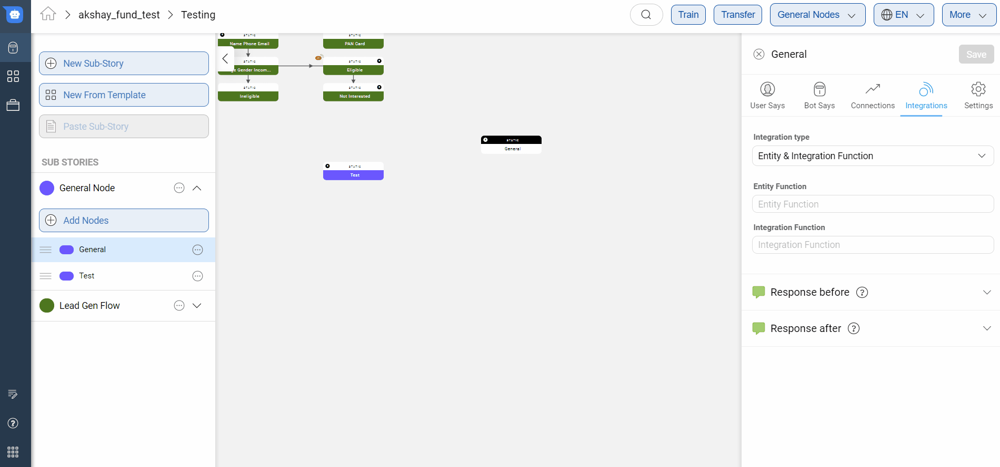
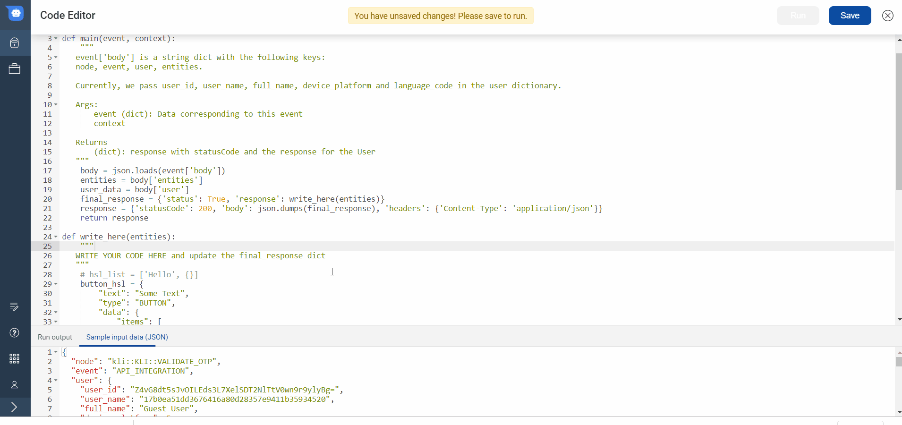

## Node Integrations
Another way to use the entities collected and run some buisness logic on them by using custom python code.


### Custom Code

A node can also be configured to execute custom code once the required entities have been collected.

To be able to do so, you can use the in-built code editor in Mogambo or paste Python3.6 specific code into the editor and save.

You can open the code editor by choosing `Custom Code` from the integrations section of a node and then clicking on the `Open Code Editor` button.




### Using Custom Code Editor

The only requirement for using the custom code editor is, the code should follow the below format. The supported programming language is Python 3 and above.

If any syntax errors or exceptions are raised by the main function, this will result in a botBreak message.

```python
import  json

def main(event, context):
    """
    event['body'] is a string dict with the following keys:
    node, event, user, entities.

    Currently, we pass user_id, user_name, full_name, device_platform and language_code in the user dictionary.

    Args:
        event (dict): Data corresponding to this event
        context

    Returns
        (dict): response with statusCode and the response for the User
    """
    body = json.loads(event['body'])
    entities = body['entities']
    user_data = body['user']
    user_details = body['user_details']
    conversation_details = body['conversation_details']
    final_response = {'status': True, 'response': write_here(), 'user_details':user_details, 'conversation_details':conversation_details}
    response = {'statusCode': 200, 'body': json.dumps(final_response), 'headers': {'Content-Type': 'application/json'}}
    return response

def write_here(*args):
    """
   WRITE YOUR CODE HERE and update the final_response dict
   """
    # hsl_list = ['Hello', {}]
    button_hsl = {
        "text": "COMPLETE BLOOD COUNT; CBC",
        "type": "BUTTON",
        "data": {
            "items": [
                {
                    "actionable_text": "View Price",
                    "location_required": False,
                    "is_default": 0,
                    "uri": "LAUNCH_CHANNEL",
                    "type": "TEXT_ONLY",
                    "payload": {
                        "gogo_message": "",
                        "message": "I want to check the price of this test"
                    }
                },
                {
                    "actionable_text": "View Details",
                    "location_required": False,
                    "is_default": 0,
                    "uri": "LINK",
                    "type": "APP_ACTION",
                    "payload": {
                        "url": "XYZ.COM",
                        "gogo_message": ""
                    }
                }
            ]
        },
        "isNew": False
    }
    return [json.dumps(button_hsl)]

```

The HSL message that you want the bot to respond with should be sent as a JSON in the body of the returned response object from the main function. 

##### Supported Packages 
1. *Default* - [List of Packages here](https://gist.github.com/gene1wood/4a052f39490fae00e0c3#file-all_aws_lambda_modules_python3-6-txt)
2. *Extra packages* -  
chardet-3.0.4 
gspread-3.1.0 
httplib2-0.13.1 
idna-2.8 
mysqlclient-1.4.2 
oauth2client-4.1.3 
pyasn1-0.4.6 
pyasn1-modules-0.2.6 
pytz-2019.2 
redis-3.2.1 
requests-2.22.0 
rsa-4.0 
six-1.12.0 
unicodecsv-0.14.1 
urllib3-1.25.3


### Live Testing your Code
The full screen code editor allows you to live test your code with a configurable input. This will help you evaluate if your code is working as expected.

You can configure the input by modifying the JSON in the `Sample Input Data` section at the bottom of the code editor. The only requirement is that the input JSON should have these keys mandatorily:

* entities - This key will contain data about the entities captured in the bot.
* user_data - This key will contain data about the user.


After configuring the input json data you can test the code by clicking on the `Run` button at the top of the screen.

> **Note**: You need to save the code to be able to run it.

When you click on the `Run` button, the code will be executed using the sample input data and the output and logs will be shown at the bottom of the code executor window.



### Using Environment Variables
It is also possible to set environment variables for the code executor to store values like database username and passwords that you don't want to expose inside the code.

**The environment variables are stored at a bot level.** This means that variables stored in one node are automatically available to all nodes inside the bot.

You can set these variables by opening the code editor, clicking on the `More` button in the top right corner and selecting the `Variables` option.


In the variables menu that opens, you can set the variable name and values for the variable on the staging and production environments. For example you can create a variable called `MONGO_URI` and set its staging value as `mongodb://mongodb0.example.com:27017/admin` and it's production value as `mongodb://mongodb1.example.com:27017/admin`.

These environment variables are then available within the request parameters for the integration functions. You can read about the request parameter structure [here](https://docs.haptik.ai/bot-builder/integrations/integration-parameters)
### Pre-Transfer

`Train Bot` prepares the code for production. Hence, you should make sure to call `Train Bot` if there are any changes in the custom code integration before transferring the bot to production.
