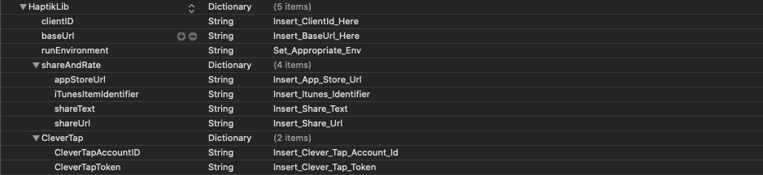

## Overview

HaptikLib is geared up with **analytics** internally and also _provides the functionality of giving callbacks for every event tracking_. The `HPAnalyticsServiceDelegate` **protocol** gives an optional method (_see example below_) which is called if you confirm to the protocol.

**HPConfiguration** class exposes a property named `analyticsCallbackObject` of type `HPAnalyticsServiceDelegate` which the application needs to set with the object that will confirm to the protocol.

Example:

<!--DOCUSAURUS_CODE_TABS-->
<!--Objective-C-->

```Objective-C
// Objective-C

#import <HaptikBase/HaptikBase.h>

@interface ViewController () < HPAnalyticsServiceDelegate >

@implementation ViewController

- (void)viewDidLoad {

    [HPConfiguration shared].analyticsCallbackObject = self;
}

- (void)eventTracked:(NSString *)eventName forParams:(NSDictionary *)params {

    // Callback for every event recorded
}

@end
```

<!--Swift-->

```Swift
// Swift

import HaptikBase

class ViewController: UIViewController, HPAnalyticsServiceDelegate {

    override func viewDidLoad() {
        super.viewDidLoad()

        // If you need the callbacks of the analytics data that haptik sends
        HPConfiguration.shared().analyticsCallbackObject = self;
    }

    func eventTracked(_ eventName: String, forParams params: [AnyHashable : Any]?) {

        // Get all the events tracked here, since this class is confirming to the analyticsCallbackObject.
    }

}
```

<!--END_DOCUSAURUS_CODE_TABS-->

---

## CleverTap Setup

Add the analytics spec along with `HaptikLib` in your podfile to make use of clevertap.

```ruby
use_frameworks!

target YourTargetName do
  pod 'HaptikLib'
  pod 'HaptikLib/Analytics'
end
```

HaptikLib also comes with CleverTap inbuilt 🙌🏻. You just have to enter the CleverTap Credentials provided to you in the `HapikLib` dictionary which you added for the credentials during the initialization.

A dictionary with the name `CleverTap` is to be added in `HaptikLib`. The dictionary will have the following two **key-value** pairs:

| Key                | Value                        |
| ------------------ | ---------------------------- |
| CleverTapAccountID | Insert_Clever_Tap_Account_Id |
| CleverTapToken     | Insert_Clever_Tap_Token      |

Example:

```XML
<key>HaptikLib</key>
<dict>
    <key>clientID</key>
    <string>Insert_ClientId_Here</string>
    <key>baseUrl</key>
    <string>Insert_BaseUrl_Here</string>
    <key>runEnvironment</key>
    <string>Set_Appropriate_Env</string>

    <key>shareAndRate</key>
   <dict>
      <key>appStoreUrl</key>
      <string>Insert_App_Store_Url</string>
      <key>iTunesItemIdentifier</key>
      <string>Insert_Itunes_Identifier</string>
      <key>shareText</key>
      <string>Insert_Share_Text</string>
      <key>shareUrl</key>
      <string>Insert_Share_Url</string>
   </dict>

    <key>CleverTap</key>
    <dict>
        <key>CleverTapAccountID</key>
        <string>Insert_Clever_Tap_Account_Id</string>
        <key>CleverTapToken</key>
        <string>Insert_Clever_Tap_Token</string>
    </dict>

</dict>
```

After adding the credentials, your `info.plist` should look like this:



