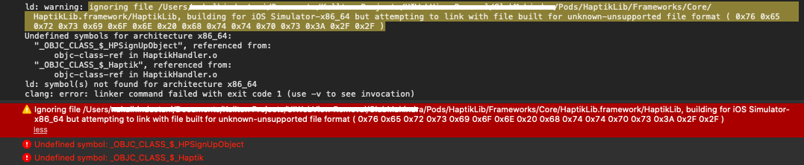

**1. How do I go from Staging Environment to Production Environment?**
Change details in your info.plist file

- Set runEnvironment to 0 
- Change the base url to your production url

```XML
<key>HaptikLib</key>
<dict>
  <key>clientID</key>
  <string>Insert_ClientId_Here</string>
  <key>baseUrl</key>
  <string>Production_URL_HERE</string>
  <key>runEnvironment</key>
  <string>0</string>
</dict>
```


**2. Why does Haptik require APNS F8 certificate?**

- To send messages to the user via notifications, Haptik backend requires authentication certificate

**3. Why Haptik send notifications?**

- If a user leaves the application while chatting with an IVA, and the
  IVA responds, Haptik delivers the message sent via notifications.

**4. When will Haptik SDK display notifications to the users?**

- Notifications are displayed if the user was chatting with an IVA, but
  now has done one of the following things

  1. Is in the app but has exited the chat screen
  2. Has put the app in background
  3. Has killed the app

**5. App is not receiving notifications from Haptik backend?**

- Please make sure you have provided the valid APNS certificate  to Haptik when filling the 
  [pre-requisites form](https://docs.google.com/forms/d/e/1FAIpQLSfxdgMXYQ1hR4PWO54wXzWZhkB4c_21ypTPCSpfEwhEcznwPA/viewform)
- Make sure you have followed all the steps [here](https://hellohaptik.github.io/haptik-ios-framework/notifications)

**6. App was receiving notifications in Staging Environment but is not
receiving notifications in Prod Environment**

- Please check if APNS server is valid for in your developer account.
- In this case, please provide respective .p8 certificate to Haptik

**7. What is the minimum iOS requirement for Haptik modules ?**

| Module Name | iOS Version |
| ----------- | ----------- |
| Haptik Lib  | 9           |
| Offline     | 9           |
| Analytics   | 9           |
| Speech      | 10          |
| Location    | 10          |

**8. Haptik SDK gives build error**


- This usually happen if you missed to install Git LFS please check integration gide for prerequisites and quickstart guide 

**9. What if I missed Installing Git LFS and installed SDK?**

- As mentioned in the Haptik Integration Guide Git LFS this is a necessary [prerequisite](https://hellohaptik.github.io/haptik-ios-framework/integration-guide#prerequisites)
- You might need to clear the cache after installing Git LFS and install the pod again to fetch the SDK in the correct file format.

- **Run these commands from your project directory after installing Git LFS**

```console
rm -rf ~/Library/Caches/CocoaPods
rm -rf Pods
rm -rf ~/Library/Developer/Xcode/DerivedData/*
pod deintegrate
pod setup
pod install
```
