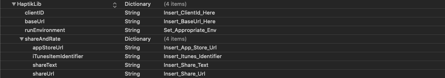

- Haptik provides inbuilt share functionality where you can configure the SDK to share your app specific **_share text_** and **_share URL_** with others via the default iOS share extension from the conversation screen.

- Users have an option to Rate your application on _app store_ and share your application from the conversation screen. You need to add your applications **_app store url_** and **_itunes item identifier_** for the SDK to take the user to your applications app store page.

To add these credentials, define a **_Dictionary_** object with the name **shareAndRate** inside the inside the **_HaptikLib_** dictionary defined in your `Info.plist`.

The `shareAndRate` dictionary should have the following **key-values** present in it:

| Key                  | Value                    | Usage                                         |
| -------------------- | ------------------------ | --------------------------------------------- |
| appStoreUrl          | Insert_App_Store_Url     | The App Store link used for rating the app.   |
| shareText            | Insert_Share_Text        | String used to share the app.                 |
| shareUrl             | Insert_Share_Url         | Url will replace %@ anywhere in the shareText |
| iTunesItemIdentifier | Insert_Itunes_Identifier | Itunes ID of your app used for user ratings.  |

On opening app's `Info.plist` in _Source Code_ format you can add the required keys as illustrated below -

```XML
<key>HaptikLib</key>
<dict>
   <key>clientID</key>
   <string>Insert_ClientId_Here</string>
   <key>baseUrl</key>
   <string>Insert_BaseUrl_Here</string>
   <key>runEnvironment</key>
   <string>Set_Appropriate_Env</string>

   <key>shareAndRate</key>
   <dict>
      <key>appStoreUrl</key>
      <string>Insert_App_Store_Url</string>
      <key>iTunesItemIdentifier</key>
      <string>Insert_Itunes_Identifier</string>
      <key>shareText</key>
      <string>Insert_Share_Text</string>
      <key>shareUrl</key>
      <string>Insert_Share_Url</string>
   </dict>


</dict>
```

After adding the credentials, your `info.plist` should look like this:



> - If the values are not added then the user will not see an option to rate and share on the conversation screen.
> - Inside the `shareText` wherever there will be `%@` present, it will be replaced by the `shareUrl` provided.

---
