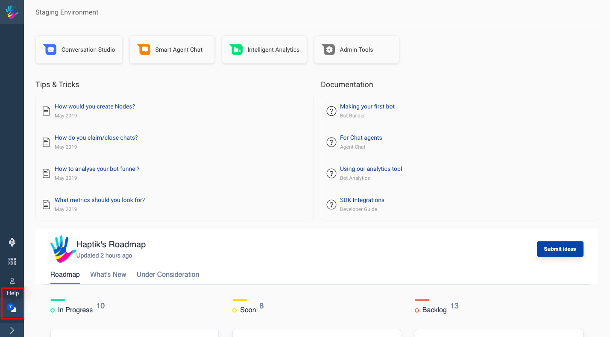
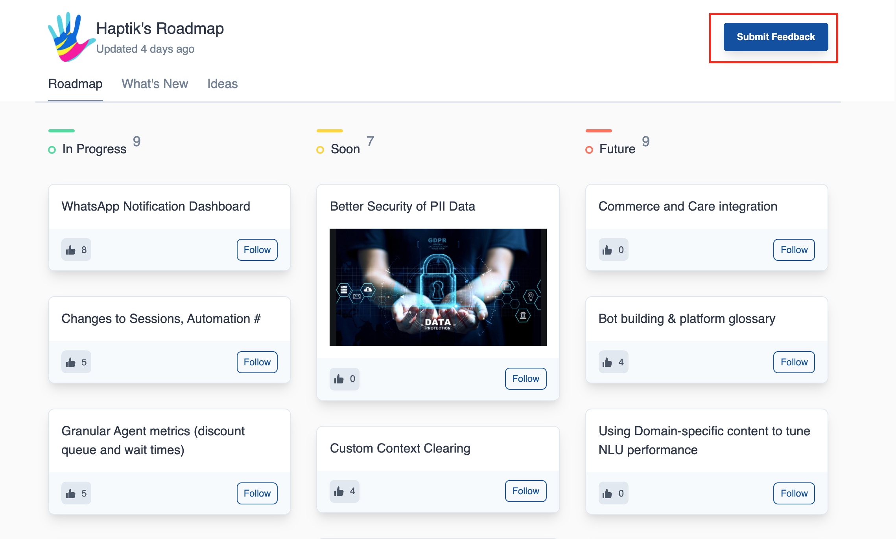

Haptik Platform has multiple tools like Bot Builder, Agent Chat and Chat Analytics. All of these tools have numerous features which help us create complex and sophisticated Conversational AI solutions like IVA.

But what if you get stuck somewhere or you want to know about a particular feature in more depth. To handle these, we have a **Support Bot** in place to help you. 

## Where is Support Bot?

You can click on the icon highighted in the above diagram to open the Support Bot. The bot will open up as shown below with a cross button on the top right corner to close the bot.

The Support Bot is accessible from all screens of the Platform. Home Screen, all screens of Bot Builder, all screens of Chat Analytics tool except Agent Chat screen.

## How to use it?

There are 3 main menu items on the bot -

- Report an Issue
- Have a Question?
- Feature Request

The bot also handles FAQs. You can ask your queries directly to get responses.

### Report an Issue

This option should be chosen whenever you want to report an issue on the Platform if some feature is not behaving as expected. Be ready with the following details before starting -

- Reporter Name
- Reporter Email ID
- Tool Name
- Bot Name, Business Name 
- Chat Link 
- Date & Time of the issue
- Screenshot (Only 1 allowed)

After providing the above details, you will be able to create a ticket successfully. Haptik team will reach out to you for the same.

### Have a Question?

This option should be chosen whenever you have a query about a feature of the Platform. It will make a search for you on docs.haptik.ai before asking you to raise a query for the same.

### Feature Request

This should be chosen when you want to raise feature requests for the Platform. It will be taking you to our Roadmap page where you can see the on-going, what's new and upcoming features. If your request is not listed there, you can create a new by clicking on the **Feedback button** on top right corner.

You can also make requests to change the Support Bot on the Bot itself.

