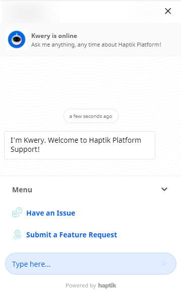

Haptik Platform has multiple tools like Conversation Studio, Smart Agent Chat, Intelligent Analytics, and Admin Tools. All of these tools have numerous features that help us create complex and sophisticated Conversational AI solutions like IVA.

But what if you get stuck somewhere or you want to know about a particular feature in more depth. To handle these, we have a **Help Section** in place to help you. 

## Where can you access **Help**?

You can access the Help Section from all tool pages, i.e. from Home Page, Conversation Studio, Smart Agent Chat, Intelligent Analytics, and Admin Tools on the left sidebar. You can click on the icon highlighted in the below diagram to open.

The Help Section is powered by an IVA trained on 200+ plus FAQs about the platform and documentation links. 

If the FAQ and documentation are not at par in resolving your query, you can also raise an issue on the IVA by following the ticketing journey.

Our support team looks at these tickets and resolves the query as soon as possible.

## How to use the Help Section?

As stated above, along with the FAQs and documentation there is a ticketing journey to raise issues about the platform. 

You can also submit requests for any new feature required on the platform. 

### 1. Have an issue

When you have an issue and you want to raise an issue you will have to provide the following information - 

- **Issue details**: You can describe the issue here currently facing on the platform

- **Screenshot**: Screenshot of the issue you are currently facing

- **Stage of IVA**: You can describe the state your IVA is in i.e. already live or in the development phase

- **Bot link or Chat Link**

- **Date and Time**: You can mention the date and time of the issue you are currently facing

Once you have provided the above details, you will receive a confirmation message about the ticket on the IVA.

### 2. Submit a feature request

You can choose this icon when you want to raise feature requests for the Platform. It will be taking you to our Roadmap page where you can see the in-progress, upcoming features. There is also a what's new section which lists down all recent updates in the platform. 

If your request is not listed on the Roadmap, you can create a new one by clicking on the **Submit Feedback button** on the top right corner.

> Note: You can also make requests to improve the Help Section on the IVA itself.
