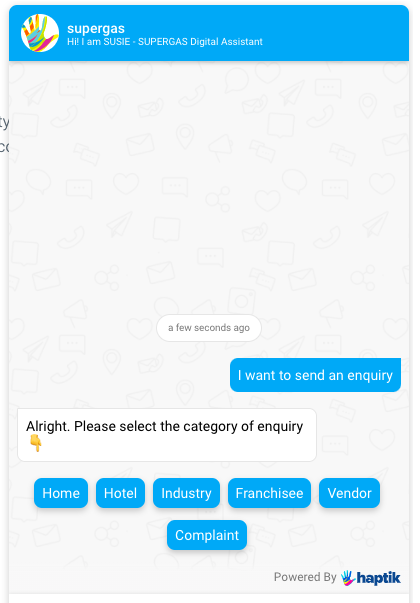

## Customising the SDK

The SDK can be configured in a variety of ways to fit in seamlessly with the overall experience of the parent application.

> These settings can be configured in the Business Manager section of the Bot Builder. <br> 
> **Bot Builder → Your Business → Partner Specific Settings → SDK Configuration**

## Glossary
<AUTOGENERATED_TABLE_OF_CONTENTS>

## UI Settings

> Settings that primarily effect the look and feel of the SDK.

### `primary-color`

The primary colour used throughout the SDK. This should ideally be the same as your brand's primary colour.

**default: #00000**

### `typography`

The font family used throughout the SDK. It must be a google font. You can see available fonts here: [https://fonts.google.com/](https://fonts.google.com/)

**default: Roboto**

### `widget-positioning`

The portion of the window where the SDK is rendered (along with the Let's chat with us button). 

**Possible Values:**

- `bottom-left`: *Places the SDK on the bottom left part of the page*
- `bottom-right`: *Places the SDK on the bottom right part of the page*
- `center`: *Places the SDK in the centre of the page.*

**default: Bottom Left**

### `custom-button`

Whether to hide the main chat button or not. Set this to `true` if using your own custom button implementation. When set to `true` hides the default button.

**default: false**

### `privacy-policy-url`
If GDPR is enabled, you can add a URL to your Privacy Policy page through init settings. Users will be redirected to this URL when they click on the link in the GDPR view. If not provided users will be redirected to Haptik's privacy policy page.

```
window.haptikInitSettings = {
  ...
  "privacy-policy-url": "URL_TO_YOUR_PRIVACY_POLICY_PAGE",
  ...
};
```

### `custom-css`
A custom css file can be injected to the XDK, which will allow to modify the styles of it. This parameter takes a path of the CSS file, which can either be relative or absolute.

_example:_
`/overrides.css`
```
.header, .minimized-view, .composer, .composer > textarea {
  background-color : black !important;
}

.header, .minimized-view, .composer > textarea {
  color: white !important;
}

.taskbox-body {
  border-radius : 0 !important;
}

.taskbox-body .taskbox-tab {
  width : 100px !important;
}

.taskbox-body .taskbox-tasks>.task:hover {
  background-color: beige !important;
}
```
> `!important` flag is required to invoke overriding behaviour

then use the file as below
```
window.haptikInitSettings = {
  ...
  "custom-css": "./overrides.css",
  ...
};
```
> An example CSS is available at https://tinyurl.com/ybazgbq4 for you to get started

> Please note: adding a web URL for custom-css will add an extra delay for rendering the chat window. The delay is entirely dependent on how fast it is served.

#### List of CSS selectors

##### For chat icon


| CSS selectors                                 | Usage                                                 |
|-----------------------------------------------|-------------------------------------------------------|
| `.minimized-view`                             | For chat icon wrapper                                 |
| `.minimized-view-icon`                        | For chat icon                                         |
| `.minimized-view-text`                        | For chat icon text                                    |
| `.minimized-view-unread-count`                | For chat icon unread notification circle              |
| `.minimized-view-cross-icon`                  | For cross chat icon                                   |

##### For task-box


| CSS selectors                                 | Usage                                                 |
|-----------------------------------------------|-------------------------------------------------------|
| `.taskbox-body`                               | For task-box wrapper                                  |
| `.taskbox-tab-wrapper`                        | For task-box top handler                              |
| `.taskbox-tasks`                              | For task-box list                                     |
| `.taskbox-tasks > task`                       | For task-box list item                                |

##### For composer


| CSS selectors                                 | Usage                                                 |
|-----------------------------------------------|-------------------------------------------------------|
| `.composer`                                   | For composer wrapper                                  |
| `.composer-icon`                              | For composer icon                                     |
| `.composer-icon.left`                         | For left composer icon                                |
| `.composer-icon.right`                        | For right composer icon                               |
| `.composer-text-area`                         | For composer text area                                |

##### For message window


| CSS selectors                                 | Usage                                                 |
|-----------------------------------------------|-------------------------------------------------------|
| `.extended-view`                              | For chat window                                       |
| `.header`                                     | For chat window header wrapper                        |
| `.header-top`                                 | For chat window header top bar                        |
| `.header-promo`                               | For chat window header expanded view                  |
| `.message-section-messages`                   | For message section - wrapper                         |
| `.timeline-message`                           | For timestamp message                                 |
| `.message-section-message-row`                | For message row containing messages                   |
| `.message-section-message-row.from-user`      | For user messages                                     |
| `.message-section-message-row.from-business`  | For bot messages                                      |
| `.fixed-bottom-area`                          | For transparent area at the bottom of message section |

> For finer control, use browser's debug tool to find DOM selectors and use the same.

### `mode`

This setting governs the initial view of the SDK. Supporting use cases where the SDK should always be open.

**Possible Values:**

- `default`: *Shows a default Let's Chat with us button*
- `fsm`: *Loads with the chat window open by default without a cross button*

**default: Default**

_Currently `"mode": "fsm"` is not supported on IVA with custom signup._

## Feature Settings
> Settings that primarily disable or enable features in the SDK.

### `enable-typing-suggestions`

Enables typing suggestions for the bot. Typing suggestions are autocomplete suggestions that show up for users when they type. This gives the user some context around the capabilities of the bot.


**default: false**

### `enable-user-feedback`

Enables per message user feedback for the bot. Adds feedback icons to all bot responses to freeform user input in order to collect feedback. It's a 2-stage process where the user can quickly give a thumbs-up/thumbs-down. Once done, the user can then also optionally give more detailed feedback in the form of tags and a freeform comment.


**default: false**

### `bot-type`

The SDK supports both voice and text base conversations. This setting can set that accordingly.

**Possible Values:**

- `TEXT`: *A text based conversational interface where the user is expected to use the keyboard to send messages.*


- `VOICE`: *A voice based conversational interface where the user can also send messages using voice. The bot messages are spoken out aloud.*


**default: TEXT**

## Text Settings
> Settings that primarily alter the text/content of the SDK

### `composer-placeholder`

The placeholder text for the composer (typing area). This is the text that's shown in the typing area when it's empty


**default: Type here...**

### `chat-bubble-text-desktop`

The chat bubble text on **desktop browsers**. Set it to `_NONE_` if you don't want to show any text and just the chat icon.

**default: Chat with Us**

### `chat-bubble-text-mobile`

The chat bubble text on **mobile browsers**. Set it to `_NONE_` if you don't want to show any text and just the chat icon.

**default: Chat with Us**

### `user-feedback-tags`

An object containing textual copies of the tags to show when showing the per usage message feedback. **Note: User feedback needs to be enabled**


**Object Structure + Default**

```js
    'user-feedback-tags': {
    	// tags to show when feedback is positive
      // <array of strings>  
    	'positive': [
    		'Seemed human', 
    		'Easy to understand',
    		'It was relevant',
    		'That was fast'
    	],
    	// tags to show when feedback is negative
      // <array of strings>
    	'negative': [
    		'Unrelated response', 
    		'Delayed response', 
    		'Repetitive response',
    		'Unhelpful message'
    	]
    }
```

### `user-feedback-questions`

An object containing textual copies of the questions to show when showing the per usage message feedback. ***Note: User feedback needs to be enabled***


**Object Structure + Default**

```js
  'user-feedback-questions': {
    	// when feedback is positive
    	'positive': 'Yay! What did you like?',
    
    	// when feedback is negative
    	'negative': 'Sorry about that. What went wrong?'
    }
```

## Disable Settings
> Some features/elements can be disabled and turned off. These can controlled using the following settings.

### `hide-composer`

Hides the composer so that the user is not given the option to type anything. This is useful when building actionable and highly directed bots.

**default: false**

### `ignore-storage`

Disables the storage so that a new user is created every time the user comes back. No messages/user information is stored in local storage. Essentially, every user is treated like a first-time user.

**default: false**

### `initialize-language`

Code of language you want to open bot with. For eg `en`, `hi`. (Optional). We support [ISO_639-1](https://en.wikipedia.org/wiki/ISO_639-1) language codes. 

**default: en**

### `no-cross`

Hides the cross button so that user is unable to close the chat window. This is useful when building experiences with custom chat buttons and other customised UI elements.

**default: false**

_The user will be slightly able to see the close button but they won't be able to click on the button._

### `no-chat-bubble`

Hides the chat bubble. The SDK then needs to be opened and controlled programmatically.

**default: false**

### `no-header`

Hides the chat window header. This is useful when integrating inside native apps and webviews where there's already a header present outside the webview.

**default: false**

## Misc Settings
> Some settings that don't necessarily fall in the above category buckets

### `voice-bot-initial-input`

The default state of the voice bot. Should it by default have the text composer or the voice composer?

**Possible Values:**

- `TEXT`: *Show the text composer by default*
- `VOICE`: *Show the voice composer by default*

**default: VOICE**
