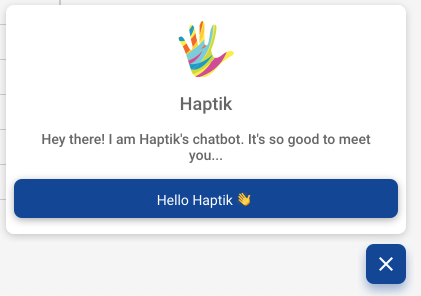
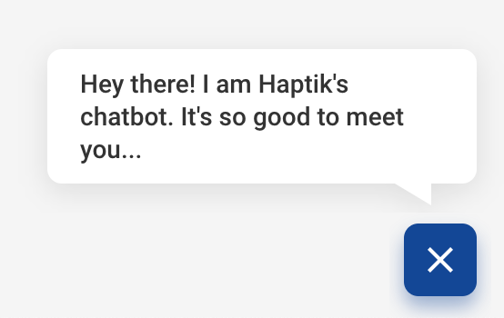

Bot Prompts are Custom Prompts triggered to increase user engagement and help users with actions on the website. 

## Types of triggers

These prompts can be triggered in 2 ways:

- **Dynamic Trigger:** *These are triggered based on dynamic conditions dependant on user actions. (Ex. Number of visits, time on page, url etc.)
See below on how to configure dynamic triggers.*
- **Programmatic Trigger:** *Prompts can also be triggered manually on a code level using the SDK functions in case the client wants to implement custom trigger logic on their end.
See Configuration → SDK Methods on how to trigger this.*

Bot Prompts don't show up regardless of triggers if the user already has the chat window open

## Configuring dynamic triggers

Dynamic triggers can be configured through the Bot Builder. You can set rules according to which the prompt will be triggered for users.

To add a prompt, open the relevant business on the Bot Builder

*Bot Builder → Businesses → Business → Bot Prompt Triggers*

Tap on create a new trigger to create a trigger.

**Field Definitions:**

### `Trigger Title <String>`

The name of the trigger, used internally.

### `Active <Boolean`

Whether the trigger is active or not.

### `Variants`

Different bot prompt variations for the trigger. One of the variations is selected at random and shown to the user. Each variant has the following properties:

- `Prompt Title (String)` : The message to be shown to the user.
- `Button Text (String)` : The text to be shown on the button of prompt.
- `User Message (String)` : The Message which should be sent as a User Message if the user clicks on the button.

### `Prompt Rules`

These are the conditions that the XDK checks to determine whether to trigger the prompt or not. You can have multiple rules defined. Different Rule Types:

- `Trigger Based On`
The basis on which to test the rule. 
Possible values:
    - `Page URL`: *Sets a Rule which checks the page URL for the condition specified.*
    - `No. of Visits`: *Checks for the number of visits on the page by the user.*
    - `Query Params`: *Checks the Query Parameters for the specified Value.*
    - `Time on Page` : *Checks for the time on the page by the user.*
    - `Form Field`: *Checks the Form Fields for the specified Value.*
- `Condition`
The operator to apply when checking the trigger (For example: `Greater than`, `Contains` etc.)
- `Value`
The value to compare the value the trigger is based on with. This is value that is compared along with the condition.

### `Prompt Rule Type (AND/OR)`

Whether all the rules for trigger should match (`AND`) or any one of the rules should match (`OR`)

## Bot Prompt UI Types

The XDK supports 2 different types of bot prompt interfaces. 

*See Configuration → SDK Methods on how to trigger this.*

- **Full Bot Prompt**
Contains a logo, header title, message and a call to action button.

- **Minimal Bot Prompt**
Contains just the message inside a minimal chat bubble above the chat with us button of the XDK. The entire bubble is clickable and acts as the call to action.

