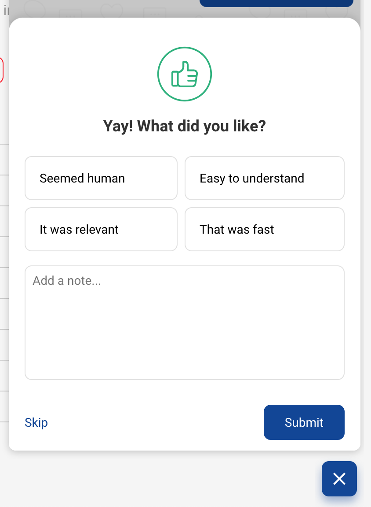

## How does this work?

All bot responses to freeform user messages will have a rating icon. Users can click on the thumbs up or down rating icon. After this click, the user would get a comment icon, via which the user could now add tags and provide comments for feedback. The tags and feedback question copy is configurable on a business level. 

> All responses to freeform input have feedback icons, upon giving basic feedback, the user can give more detailed feedback

Bot analysts review the tasks and their order on a regular basis. And as per the incoming intents and each task performance (Task tap, completion values), bot analysts would add new task(s), reorder the task(s) on Taskbox. Some bots depending on their end goals would skip the Taskbox for a new user and send a launch message instead of the default open taskbox view. 

## How to implement this on your bot?

It just needs to be enabled by adding the `enable-user-feedback` flag. Check the customization section to see how to enable this.

> The tags and the feedback title of the comments modal can also be configured. The customization section has all the necessary information.
