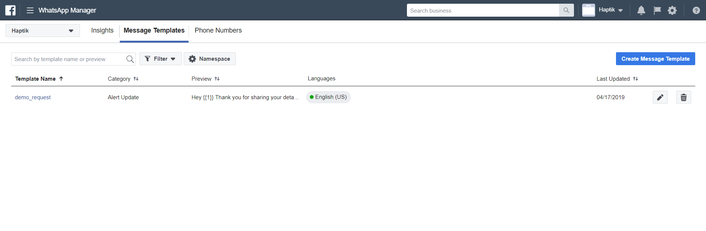
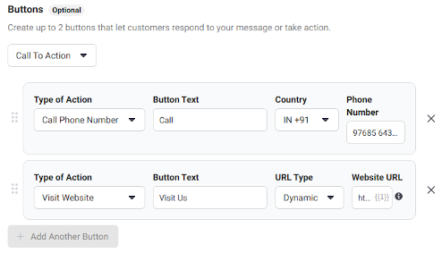
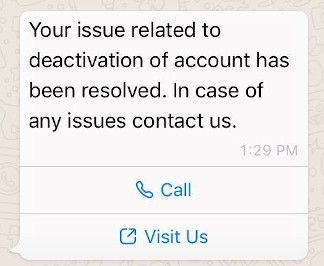
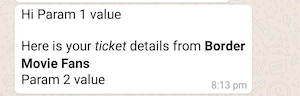
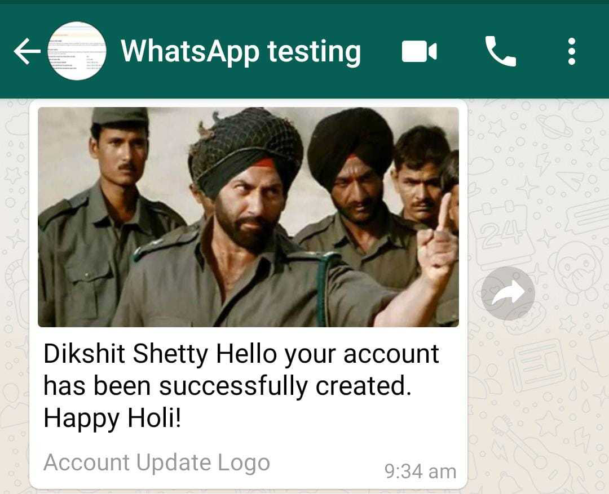
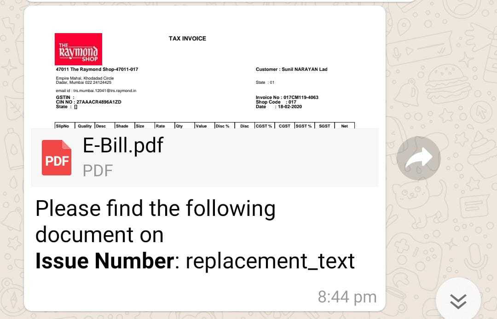
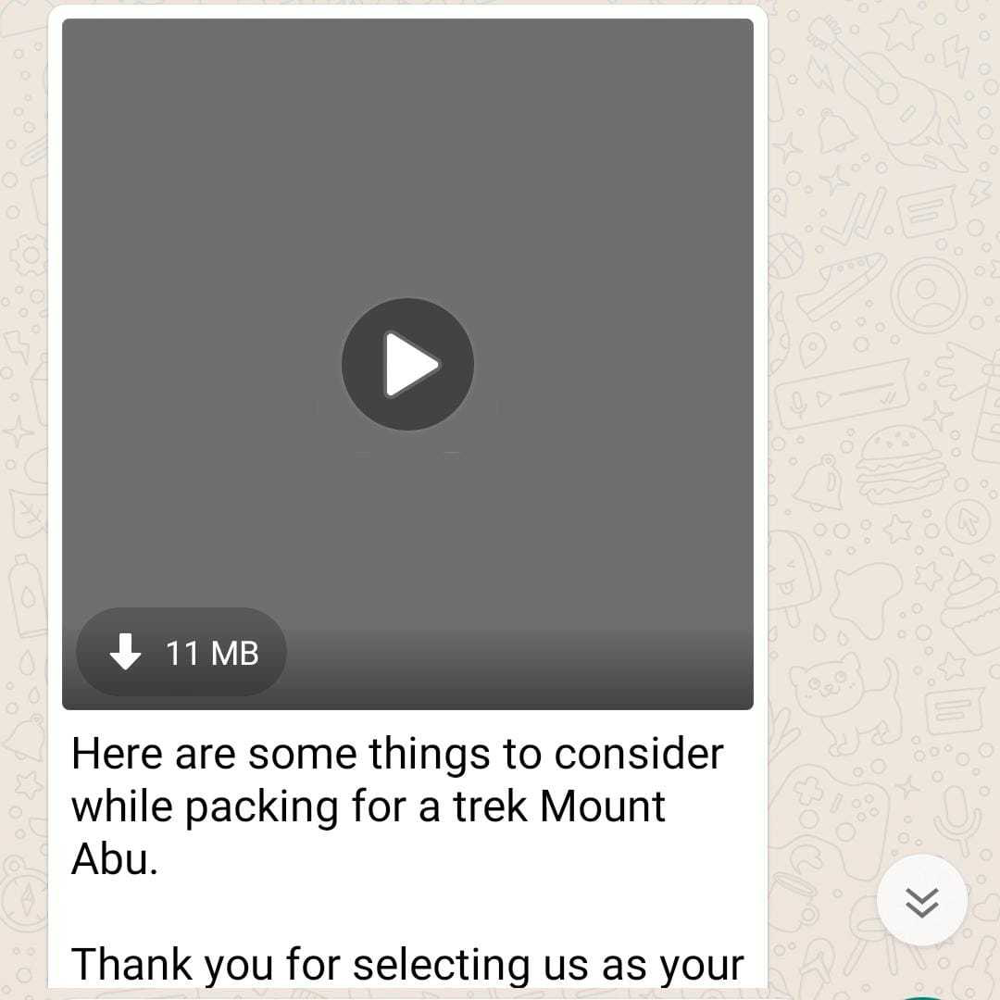

As explained in the `Types of Conversations` section, you can have the bot initiate a conversation with the user. This is done by sending them a pre-approved message template.

## Highly Structured Message (HSM) Templates
The templates that can be sent to WhatsApp users are called Highly Structured Messages. In short they are often referred to as HSMs.

A HSM is a template message with placeholders for dynamic data. All HSMs need to be approved by WhatsApp before they can be sent to the user.

## Setting up a HSM
To setup a HSM you first need to get access to the FB Business Manager Tool of the business. If you don't already have access, you can request it by sending an email to `platform@haptik.ai` with the subject as `Request access to FB Business Manager` and in the body mention the business and the reason for access request.

Once you have access, you can go to the Message Templates section of the business manager tool and create your HSM.



On the `Message Templates` page click on the **Create Message Template** button to create a new template.


The steps involved in creating a HSM template are:

1) Set the name of the template.
2) Choose the category of template. You can read more about the allowed categories in the next section.
3) Select the language of the template. For a given template type, you can have multipe language versions of it.
4) Insert the content of the template. Inside the content you can use rich text elements like `Bold`, `Italics` etc and you can also insert variables in it.
5) Once satisfied, click on submit to submit the HSM for approval.

> **NOTE:** Once approved, the HSM content cannot be edited.

### Adding buttons to HSM templates

WhatsApp allows buttons to be added to the HSM template. The `Buttons` section is located at the bottom of the HSM page (assuming that you are either creating a new HSM or editing an existing one). There are two broad categories of buttons that you can add to your template:

1. Quick Reply
2. Call To Action

**Quick Reply:** <br/>
An HSM template can have at the most 3 quick reply buttons. Quick Reply buttons as their name implies, are buttons which when tapped-on by the user, send the title of those buttons as a message from that user. _(You can even provide a payload to override the message that gets sent back on button click. More on that later, in sending HSM Templates section)_

> Known limitations:
> - At most 3 quick reply Buttons
> - Text of Each button can be no more than 20 characters

_Steps to add Quick Reply buttons:_
- In the `Buttons` section, click the dropdown which by default is set to `None` and choose `Quick Reply`
- A new input field titled `Button Text` will appear
- Enter the text which is to be shown in the Quick Reply
- To add more buttons, click on `Add Another Button` and repeat the above step
- Once you save your HSM template, this configuration gets stored along with it.


-  <br/> _Quick Reply buttons in HSM template builder_ <br/><br/>


-  <br/> _Quick Reply buttons in users Whatsapp Messenger_

<br/>

**Call To Action:** <br/>
A Call To Action button as the name implies, is a button which when clicked by the user would cause a certain action to be called or performed right on the user's device.

Call To Action buttons are further divided into two types:-
- Call Phone number
- Visit Website

> Known limitations:
> - Max two buttons i.e. one of each type (Call Phone Number or Visit Website)
> - Text of Each button can be no more than 20 characters

_Steps to add Call To Action buttons:_
- In the `Buttons` section, click the dropdown which by default is set to `None` and choose `Call To Action`.


- _Call Phone Number_:
    - This button takes a phone number with country code and text to display on the button as parameters and when sent to the user, this button on click will actually initiate a phone call to the said number.
    - When `Call Phone Number` is selected in `Type of Action` you get the following columns adjacent to it viz. `Button Text`, `Country`, `Phone Number`.


- _Visit Website_:
    - This button takes a website URL and text to display on the button as parameters and when sent to the user, this button on click will actually launch the website in the user's phone.
    - When `Visit Website` is selected in `Type of Action` you get the following columns adjacent to it viz. `Button Text`, `URL Type`, `Website URL`.
    - `URL Type` is a drop down in itself which has two options viz. `Static` and `Dynamic`
    - A `Static` URL is self explanatory. It is basically a hardcoded website URL.
    - A `Dynamic` URL is a URL that will have a parameter which will be suffixed to it to form the final URL. <br/> For example, if the URL entered for Dynamic field is `https://<sitedomain>.com`, then while sending HSM, a paramter will have to be sent which will be suffixed to this URL. Thus, if you send the parameter as `1234` then when the user receives this HSM and clicks on this button, the URL launched would be `https://<sitedomain>.com/1234`.
    - Do note that sending the parameter for `Dynamic` URL in the HSM while sending request is mandatory.


-  <br/> _Call To Action buttons in HSM template builder_ <br/><br/>


-  <br/> _Call To Action buttons in user's WhatsApp Messenger_


## Sending a HSM as a notification
After you have submitted your HSM and approval has been granted, you can start sending the HSM as notifications to opted-in users.

You can do this by making a `POST` request to the notification endpoint provided to you by the `DevOps/Platform` team.

> **NOTE:** The  older version of send notification API (`/whatsapp/notification/`) is now deprecated in favor of `/whatsapp/notification/v2/` of the same API.


The request signature is as below:

```bash
curl -X POST \
  <base_url>/whatsapp/notification/v2/ \
  -H 'Authorization: Bearer <token>' \
  -H 'Content-Type: application/json' \
  -H 'client-id: <client-id>' \
  -d '{
    "business_id": <business_id as a number>,
    "to": "<phone_number>",
    "type": "hsm",
    "hsm": {
        "namespace": "<from whatsapp dashboard>",
        "element_name": "<from whatsapp dashboard> ",
        "language": {
            "policy": "deterministic",
            "code": "en_US"
        },
        "localizable_params": [
            {"default": "Param 1 value"},
            {"default": "Param 2 value"}
        ]
    }
}
'
```

In the request body, `business_id`, `token` and `client_id` will be provided by Haptik.

If the number does not exist on WhatsApp you will get the below message as response body:
```
{
    "error_message": "unable to verify contact details"
}
```

When API call is successful you will get the below but does not mean message was delivered but Notifications API was triggered and WhatsApp sent the message to defined number. Sent vs Delivered messages only stats are available on WhatsApp dashboard.
```
{
   "meta" : {
      "api_status" : "stable",
      "version" : "2.25.1"
   },
   "messages" : [
      {
         "id" : "<random message id>"
      }
   ]
}
```

In case of any other errors if returned by WhatsApp, they will be returned as it is with the corresponding status codes. You can refer [this](https://developers.facebook.com/docs/whatsapp/api/messages/message-templates/#response) for reference.

Details regarding the other fields in the body can be found [here](https://developers.facebook.com/docs/whatsapp/message-templates/sending/).

Acceptable formats for phone number can be found [here](https://developers.facebook.com/docs/whatsapp/api/contacts#phone).

## Sending a Media HSM

You can not only send text based HSMs to your WhatsApp end users, but also Media HSMs, Button HSMs.

Checkout the examples below:

**Text HSM**



Nothing new here.

**Image HSM**



HSM sent with an image file as an attachment.

**Document HSM**



HSM sent with a PDF file as an attachment.

**Video HSM**



HSM sent with a Video file as an attachment.

Pardon us for the text copies and images in above messages. Also, only PDF's supported. Docx files are not supported as of now.

How to use them:

Well here is a simple structure of the message used for sending Media HSM with an Image.

Example curl requests for Image:

```
curl -X POST \
  <base_url>/whatsapp/notification/v2/ \
  -H 'Authorization: Bearer <token>' \
  -H 'Content-Type: application/json' \
  -H 'client-id: <client-id>' \
  -d '{
    "business_id": <business_id as a number>,
    "to": "<phone_number>",
    "type": "template",
    "template": {
        "namespace": "<from whatsapp dashboard>",
        "name": "<from whatsapp dashboard>",
        "language": {
            "policy": "deterministic",
            "code": "en"
        },
        "components": [
            {
                "type": "header",
                "parameters": [
                    {
                        "type": "image",
                        "image": {
                          "link": "<URL of the image>"
                        }
                    }
                ]
            },
            {
                "type": "body",
                "parameters": [
                {
                  "type": "text",
                  "text": "Param Value 1"
                }
                ]
            }
        ]
    }
}'
```

Example curl requests for Document:

```
curl -X POST \
 <base_url>/whatsapp/notification/v2/ \
  -H 'Authorization: Bearer <token>' \
  -H 'Content-Type: application/json' \
  -H 'client-id: <client-id>' \
  -d '{
    "business_id": <business_id as a number>,
    "to": "<phone_number>",
    "type": "template",
    "template": {
        "namespace": "<from whatsapp dashboard>",
        "name": "<from whatsapp dashboard>",
        "language": {
            "policy": "deterministic",
            "code": "en"
        },
        "components": [
            {
                "type": "header",
                "parameters": [
                    {
                        "type": "document",
                        "document": {
                          "link": "<URL>",
                          "filename": "<Filename to be displayed>"
                        }
                    }
                ]
            },
            {
                "type": "body",
                "parameters": [
                {
                  "type": "text",
                  "text": "Param Value 1"
                }
                ]
            }
        ]
    }
}'

```

Example curl requests for Video:

```
curl -X POST \
  <base_url>/whatsapp/notification/v2/ \
  -H 'Authorization: Bearer <token>' \
  -H 'Content-Type: application/json' \
  -H 'client-id: <client-id>' \
  -d '{
    "business_id": <business_id as a number>,
    "to": "<phone_number>",
    "type": "template",
    "template": {
        "namespace": "<from whatsapp dashboard>",
        "name": "<from whatsapp dashboard>",
        "language": {
            "policy": "deterministic",
            "code": "en"
        },
        "components": [
            {
                "type": "header",
                "parameters": [
                    {
                        "type": "video",
                        "video": {
                          "link": "<URL of the Video>"
                        }
                    }
                ]
            },
            {
                "type": "body",
                "parameters": [
                {
                  "type": "text",
                  "text": "Param Value 1"
                }
                ]
            }
        ]
    }
}'

```

Note: The above structure is for reference only and will change based on the way we create HSM on Whatsapp Business Manager and for each media type.

> Only Images, PDF, MP3 and MP4 files are supported.

## Sending HSMs with Buttons

[Link to the official documentation.](https://developers.facebook.com/docs/whatsapp/api/messages/message-templates/interactive-message-templates)

**Quick Reply:**

- Sending a HSM template with Quick Replies is similar to sending any other HSM template.
- The only difference is when you would like to send a payload with the template.
- What is a _payload_ in Quick Reply?
    - _payload_ is information you would like to send back to the Haptik API when a Quick Reply button is clicked.
    - For instance, in our above example we have a template which sends two Quick Reply buttons viz, `Yes` and `No`.
    - Let's say when the HSM is sent to the user, the button `Yes` is configured without any payload, but the button `No` has a _payload_ `No, I did not receive the order`.
    - Now, inside the WhatsApp Messenger, if the user clicks on `Yes`, the reply sent to Haptik API will be `Yes`.
    - However, if the user clicks on `No`, the reply sent back to Haptik API will be `No, I did not receive the order` i.e. the payload will be sent back.

Sample CURL request for sending payload for Quick Reply. _(Note how index is used to target specific buttons)_

`index`: _Zero based index_ to appropriately target the button for which you are sending the param. For instance, if you are sending the payload for your second button then the value of `index` would be `1`

```
curl -X POST <base_url>/whatsapp/notification/v2/ \
-H 'client-id: <client-id>' \
-H 'Authorization: Bearer <token>' \
-H 'Content-Type: application/json' \
-d '{
  "business_id": <ID of the business>,
  "to": "<phone number>",
  "type": "template",
  "template": {
    "namespace": "<from whatsapp dashboard>",
    "name": "<name of the template>",
    "language": {
      "policy": "deterministic",
      "code": "en"
    },
    "components": [
      {
        "type": "button",
        "sub_type": "quick_reply",
        "index": "1",
        "parameters": [{
          "type": "payload",
          "payload": "No, I did not receive the order"
        }]
      }
    ]
  }
}
'
```
**Call To Action:**

- Sending a HSM template with Call To Action buttons is similar to sending any other HSM template.
- The only difference is when you would like to send a parameter to the dynamic URL.
- Do note that the paramter sent to the dynamic URL should be a URL safe string, since it would be appended at the end of the base_URL provided in the HSM builder template _(Please refer to the earlier sections for detailed explanation)_.


Sample CURL request for sending parameter for dynamic URL. _(Note how index is used to target the dynamic URL button)_

`index`: _Zero based index_ to appropriately target the button for which you are sending the param. For instance, if you are sending the dynamic URL param for your second button then the value of `index` would be `1`

```
curl -X POST <base_url>/whatsapp/notification/v2/ \
-H 'client-id: <client-id>' \
-H 'Authorization: Bearer <token>' \
-H 'Content-Type: application/json' \
-d '{
  "business_id": <ID of the business>,
  "to": "<phone number>",
  "type": "template",
  "template": {
    "namespace": "<from whatsapp dashboard>",
    "name": "<name of the template>",
    "language": {
      "policy": "deterministic",
      "code": "en"
    },
    "components": [
      {
        "type": "button",
        "sub_type": "url",
        "index": "1",
        "parameters": [{
          "type": "text",
          "text": "445566"
        }]
      }
    ]
  }
}
'
```

## FAQs

I keep getting `"unable to verify contact details"` in response even though the Mobile Number entered is a valid WhatsApp account.
> This could happen because of the following reasons:
> - If the credentials entered in Mogambo's Business Manager are incorrect.
> - If you have not specified the Country code in the `to` field when sending the HSM and if it is different from the Country Code used when setting up the WhatsApp Number.
