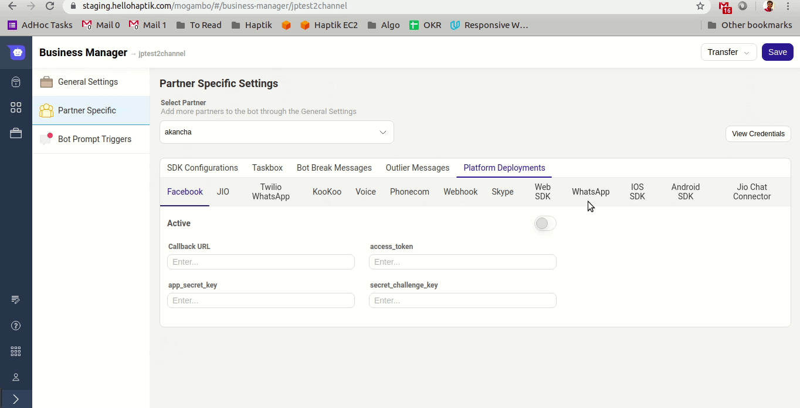

## What is supported?
You can create a Non-English Bot on WhatsApp. 

However, the language support is specified at the Business level. **We do not detect language based on the User's message as of now.** Hence, we can support only 1 language on WhatsApp.

## How does it work?
When a WhatsApp user is created in our system, it is associated with a specific language code. By default, it is en (english).
We now give the option to configure the default language for the user from the WhatsApp configuration tab in Mogambo's Business Manager.

For example, if you set the language code to mr (Marathi), then the user's default language will be set to Marathi. And it will work only for Marathi Bots, and will send a botbreak message if you try to make it work for other languages.

**Supported Language Codes**:
* en (English)
* hi (Hindi)
* bn (Bengali)
* mr (Marathi)
* te (Telugu)
* ta (Tamil)
* gu (Gujarati)
* ur (Urdu)
* kn (Kannada)
* or (Oriya)
* ml (Malayalam)
* pa (Punjabi)

**If you type any incorrect language code, the user will be created with supported language as English.**

## Edge Cases
Here are some edge cases that you need to take care of:

1) The language code on General Settings page and the WhatsApp config page are not synced. So you will have to ensure they are in sync. Else you will keep getting unexpected results.
2) You cannot use the same partner for 2 businesses of different languages. The User that we create, is associated to a Partner. So, if you create a User with Demo partner with Bengali as default language, that User will be able to talk only with Bengali Bots.
