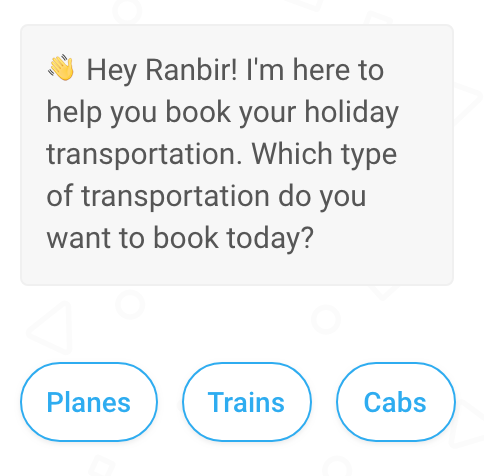
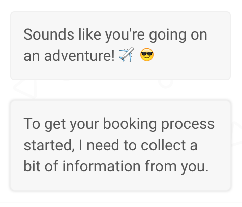
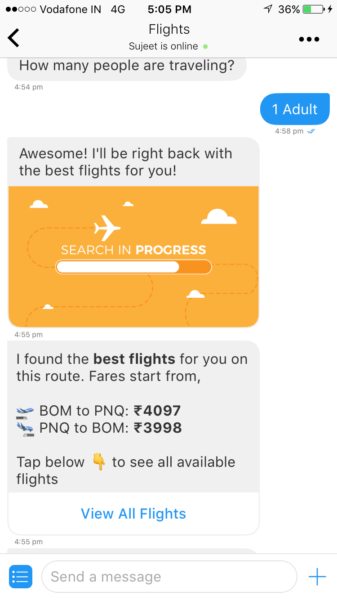
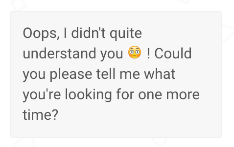

## Designing a Chatbot

We recommend starting the chatbot design process by creating an outline and a strategy. The chatbots your company creates will be an extension of your brand; therefore, their design warrants as much attention as the design of any other customer touch-point. To get you started, we’ve put together a guide to chatbot design, complete with tips from our own in-house design experts.     

1. **Start by identifying your goals**: 
   Identify and understand what you want your chatbots to accomplish. What are the desired outcomes of the conversation it will have with users? For example, your chatbot might be primarily intended to:

   - Gather customer information
   - Share information with potential clients
   - Direct users to a particular site

   Mapping the intended outcomes of the conversation will help you design a chatflow that drives the results you desire.

2. **Create a conversation framework**: 
   Using the framework of *stories* and *sub-stories* to divide the entire conversation into smaller chunks associated with specific tasks is a helpful second step.

   > **Stories** are clusters of chat flows that usually align with the overall goals of the chatbot. For example, a trip aggregator website wants to build a chatbot with the goals of helping users:
   >
   > - Book flights
   > - Find and book hotels
   > - Make restaurant reservations
   >
   > Each of these goals would be classified as a story.

   > **Sub-stories** are the smaller tasks that help accomplish the broader story goals. Continuing our trip aggregator example from above, the sub-stories within the story, "Find and book hotels" would be: 
   >
   > - Collect user preference (location, amenities, dates, etc)
   > - Hotel booking
   > - Booking payment
   > - Information about trip aggregator sites other services.

   You can use the framework of stories and sub-stories as a skeleton for building out the chatflows for your entire bot. 

3. **Write a Script**: 
   Once you’ve figured out what you want your chatbot to accomplish, you need to figure out exactly how it will communicate information, queries, and instructions to end users. Every sub-story involves some back and forth between the chatbot and the end user, and it is the bot builder’s job to create a script that the chat bot will pull from to respond to the end user appropriately. 

   As mentioned above, a helpful method of making sure the chatbot script includes all the components required to accomplish the original goals it set out to, is to build out text from the user flow outlined by identifying the stories and sub-stories of the conversation.  

4. **Give Your Chatbot a Personality**:
   The personality expressed by the chatbot will be an extension of your company's brand, so it's important to design it carefully. Chatbot personality emerges via: 

   - Word choice, speaking style, and cadence (does bot respond using curt and minimal phrases, or friendly, free flowing sentences interspersed with emojis?)
   - Speed of reply (does your bot indicate when it's formulating its reply or respond instantly?)
   - Frequency of messages (does your bot respond in serious, academic paragraphs)

   Other methods of creating a consistent personality include:

   - **Giving directional cues to the user**: By prompting users to respond in certain ways, bot builders can better anticipate users' inputs and accordingly develop a styled conversation flow that move in a pre-determined direction. For example: 
  
  
   
   - **Connect with the user on a personal level**: Incorporating personal touches into your chatbot's script, such as addressing users by name or asking users how they're doing, will keep users more engaged. 
   
   
   
   - **Don't keep the user waiting**: Certain user requests require some amount of processing time by the chatbot. When you anticipate this happening, create fillers to keep users engaged. Similarly, when your chatbot's conversations with users are just opening, don't immediately dive into a series of questions. Always maintain an equal flow of information so users don't become frustrated or disengaged. 
   
   
   
   - **Add appropriate emotions to your conversation**: Make sure to match the tone of each bot response to the emotions a user expects. For example, if the bot is expressing positive information, such as the completion of a hotel booking to a user, throw in a smiling emoji or fun gif (if your bot has a somewhat casual persona). If the bot is expressing negative news, such as the inability to process a request, express this to the user with a regretful tone. 
   
   
