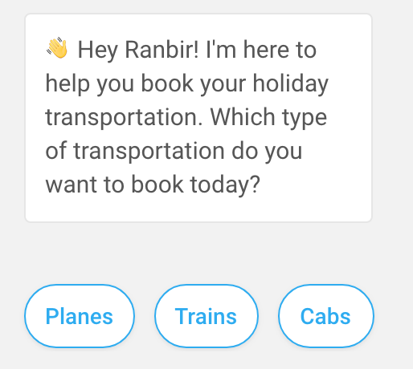

## Glossary

> You're viewing an older version of the documentation. Please visit the [new documentation](https://docs.haptik.ai/) for updated, comprehensive guides & resources on the topic

**API** - A software intermediary that allows two applications to communicate. In the context of Mogambo, bot builders can use APIs to connect data from another application to a chat flow. 

**Button** - One possible bot reply format. A button represents a single task in a *taskbar* (see more information below) that bots can deploy to prompt users to navigate in one of several directions. Looks like this: 

**Carousel** - Another possible bot reply format. A carousel is comprised of a set of selections a user may make, presented in a horizontal scroll format. Each item is enabled with an icon to give bot builders the opportunity to supplement the selection list with more detail. A carousel is usually used to prompt users to make a selection of some sort (such as the hotel they’d like to book, the destination they’d like to visit, etc). Looks like this: 

**Chat Bubble** - The bubble in which a bot reply is shown. 

**Conversational User Interface** - A digital interface that allows users to interact with an operating system by telling it what to do, via voice or text, rather than by interacting with icons on a screen or using syntax specific commands. 

**Entities** - Entities are relevant when the purpose of a bot reply is to prompt an input from the user. An entity represents the set of values from which a user’s response must come in order for that user to progress onwards in a conversation. Depending on the context of the conversation, the required response can either be a single value or limited group of specific values from the entity, or any value from within the entity. Entities are always added in connection with the bot’s query the required response is associated with, so that they may detect whether the required response was given.

**Graphical User Interface** - Digital interface that allows users to interact with an operating system by clicking through graphics, icons or, visuals on a screen.

**HSL Components** - Haptik Specific Language components. In the context of Mogambo, HSL components are defined as the formats a bot response may come in.

**Intent** - A set of sentences or phrases that vary in wording, but all represent a single fundamental meaning. 

> *Example*: 
>
> A user wants to express to a bot that he'd like to order a cab. The associated **intent** would be the following group of sentences that share this common meaning:
>
> > 1. I want to book a cab
> > 2. Find me a taxi
> > 3. Look for a cab
> > 4. I need a taxi     *and so forth*

When a user sends a message to your bot, our pipeline identifies keywords in the message and compares them to the keywords of other sentences/phrases to determine which intent the message falls into. Once the bot has determined that the keywords from the message are similar enough to the keywords from a particular intent (and therefore, is able to identify the received message’s core meaning), the bot is able to respond accordingly.

**Mogambo** - The name of Haptik's bot builder tool.

**Natural Language Processing** - The method by which an operating system understands natural language (everyday language, rather than programming language), powered by machine learning. 

**Node** - Nodes are the building blocks of our chatbots; they are interlinked and, when taken altogether, comprise a full conversation, including all its various chat flow variants. Nodes are the points where conversation converges or diverges basis the information users input to the bot. 

**Quick Reply** - Another possible bot reply format. Quick replies are a limited selection of preset user responses presented by the bot that the user can tap to choose from. Looks like: 

 

**Story** - Stories are major tasks that usually align with the overall goals of the chatbot. 

**Sub-story** - Sub-stories are the smaller tasks that help accomplish the broader story goals. 

**Supervised Learning** - A machine learning process in which a system is presented with a dataset containing inputs and desired outputs that are classified into these two categories. After a certain amount of time spent observing the correlation between the inputs and outputs, the system develops an algorithm that defines the relationship between the inputs and outputs and allows it to classify inputs into categories in the future. 

**Task Box** - A box of main tasks a particular bot can help a user with. Bot builders can design their chatbot to always give users acccess to the task box, which will appear as an icon in the bottom left-hand corner of the chat interface. 

**User Flow** - The path a user takes to perform a certain task. Often associated with a certain persona and/or entry point. There are often several paths users can take to accomplish the task.

**Unsupervised Learning** - A machine learning process in which a system is presented with a dataset containing only inputs, and no labeled outputs. In unsupervised learning, the system must identify the underlying structure and patterns in data without instruction. 
